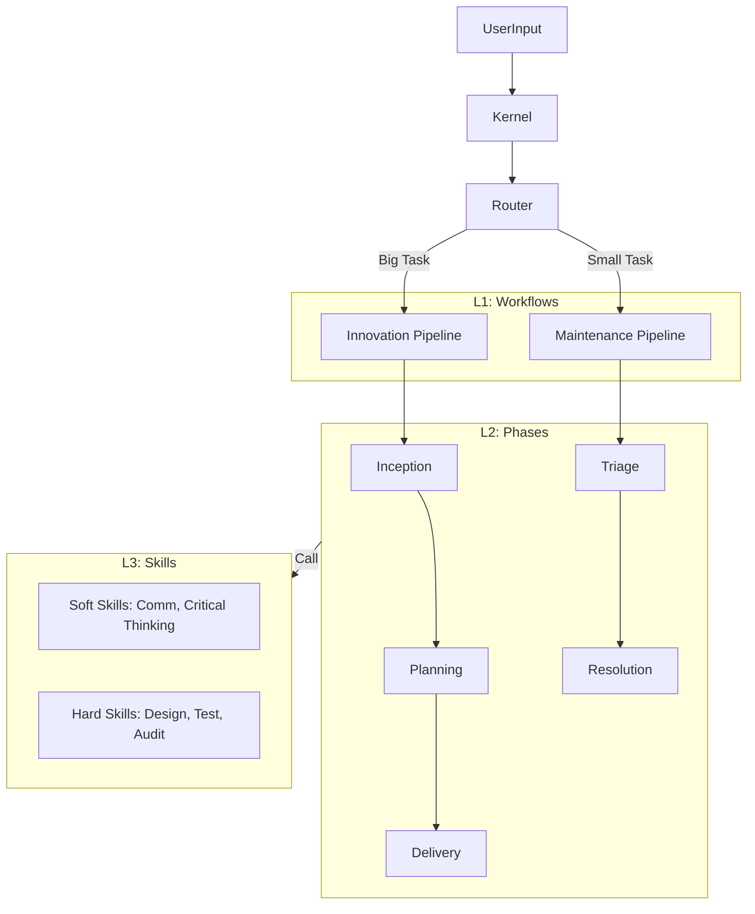

# The Conn v2.2 System Architecture

## 1. 核心设计理念 (Core Philosophy)
The Conn 是一个基于 **Workflow-Centric (工作流为中心)** 的智能软件工程引擎。它模拟了一支顶尖工程团队的协作模式，将复杂的软件开发过程抽象为 **编排 (Workflows)**、**阶段 (Phases)** 和 **技能 (Skills)** 三个层级。

### The Trinity Model (三位一体模型)
所有执行的基础都依赖于以下三要素的结合：
1.  **Persona (角色 - 主体)**: 谁在做？(Who) - 提供意图 (Intent) 和思维模式 (Mindset)。
2.  **Skill (技能 - 动词)**: 怎么做？(How) - 提供标准化的算法和步骤。
3.  **Domain (领域 - 副词)**: 在哪里做？(Where) - 提供战略上下文和约束规则。

---

## 2. 架构分层视图 (Layered View)



---

## 3. 详细层级说明 (Detailed Layers)

### Layer 0: Kernel (内核基础设施)
- **Path**: `engine/kernel/`
- **Responsibilities**:
    - **Boot**: 系统启动，加载上下文。
    - **Protocol**: 定义系统交互的 XML 协议。
    - **Registry**: 维护角色、领域和技能的注册表。

### Layer 1: Workflows (业务编排)
- **Path**: `engine/workflows/`
- **Definition**: 定义了不同类型任务的 **全生命周期 (Lifecycle)**。
- **Pipelines**:
    - **Innovation (创新流水线)**: `workflows/innovation/workflow.md`
        - 适用于：新功能开发、架构重构。
        - 特点：长周期，重设计，多角色协作。
    - **Maintenance (维护流水线)**: `workflows/maintenance/workflow.md`
        - 适用于：Bug 修复、配置调整、文档更新。
        - 特点：短周期，快速响应，自动化程度高。

### Layer 2: Phases (执行阶段)
- **Path**: `engine/workflows/*/` (inside pipeline folders)
- **Definition**: 流水线上的具体 **里程碑 (Milestones)**。
- **Key Phases**:
    - **Inception (创意)**: 澄清需求 (5W)，产出设计。
    - **Planning (规划)**: 拆解 User Story，生成 Task 清单。
    - **Delivery (交付)**: 编码实现，执行 E2E 测试，生成变更摘要。
    - **Triage (分诊)**: 分析 Bug 根因，判定修复策略。
    - **Resolution (解决)**: 应用修复，执行回归测试。

### Layer 3: Skills (原子能力)
- **Path**: `engine/skills/`
- **Definition**: 可复用的、标准化的 **思维算法 (Algorithms)**。
- **Library**:
    - **Core**: `Critical Thinking` (批判性思维), `Triage` (分诊), `Communication` (沟通)。
    - **Agile**: `User Story` (故事编写), `Acceptance` (验收标准)。
    - **Tech**: `System Design` (系统设计), `Testing` (测试策略), `Code Review` (代码审查), `Security Audit` (安全审计)。

---

## 4. 目录结构 (Directory Structure)

```text
.the_conn/
├── tc.md                       # 入口路由表
├── docs/                       # 系统文档
│   └── architecture.md         # (本文件)
├── engine/
│   ├── kernel/                 # 内核
│   ├── personas/               # 角色定义
│   ├── domains/                # 领域规则
│   ├── skills/                 # 技能库 (L3)
│   │   ├── core/
│   │   ├── agile/
│   │   └── tech/
│   └── workflows/              # 工作流 (L1) & 阶段 (L2)
│       ├── innovation/
│       │   ├── workflow.md     # Route 1 Orchestrator
│       │   ├── inception.md
│       │   ├── planning.md
│       │   └── delivery.md
│       └── maintenance/
│           ├── workflow.md     # Route 2 Orchestrator
│           ├── triage.md
│           └── resolution.md
└── runtime/                    # 运行时数据 (Context, Data, Workspace)
```
