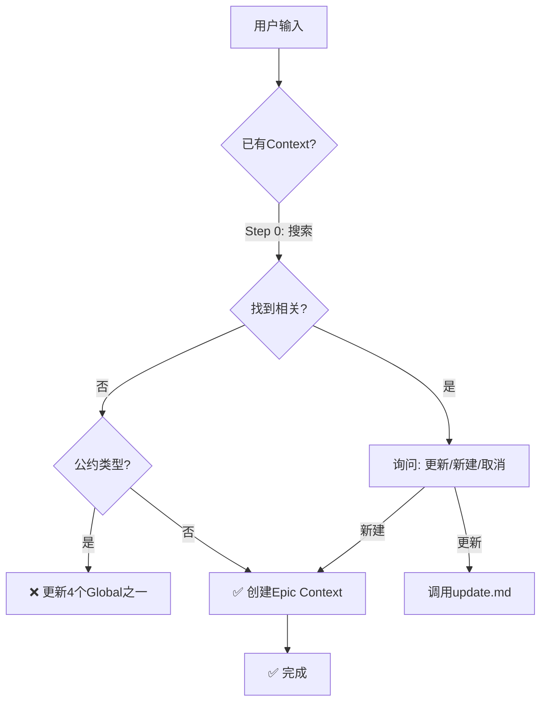
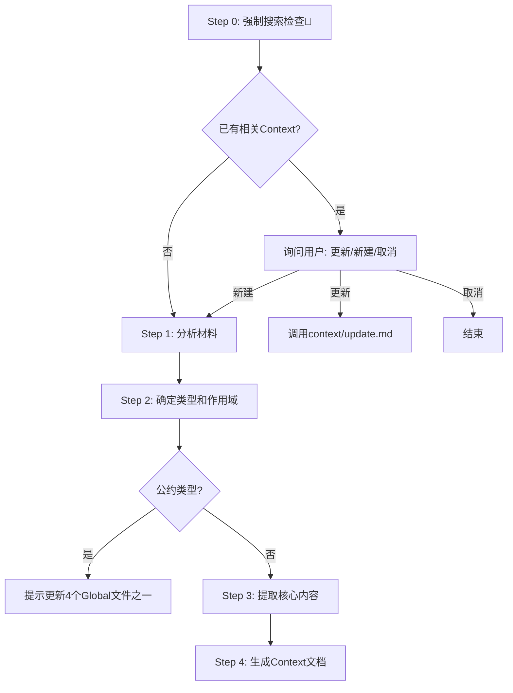

# Context 添加/提取指南

根据用户提供的内容或材料，创建新的 Context 文档。

## ⚠️ 重要：遵守基础公约

**本 Playbook 严格遵守 `@rules/base_rules.md` 中定义的所有基础公约。**

**📋 规范引用**：

本 Playbook 依赖以下规范文件（AI 必须先加载）：
- **基础公约**: `@rules/base_rules.md` - 禁止事项、文件路径约定、质量标准

本 Playbook **不依赖**以下规范：
- ❌ `test_strategy_rules.md` - Context 添加不涉及测试策略决策
- ❌ `bdd_language_rules.md` - Context 添加不涉及 BDD

**原因**: context/add 只负责创建 Context 文档，不涉及测试策略规划

## 本 Playbook 的工作范围

**专注于**：

- ✅ **直接添加**：用户已整理好内容，直接创建 Context
- ✅ **提取添加**：从技术方案、需求文档或架构讨论中提取关键设计信息，生成 Context 文档
- ✅ **智能判断**：AI 根据用户输入自动判断是直接添加还是提取添加

**重要**：Context 文档是**设计文档**，关注"是什么"和"为什么"，严格避免实现逻辑细节。

---

## 📋 速览（AI 快速决策）



**关键点**：
- ✅ **Step 0 强制搜索**：避免重复创建，必须先检查已有 Context
- ✅ **Global Context 固定 4 个**：Architecture / Tech_Stack / Testing_Strategy / Coding_Standard_*
- ✅ **公约类型必须归入 Global**：不创建新的 Global Context 文件
- ✅ **Epic Context 自由创建**：模块设计、数据模型、API 规范等

---

## 🚨 常见错误与解决方案

| #     | 错误类型                     | 错误表现                                      | 正确做法                                                          | 为什么错误                       |
| ----- | ---------------------------- | --------------------------------------------- | ----------------------------------------------------------------- | -------------------------------- |
| **1** | **跳过搜索检查**             | 直接创建 Context，未先搜索已有文档            | **Step 0 强制搜索**，确认无重复后再创建                           | 会导致重复内容，污染 Context 库  |
| **2** | **创建新的 Global Context**  | 创建了 `Security.md`、`Performance.md` 等     | **归入 4 个固定文件**，如 Security → Architecture.md              | Global Context 碎片化，难以管理  |
| **3** | **混淆两种模式**             | 用户提供已整理内容，却执行了提取流程          | **直接添加**：已整理内容直接创建<br/>**提取添加**：原始材料需提取 | 增加不必要的处理步骤，降低效率   |
| **4** | **包含实现细节**             | Context 中包含函数逻辑、循环语句、错误处理    | **只记录设计**：接口定义、职责、约束，不写实现                    | Context 是设计文档，不是代码手册 |
| **5** | **复制 Global Context 内容** | Epic Context 重复 Architecture 已有的架构内容 | **Epic Context 应引用 Global**，只记录 Epic 独有的差异            | 内容冗余，修改时需同步多处       |

---

## 使用场景

| 场景类型            | 典型情况                                                  | AI处理方式             |
| ------------------- | --------------------------------------------------------- | ---------------------- |
| **场景A: 直接添加** | 用户已整理好内容（架构设计/模块设计/API规范/Context补充） | 直接创建               |
| **场景B: 提取添加** | 用户提供原始材料（技术方案/架构讨论/PRD/技术调研）        | 提取关键设计信息后创建 |

---

## Context 类型系统

### 全局 Context (scope: global)

**⚠️ 重要：Global Context 固定为以下 4 个文件，不随意新增**

| Type               | 固定文件名                      | 内容归类规则                                                 |
| ------------------ | ------------------------------- | ------------------------------------------------------------ |
| `architecture`     | `Architecture.md`               | 系统设计、模块关系、通信方式、架构原则、部署方案、API 约定等 |
| `tech_stack`       | `Tech_Stack.md`                 | 语言、框架、工具、数据库、中间件等技术选型                   |
| `coding_standard`  | `Coding_Standard_{Language}.md` | 命名约定、错误处理、注释规范、最佳实践等                     |
| `testing_strategy` | `Testing_Strategy.md`           | 测试方法、覆盖率要求、BDD/TDD 策略、测试组织规范等           |

**⚠️ Global Context 添加规则**：
- ❌ 不创建新的 Global Context 文件
- ✅ 公约类型的内容必须归入已有的 4 个文件
- 🔄 使用 `@prompts/context/update.md` 更新已有文件，而不是创建新文件

**归类示例**：部署方案/API 约定/安全规范 → 更新 `Architecture.md` | 性能优化实践 → 更新 `Coding_Standard_{Language}.md`

### Epic Context (scope: epic:EPIC-XX)

| Type            | 典型文件名                | 说明     |
| --------------- | ------------------------- | -------- |
| `module_design` | `Module_Design_Init.md`   | 模块设计 |
| `data_model`    | `Data_Model_User.md`      | 数据模型 |
| `api_spec`      | `API_Spec_REST.md`        | API 规范 |
| `integration`   | `Integration_OAuth.md`    | 集成方案 |
| `algorithm`     | `Algorithm_Scheduling.md` | 算法说明 |
| `protocol`      | `Protocol_Design_UDP.md`  | 协议设计 |
| `migration`     | `Migration_V1_To_V2.md`   | 迁移方案 |

---

## 输入要求

| 模式         | 用户提供内容                                      | AI处理流程                                                             |
| ------------ | ------------------------------------------------- | ---------------------------------------------------------------------- |
| **直接添加** | Context类型/作用域/已整理内容                     | 直接创建                                                               |
| **提取添加** | 原始材料（技术方案/讨论/PRD/调研）+可选的类型提示 | Step 0搜索检查 → Step 1分析 → Step 2确定类型 → Step 3提取 → Step 4生成 |

---

## 执行流程（提取添加模式）



### 执行追踪

**AI 必须在执行过程中维护以下追踪表格**：

```markdown
## 🔄 Context 添加执行追踪

| Step | 内容              | 状态 | 输出 | 备注   |
| ---- | ----------------- | ---- | ---- | ------ |
| 0    | 强制搜索检查      | ⏳    | -    | 待开始 |
| 1    | 分析材料          | ⏳    | -    | 待开始 |
| 2    | 确定类型和作用域  | ⏳    | -    | 待开始 |
| 3    | 提取核心内容      | ⏳    | -    | 待开始 |
| 4    | 生成 Context 文档 | ⏳    | -    | 待开始 |

**图例**：✅ 已完成 | 🔄 进行中 | ⏳ 等待中 | ❌ 失败
```

**更新规则**：进入某Step → 🔄 | 完成某Step → ✅ | Step失败 → ❌

---

## Step 0: 强制搜索检查 🔴

**⚠️ 重要**: 在添加任何 Context 之前，**必须**先执行搜索检查，避免重复创建。

### 搜索流程

**Step 0.1: 提取搜索关键词**

参考 `@rules/keyword_extraction_rules.md` 从用户内容中提取 3-6 个关键词：

```
Step 1: 初步提取 → Step 2: 优先级排序 → Step 3: 归一化 → Step 4: 精简 → Step 5: 验证
```

**提取原则**: 技术术语优先（框架、库、架构模式） | 关键词数量: 3-6 个 | 统一格式: 小写、英文、单数形式 | 排除通用词（create, update 等）

**Step 0.2: 调用 Context 搜索**

调用 @playbooks/context/search.md：

```json
输入: {
  "keywords": ["关键词1", "关键词2", ...],
  "task_type": "context_add",
  "epic": "EPIC-XX",  // 如果是 Global Context，留空
  "type_filter": ["protocol", "module_design"]  // 可选
}

输出: {
  "contexts": ["路径1", "路径2", ...],
  "total": N,
  "message": "..."
}
```

**Step 0.3: 根据搜索结果决策**

| 搜索结果                              | AI 行动                                           |
| ------------------------------------- | ------------------------------------------------- |
| **找到高度相关** (total > 0)          | 询问用户：[1] 更新已有 / [2] 创建新 / [3] 取消    |
| **未找到相关** (total = 0)            | 继续 Step 1（安全创建）                           |
| **公约类型** (检测到 architecture 等) | 提示用户应更新对应的 4 个 Global Context 文件之一 |

---

## 输出要求

### 1. 文件路径格式

```
{Scope 目录}/{Type}_{Descriptor}.md
```

**全局 Context**: `.the_conn/context/global/{Type}_{Descriptor}.md`

**Epic Context**: `.the_conn/context/epics/EPIC-{序号}/{Type}_{Descriptor}.md`

**命名规则**:
- `{Type}`: 从类型枚举中选择（小写）
- `{Descriptor}`: 描述性名称，使用 PascalCase
- 特殊情况：纯类型名不加 Descriptor（如 `Architecture.md`）

**示例**:
- `.the_conn/context/global/Architecture.md`
- `.the_conn/context/epics/EPIC-01/Module_Design_Init.md`
- `.the_conn/context/epics/EPIC-02/Protocol_Design_UDP.md`

---

### 2. Frontmatter 规范

```yaml
---
type: {类型}
scope: {global 或 epic:EPIC-XX}
title: {标题}
created: {yyyy-mm-dd}
updated: {yyyy-mm-dd}
status: active
tags:
  - {tag1}
  - {tag2}
---
```

**字段说明**:

| 字段      | 类型   | 说明             | 示例                       | 必填 |
| --------- | ------ | ---------------- | -------------------------- | ---- |
| `type`    | enum   | Context 类型     | `architecture`             | 是   |
| `scope`   | string | 范围             | `global` 或 `epic:EPIC-01` | 是   |
| `title`   | string | 标题             | `系统架构设计`             | 是   |
| `created` | date   | 创建日期         | `2025-12-11`               | 是   |
| `updated` | date   | 最后更新日期     | `2025-12-11`               | 是   |
| `status`  | enum   | 状态             | `active` / `deprecated`    | 是   |
| `tags`    | array  | 标签（便于搜索） | `[microservices, grpc]`    | 否   |

**字段约束**:
- `type`: 必须从类型枚举中选择
- `scope`: 格式必须是 `global` 或 `epic:EPIC-{序号}`
- `created`: 创建时的日期
- `updated`: 初次创建时与 `created` 相同
- `status`: 新创建的 Context 都是 `active`
- `tags`: 可选但强烈推荐，有助于 Context 搜索

---

## 生成原则

**核心原则: Context 是设计文档，不是实现手册**

**⚠️ 添加前必须先检查已有 Context！**

### 通用原则

0. **避免重复 + Global Context 更新优先**:
   - 内部检查是否已有相关 Context
   - **如果是公约类型内容（架构、技术栈、编码规范、测试策略）**：
     - ❌ **不创建新的 Global Context 文件**
     - ✅ **必须使用 `@prompts/context/update.md` 更新已有的 4 个 Global Context 文件**
   - 如果与 global Context 重叠，Epic Context 应引用而非复制
   - 原则：**Global Context 固定 4 个文件，Epic Context 自由创建**

1. **类型准确**: 根据内容选择最合适的 type
2. **范围判断**: 
   - **公约类型** → 必须归入 global 的 4 个固定文件
   - **Epic 专属** → 可以创建新的 Epic Context 文件
3. **命名清晰**: Descriptor 应简洁明确，使用 PascalCase（仅 Epic Context）
4. **结构清晰**: 使用标题层级组织内容
5. **抽象层次**: 聚焦设计决策、接口约定、架构原则，**严格避免实现细节**
6. **聚焦"是什么"和"为什么"**: 记录设计意图和架构决策，而非"怎么做"
7. **保持精简**: 只包含 AI 理解设计所必需的信息

### 提取添加特定原则

| 原则           | 说明                                                                     |
| -------------- | ------------------------------------------------------------------------ |
| **提取优先级** | 设计决策优先/接口和边界/约束和原则/架构层面                              |
| **避免重复**   | Global已有的内容Epic应引用而非复制/只提取Epic独有的、差异化的设计内容    |
| **粒度适中**   | 一个Context聚焦一个主题/简单主题(如"Go编码规范"):1个/复杂主题:拆分为多个 |

**应该记录的内容**:
- ✅ 设计决策和理由（"选择异步架构是因为..."）
- ✅ 模块职责和边界（"认证模块负责..."）
- ✅ 接口定义和约定（"API 返回格式为..."）
- ✅ 数据结构和模型（"用户实体包含字段..."）
- ✅ 约束和要求（"响应时间不超过 100ms"）

**严格禁止的内容**:
- ❌ 代码实现逻辑（"在函数内部先判断..."）
- ❌ 算法步骤细节（"使用循环遍历数组..."）
- ❌ 变量和函数命名（"定义变量 x = ..."）
- ❌ 错误处理实现（"try-catch 捕获异常..."）
- ❌ 日志和调试信息（"打印日志到控制台..."）

---

## 内容结构模板

### 架构/设计类 (architecture, module_design, protocol)

```markdown
# {标题}

## 1. 概述与目标

{简要说明设计目标和适用场景，1-3 句话}

## 2. 核心设计

### 2.1 {设计要点1}

{说明}

### 2.2 {设计要点2}

{说明}

## 3. 技术选型（如适用）

| 类别   | 选择   | 理由         |
| ------ | ------ | ------------ |
| {类别} | {技术} | {为什么选择} |

## 4. 接口定义（如适用）

{API 签名、模块接口、数据结构定义}

## 5. 关键约束

- {设计约束、性能要求、安全要求}
- {技术限制、依赖要求}

## 6. 注意事项

- {使用注意事项、已知限制}

---

**注意**: 保持在设计和架构层面，避免深入具体实现逻辑
```

---

### API/数据模型类 (api_spec, data_model, api_convention)

```markdown
# {标题}

## 1. 概述

{API/模型用途，1-2 句话}

## 2. 定义

### 2.1 {接口/模型1}

{定义或签名}

### 2.2 {接口/模型2}

{定义或签名}

## 3. 示例

{使用示例，帮助理解}

## 4. 约束与规则

- {验证规则}
- {限制条件}
```

---

### 集成/迁移/部署类 (integration, migration, deployment)

```markdown
# {标题}

## 1. 背景

{为什么需要，1-3 句话}

## 2. 方案概述

{方案简要说明}

## 3. 关键步骤

1. {步骤1}
2. {步骤2}

## 4. 配置说明（如适用）

{配置项说明}

## 5. 风险与对策

| 风险   | 影响   | 应对措施 |
| ------ | ------ | -------- |
| {风险} | {影响} | {措施}   |
```

---

### 规范/策略类 (coding_standard, testing_strategy, domain_model)

```markdown
# {标题}

## 1. 目标

{规范的目的}

## 2. 规则

### 2.1 {规则类别1}

{具体规则}

### 2.2 {规则类别2}

{具体规则}

## 3. 示例

**好的做法**:

```{language}
{示例代码}
```

**不好的做法**:

```{language}
{示例代码}
```

## 4. 检查清单

- [ ] {检查项1}
- [ ] {检查项2}
```

---

## 示例模板

### 示例 1: Global Context - 编码规范

**文件**: `.the_conn/context/global/Coding_Standard_Go.md`

```markdown
---
type: coding_standard
scope: global
title: Go 编码规范
created: 2025-12-11
updated: 2025-12-11
status: active
tags:
  - golang
  - coding-style
---

# Go 编码规范

## 1. 目标

确保 Go 代码风格统一，提高可读性和可维护性。

## 2. 规则

### 2.1 命名约定

- **变量**: 驼峰命名，首字母小写（如 `userName`）
- **常量**: 驼峰命名，首字母大写（如 `MaxRetries`）

### 2.2 错误处理

- 不忽略错误，明确处理或返回
- 使用 `fmt.Errorf()` 添加上下文

## 3. 示例

**好的做法**:

```go
func GetUser(id int) (*User, error) {
    user, err := db.Query(id)
    if err != nil {
        return nil, fmt.Errorf("failed to get user %d: %w", id, err)
    }
    return user, nil
}
```

## 4. 检查清单

- [ ] 所有导出函数都有注释
- [ ] 所有错误都被处理
```

---

### 示例 2: Epic Context - 模块设计

**文件**: `.the_conn/context/epics/EPIC-01/Module_Design_Init.md`

```markdown
---
type: module_design
scope: epic:EPIC-01
title: 初始化模块设计
created: 2025-12-11
updated: 2025-12-11
status: active
tags:
  - initialization
  - cli
---

# 初始化模块设计

## 1. 概述与目标

提供 CLI 命令一键创建 The Conn 框架的标准目录结构。

## 2. 核心设计

### 2.1 幂等性设计

重复执行不覆盖已有文件：
- 检查目标文件是否存在
- 存在则跳过，输出提示
- 不存在则创建

## 3. 接口设计

```python
def init_project(target_path: Path, overwrite: bool = False) -> InitResult:
    """初始化 The Conn 项目结构"""
```

## 4. 关键约束

- 路径处理需跨平台兼容
- 需要检查目标目录写权限
```

---

### 示例 3: Epic Context - 协议设计

**文件**: `.the_conn/context/epics/EPIC-02/Protocol_Design_UDP.md`

```markdown
---
type: protocol
scope: epic:EPIC-02
title: UDP 可靠传输协议设计
created: 2025-12-11
updated: 2025-12-11
status: active
tags:
  - udp
  - reliability
---

# UDP 可靠传输协议设计

## 1. 概述与目标

解决 UDP 丢包问题，实现 99.9% 事件到达率，无需 ACK 等待，低延迟。

## 2. 核心设计

### 2.1 协议结构

```json
{
  "h": {
    "seq": 5001,
    "ts": 1699999001
  },
  "d": [{"id": 101, "event": "..."}]
}
```

### 2.2 冗余策略

每个 Event 发送 3 次：
- **T+0ms**: 首次发送
- **T+20ms**: 第 1 次冗余
- **T+40ms**: 第 2 次冗余

## 3. 技术选型

| 类别     | 选择 | 理由             |
| -------- | ---- | ---------------- |
| 编码格式 | JSON | 易调试、跨语言   |
| 冗余间隔 | 20ms | 平衡延迟和可靠性 |

## 4. 关键约束

- seq 序列号: 64 位整数，避免溢出
- Event id: 全局唯一性要求（UUID）
```

---

## 常见问题

| 问题                                             | 答案                                                                                                                                                                                                                                                                                                                                                       |
| ------------------------------------------------ | ---------------------------------------------------------------------------------------------------------------------------------------------------------------------------------------------------------------------------------------------------------------------------------------------------------------------------------------------------------- |
| **何时使用 add.md，何时使用 extract.md？**       | **add.md**: 用户已经整理好内容，直接创建 Context<br/>**extract.md**: 用户提供原始材料（技术方案、讨论记录），需要 AI 提取关键信息                                                                                                                                                                                                                          |
| **如何避免重复创建 Context？**                   | **添加前必须先检查**！<br/>1. 使用 `@prompts/context/search.md` 搜索相关主题<br/>2. **如果是公约类型内容**：❌ 不创建新的 Global Context 文件 ✅ 使用 `@prompts/context/update.md` 更新已有的 4 个 Global Context 文件<br/>3. Epic Context 应引用 global Context，而非复制内容<br/>4. 原则：**Global Context 固定 4 个，Epic Context 可自由创建**            |
| **Global Context 为什么固定为 4 个文件？**       | **避免文件碎片化**：所有公约类型内容集中管理<br/>**便于查找和维护**：4 个文件覆盖所有全局规范<br/>**减少上下文冗余**：Task 加载时只需这 4 个核心文件<br/>**归类原则**：架构/设计/部署/API 约定 → `Architecture.md` \| 技术选型/工具/框架 → `Tech_Stack.md` \| 编码规范/最佳实践 → `Coding_Standard_{Language}.md` \| 测试方法/策略 → `Testing_Strategy.md` |
| **如果需要添加安全规范、性能优化等内容怎么办？** | 归入已有的 4 个文件：<br/>安全规范 → 更新 `Architecture.md` 添加"安全设计"章节<br/>性能优化 → 更新 `Coding_Standard_{Language}.md` 添加"性能优化"章节<br/>部署方案 → 更新 `Architecture.md` 添加"部署架构"章节<br/>API 约定 → 更新 `Architecture.md` 添加"API 设计约定"章节                                                                                |
| **如何判断 Context 是 global 还是 epic？**       | **Global**: 多个 Epic 都会用到 → **必须归入 4 个固定文件**<br/>**Epic**: 仅特定 Epic 使用 → **可以自由创建新文件**                                                                                                                                                                                                                                         |
| **一个主题应该创建一个 Context 还是多个？**      | 根据主题复杂度：<br/>简单主题（如 "Go 编码规范"）: 一个 Context<br/>复杂主题（如 "微服务架构 + gRPC 协议 + 数据模型"）: 拆分为多个 Context                                                                                                                                                                                                                 |
| **Context 内容应该多详细？**                     | 足够让 AI 理解设计意图即可：<br/>✅ 包含：设计决策、技术选型理由、接口约定、架构原则<br/>❌ 不包含：项目背景故事、冗长的讨论过程、显而易见的常识、具体实现细节                                                                                                                                                                                               |

---

## 执行检查点

### ✓ 检查点 0: 强制搜索完成

**已完成**:
- [x] 提取搜索关键词
- [x] 调用 context/search.md
- [x] 分析搜索结果
- [x] 用户确认操作（创建新文件 / 更新已有 / 取消）

**产出**: 搜索执行记录 | 决策依据

**下一步**: 如果选择创建 → 继续 Step 1 | 如果选择更新 → 调用 context/update.md | 如果选择取消 → 结束操作

---

### ✓ 检查点 1: 材料分析完成

**已完成**:
- [x] 识别知识类型
- [x] 判断作用范围（global / epic）
- [x] 提取关键决策和技术要点

**产出**: Context 类型确认 | 作用域确认

**下一步**: 确定 Context 类型和作用域

---

### ✓ 检查点 2: 类型和作用域确定完成

**已完成**:
- [x] 确定 Context type
- [x] 确定 Context scope
- [x] 确定文件路径和命名

**产出**: 文件路径: `.the_conn/context/{scope}/{type}_{descriptor}.md`

**下一步**: 提取核心内容

---

### ✓ 检查点 3: 核心内容提取完成

**已完成**:
- [x] 提取设计决策和理由
- [x] 提取接口和边界
- [x] 提取约束和原则
- [x] 过滤实现细节（确保只保留设计层面）

**产出**: 结构化的 Context 内容

**下一步**: 生成 Context 文档

---

### ✓ 检查点 4: Context 文档生成完成

**已完成**:
- [x] 生成 Frontmatter
- [x] 生成文档正文
- [x] 应用对应模板
- [x] 验证内容抽象层次

**产出**: 完整的 Context 文档 | 文件路径: `.the_conn/context/{scope}/{type}_{descriptor}.md`

**质量检查**:
- [ ] Frontmatter 字段完整且正确
- [ ] 内容聚焦设计，无实现细节
- [ ] 文件命名符合规范（PascalCase）
- [ ] 文件保存在正确的目录

**任务完成**

---

## 快速自检清单

AI 在创建 Context 前必须检查：

- [ ] 我执行了**Step 0 强制搜索检查**（避免重复）
- [ ] 如果是公约类型内容，我**选择更新 4 个 Global Context 文件之一**（不创建新的）
- [ ] 我区分了**直接添加**和**提取添加**模式
- [ ] 我的 Context 内容**聚焦设计**（无实现细节）
- [ ] 我的 Frontmatter **字段完整且正确**（type, scope, title, tags）

---

现在，请根据用户提供的信息创建 Context 文档。

**🔴 强制要求**: 开始前必须先执行 Step 0 强制搜索检查！

