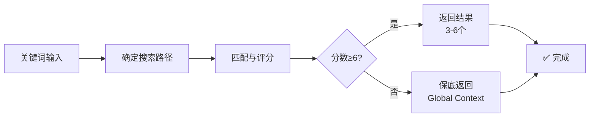
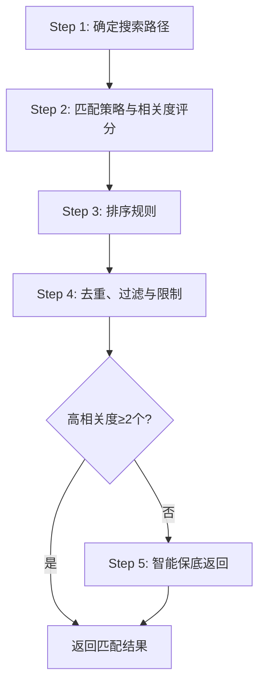

# Context 搜索指南

你是一位 AI 助手，负责为开发任务搜索相关的 Context 文档。本指南提供标准化的 Context 搜索逻辑。

## ⚠️ 重要：遵守基础公约

**本 Playbook 严格遵守 `@rules/base_rules.md` 中定义的所有基础公约。**

## 用途

为 AI 提供 Context 文档搜索逻辑，供其他 playbook（如 `task_generation.md`）引用。

---

## 📋 速览（AI 快速决策）



**关键点**：
- ✅ **相关度阈值 ≥ 6**：文件名匹配（7-10分）或 Frontmatter 匹配（6分）
- ✅ **数量控制**：建议 3-6 个，绝对上限 8 个（宁缺毋滥）
- ✅ **保底机制**：无高相关度结果时，根据任务类型返回 Global Context
- ✅ **跨 Epic 搜索**：不局限于当前 Epic，关键词匹配其他 Epic 也返回

---

## 输入参数

| 参数          | 类型   | 必需 | 说明                                                                                                                   |
| ------------- | ------ | ---- | ---------------------------------------------------------------------------------------------------------------------- |
| `keywords`    | array  | ✅    | 技术关键词数组（3-6 个），参考 `@rules/keyword_extraction_rules.md`                                                    |
| `task_type`   | string | ✅    | 任务类型：`requirements_review`/`task_generation`/`context_add`/`quick_change`/`e2e_test`/`performance_test`/`general` |
| `epic`        | string | ❌    | Epic ID（如 `EPIC-01`），用于限定搜索范围                                                                              |
| `type_filter` | array  | ❌    | Context 类型过滤：`architecture`/`tech_stack`/`module_design`/`data_model`/`testing_strategy`/`coding_standard`        |

---

## 标准调用接口

### 输入格式（JSON）

```json
{
  "keywords": ["keyword1", "keyword2", "keyword3"],
  "task_type": "requirements_review",
  "epic": "EPIC-01",
  "type_filter": ["module_design", "architecture"]
}
```

### 输出格式（JSON）

```json
{
  "contexts": [
    ".the_conn/context/global/Architecture.md",
    ".the_conn/context/global/Tech_Stack.md",
    ".the_conn/context/epics/EPIC-01/Module_Design_Auth.md"
  ],
  "total": 3,
  "task_type": "requirements_review",
  "search_keywords": ["authentication", "jwt", "redis"],
  "message": "找到 3 个匹配的 Context"
}
```

---

## 🚨 常见错误与解决方案

| #     | 错误类型             | 错误表现                               | 正确做法                                             | 为什么错误                               |
| ----- | -------------------- | -------------------------------------- | ---------------------------------------------------- | ---------------------------------------- |
| **1** | **过度匹配**         | 返回了 10+ 个低相关度文档              | **相关度阈值 ≥ 6**，只返回 3-6 个                    | 低相关度文档会导致注意力漂移             |
| **2** | **仅搜索当前 Epic**  | 只返回当前 Epic 的 Context             | **跨 Epic 搜索**，其他 Epic 的高相关度文档也返回     | 功能经常跨 Epic 依赖或复用               |
| **3** | **无结果就返回空**   | 关键词未匹配就返回空数组               | **保底机制**：根据任务类型返回 Global Context        | 某些任务（如需求评审）需要基础架构信息   |
| **4** | **内容匹配权重过高** | 返回了仅内容提到关键词的文档（分数 3） | **只返回分数 ≥ 6 的文档**（文件名/Frontmatter 匹配） | 内容匹配可能只是略微提到，不代表真正相关 |
| **5** | **未控制数量**       | 返回所有匹配的文档（如 15 个）         | **数量限制**：建议 3-6 个，绝对上限 8 个             | 过多文档导致 Token 浪费和注意力分散      |

---

## 搜索流程



### Step 1: 确定搜索路径

**搜索范围**（总是搜索所有相关路径）:

```
1. .the_conn/context/global/
2. .the_conn/context/epics/EPIC-XX/ (所有 Epic 目录)
```

**重要说明**：
- ✅ **不局限于当前 Epic**：关键词匹配到其他 Epic 的 Context 也应返回（理由：很多功能会跨 Epic 依赖或复用设计）
- ✅ **Global Context 类型限制**：只包含 `Architecture.md`/`Tech_Stack.md`/`Testing_Strategy.md`/`Coding_Standard_{Language}.md`
- ✅ **Epic Context 类型**：可以有各种具体设计文档（`Module_Design_*.md`/`Data_Model_*.md`/`API_Design_*.md` 等）

**搜索优先级**：Global Context > 当前 Epic Context > 其他 Epic Context

---

### Step 2: 匹配策略与相关度评分

**按优先级顺序匹配，并计算相关度分数**：

| 优先级 | 匹配类型         | 权重 | 说明                                                  |
| ------ | ---------------- | ---- | ----------------------------------------------------- |
| 1      | 文件名精确匹配   | 10   | 关键词**完全匹配**文件名中的单词（不区分大小写）      |
| 2      | 文件名部分匹配   | 7    | 关键词是文件名的一部分                                |
| 3      | Frontmatter 匹配 | 6    | 关键词匹配 tags 数组中的任一标签 or 出现在 title 字段 |
| 4      | 内容匹配         | 3    | 关键词出现在章节标题或前 500 字符内容中               |

**相关度阈值**: ✅ 只返回相关度分数 ≥ 6 的文件 | ❌ 不返回仅内容匹配（权重 3）的文件

---

### Step 3: 排序规则

**对匹配结果按以下规则排序**：

1. **相关度分数**（权重最高）：文件名精确匹配（10 分）> 文件名部分匹配（7 分）> Frontmatter 匹配（6 分）
2. **Context 范围**（次要）：Global Context > 当前 Epic Context > 其他 Epic Context
3. **更新时间**（最后）：如果 Frontmatter 有 `updated` 字段，优先返回最近更新的文档

---

### Step 4: 去重、过滤与限制

| 步骤           | 规则                                                                                                                 |
| -------------- | -------------------------------------------------------------------------------------------------------------------- |
| **去重**       | 同一文件只返回一次                                                                                                   |
| **相关度过滤** | **只返回相关度分数 ≥ 6 的文件** / 剔除低相关度文件（仅内容匹配，分数 < 6）                                           |
| **数量限制**   | **精确控制返回数量**：建议返回 **3-6 个**最相关的文件<br/>**绝对上限**：8 个文件<br/>高相关度 > 6 个 → 严格取前 6 个 |

**克制原则**：
- ✅ 宁缺毋滥：只返回真正需要的 Context
- ❌ 不要"可能有用就返回"：避免注意力漂移
- ❌ 不要"关联度很低但确实有点关联"就全部返回

---

### Step 5: 智能保底返回机制

**触发条件**：高相关度（分数 ≥ 6）匹配结果 < 2 个 且 `.the_conn/context/global/` 目录存在

**按任务类型推断需要的 Context**

| 任务类型              | 保底返回的文件                           | 理由                                    |
| --------------------- | ---------------------------------------- | --------------------------------------- |
| `requirements_review` | Architecture.md<br/>Tech_Stack.md        | 需求评审需要了解整体架构和可用技术栈    |
| `task_generation`     | Architecture.md<br/>Coding_Standard_*.md | Task 生成需要了解架构和编码规范         |
| `quick_change`        | 仅关键词匹配的结果                       | Bug/Hotfix 通常只需要相关模块的 Context |
| `e2e_test`            | Architecture.md<br/>Testing_Strategy.md  | E2E 测试需要了解架构和测试策略          |
| `performance_test`    | Architecture.md<br/>Testing_Strategy.md  | 性能测试需要了解架构和测试策略          |
| `general`             | Architecture.md<br/>Tech_Stack.md        | 通用搜索返回基础 Context                |

**保底返回规则**：
1. 根据任务类型确定需要返回的 **Global Context 文件**（⚠️ 保底返回**只从 Global Context 中选择**）
2. 检查文件是否存在，只返回存在的文件
3. 如果任务类型建议的 Global Context 文件都不存在，返回空结果

---

## 输出格式

### 成功返回（精确匹配）

```json
{
  "contexts": [
    ".the_conn/context/global/Architecture.md",
    ".the_conn/context/global/Tech_Stack.md",
    ".the_conn/context/epics/EPIC-01/Module_Design_Auth.md"
  ],
  "total": 3,
  "search_keywords": ["authentication", "JWT"],
  "message": "找到 3 个匹配的 Context"
}
```

### 保底返回（无精确匹配）

```json
{
  "contexts": [
    ".the_conn/context/global/Architecture.md",
    ".the_conn/context/global/Tech_Stack.md"
  ],
  "total": 2,
  "search_keywords": ["unknown_keyword"],
  "message": "未找到精确匹配，返回通用 Global Context"
}
```

### 完全无 Context

```json
{
  "contexts": [],
  "total": 0,
  "search_keywords": ["unknown_keyword"],
  "message": "项目尚未建立 Context，建议使用 @playbooks/context/add.md 创建"
}
```

---

## 关键词提取建议

**从 Story 或任务描述中提取关键词时，应包括**：

1. **技术术语**：编程语言、框架、库名称（示例：`Python`, `Flask`, `JWT`, `Redis`）
2. **功能模块**：业务领域或模块名称（示例：`authentication`, `payment`, `notification`）
3. **架构组件**：系统架构相关术语（示例：`API`, `database`, `cache`, `message queue`）
4. **设计模式**：如果 Story 涉及特定设计模式（示例：`factory pattern`, `singleton`, `repository`）

**关键词提取原则**：
- ✅ 提取专业术语，避免通用词汇（如"实现"、"开发"）
- ✅ 包含同义词和缩写（如 `auth` 和 `authentication`）
- ✅ 保持 3-6 个关键词（避免过多或过少）

---

## 使用示例

### 示例 1: requirements_review 需求评审（跨 Epic 搜索）

```
用户输入: "我要在订单系统中实现用户认证"
当前 Epic: EPIC-02 (订单管理)

AI 执行:
1. 提取关键词: ["authentication", "user", "order"]
2. 调用 search.md:
   - 关键词: ["authentication", "user", "order"]
   - 任务类型: requirements_review
   - Epic: EPIC-02

搜索过程:
- 搜索 Global Context: 找到 Architecture.md, Tech_Stack.md
- 搜索 EPIC-01 (用户管理): 找到 Module_Design_Auth.md（文件名匹配 "auth", 分数 10）
- 搜索 EPIC-02 (订单管理): 找到 Module_Design_Order.md（文件名匹配 "order", 分数 10）
- 搜索 EPIC-03 (支付): 找到 Payment_Integration.md（内容中提到 "authentication", 分数 3）

相关度过滤:
- ✅ 保留: Architecture.md, Tech_Stack.md, Module_Design_Auth.md, Module_Design_Order.md (分数 ≥ 6)
- ❌ 剔除: Payment_Integration.md (分数 3 < 6，仅内容提到)

返回结果（跨 Epic）:
{
  "contexts": [
    ".the_conn/context/global/Architecture.md",
    ".the_conn/context/global/Tech_Stack.md",
    ".the_conn/context/epics/EPIC-01/Module_Design_Auth.md",  ← 来自其他 Epic
    ".the_conn/context/epics/EPIC-02/Module_Design_Order.md"
  ],
  "total": 4,
  "task_type": "requirements_review",
  "message": "找到 4 个匹配的 Context（包含跨 Epic）"
}

AI 行为:
- 复用 EPIC-01 的认证设计，避免重复设计
- 了解 EPIC-02 订单模块的现有设计
```

### 示例 2: task_generation Task 生成

```
Story 内容: "实现用户登录 API"

AI 执行:
1. 提取关键词: ["login", "API", "authentication"]
2. 调用 search.md:
   - 关键词: ["login", "API", "authentication"]
   - 任务类型: task_generation
   - Epic: EPIC-01

返回结果:
{
  "contexts": [
    ".the_conn/context/global/Architecture.md",
    ".the_conn/context/global/Coding_Standard_Python.md",
    ".the_conn/context/epics/EPIC-01/Module_Design_Auth.md"
  ],
  "total": 3,
  "task_type": "task_generation"
}

后续操作:
将返回的 Context 写入 context.manifest.json 的 contexts 数组
```

### 示例 3: quick_change Bug 修复

```
用户输入: "STORY-03 登录时密码验证失败"

AI 执行:
1. 提取关键词: ["login", "password", "validation"]
2. 调用 search.md:
   - 关键词: ["login", "password", "validation"]
   - 任务类型: quick_change
   - Epic: EPIC-01（从 STORY-03 获取）

返回结果（假设未找到精确匹配）:
{
  "contexts": [],
  "total": 0,
  "task_type": "quick_change",
  "message": "未找到精确匹配，quick_change 任务不使用保底返回"
}

AI 行为:
- 不加载额外的 Context（Bug 修复通常只需要代码本身）
- 直接分析 STORY-03 和相关代码
```

### 示例 4: e2e_test E2E 测试规划（保底返回）

```
Feature 内容: "新功能的端到端测试"

AI 执行:
1. 提取关键词: ["new_feature", "workflow"]
2. 调用 search.md:
   - 关键词: ["new_feature", "workflow"]
   - 任务类型: e2e_test
   - Epic: EPIC-01

搜索结果:
- 未找到高相关度匹配（分数 ≥ 6）

触发保底返回:
- 任务类型 e2e_test 需要: Architecture.md, Testing_Strategy.md
- 检查文件存在，返回这两个文件

返回结果:
{
  "contexts": [
    ".the_conn/context/global/Architecture.md",
    ".the_conn/context/global/Testing_Strategy.md"
  ],
  "total": 2,
  "task_type": "e2e_test",
  "message": "未找到精确匹配，根据任务类型返回相关 Global Context"
}

说明:
- ✅ 只返回任务需要的 Global Context（Architecture, Testing_Strategy）
- ❌ 不返回 Tech_Stack.md（E2E 测试不需要）
- ❌ 不返回 Coding_Standard（E2E 测试不需要）
```

### 示例 5: 相关度过滤（避免低相关度文档）

```
用户输入: "实现支付功能"

AI 执行:
1. 提取关键词: ["payment", "transaction"]
2. 调用 search.md:
   - 关键词: ["payment", "transaction"]
   - 任务类型: task_generation
   - Epic: EPIC-03

搜索结果:
- Payment_Design.md (文件名精确匹配 "payment", 分数 10) ✅
- Transaction_Model.md (文件名精确匹配 "transaction", 分数 10) ✅
- Order_Management.md (Frontmatter tags 包含 "payment", 分数 6) ✅
- User_Profile.md (内容中某一段提到 "transaction history", 分数 3) ❌
- System_Log.md (内容中某一段提到 "payment logs", 分数 3) ❌

相关度过滤（阈值 ≥ 6）:
- ✅ 保留: Payment_Design.md, Transaction_Model.md, Order_Management.md
- ❌ 剔除: User_Profile.md, System_Log.md（仅略微提到，分数 < 6）

返回结果（克制原则）:
{
  "contexts": [
    ".the_conn/context/epics/EPIC-03/Payment_Design.md",
    ".the_conn/context/epics/EPIC-03/Transaction_Model.md",
    ".the_conn/context/epics/EPIC-02/Order_Management.md"
  ],
  "total": 3,
  "task_type": "task_generation",
  "message": "找到 3 个高相关度匹配"
}

避免的问题:
- ❌ 不返回 User_Profile.md（虽然提到 transaction history，但不是核心内容）
- ❌ 不返回 System_Log.md（虽然提到 payment logs，但关联度很低）
- ✅ 避免注意力漂移和 Tokens 爆炸
```

---

## 搜索优化建议

### 提高匹配准确性

1. **使用同义词扩展**：`auth` ↔ `authentication` | `db` ↔ `database` | `msg` ↔ `message`
2. **忽略停用词**：过滤：`the`, `a`, `an`, `of`, `for`, `to`
3. **支持模糊匹配**：`authentication` 可匹配 `Authentication_Design.md` | `user` 可匹配 `User_Management.md`

### 避免过度匹配

- ❌ 不要返回完全无关的文档
- ✅ 如果没有高质量匹配，宁可返回空结果

---

## 注意事项

1. **Context 不存在的情况**：
   - 如果 `.the_conn/context/` 目录为空或不存在，返回空结果
   - 提示用户使用 `@playbooks/context/add.md` 创建 Context

2. **Epic Context 缺失的情况**：
   - 如果指定了 Epic 但该 Epic 没有 Context，只搜索 Global Context

3. **性能考虑**：
   - 优先使用文件名和 Frontmatter 匹配（快速）
   - 内容匹配仅扫描文件前 500 字符（避免读取大文件）

4. **与其他工具的配合**：
   - 搜索结果应与 `context.manifest.json` 格式兼容
   - 搜索结果可被 `task_generation.md` 直接使用

---

## 快速自检清单

AI 在执行搜索前必须检查：

- [ ] 我设置了**相关度阈值 ≥ 6**（只返回文件名或 Frontmatter 匹配）
- [ ] 我的搜索范围包括**所有 Epic**（不局限于当前 Epic）
- [ ] 我控制了**返回数量**（建议 3-6 个，上限 8 个）
- [ ] 如果高相关度结果 < 2 个，我触发了**保底返回机制**
- [ ] 我遵循了**宁缺毋滥**原则（低相关度的不返回）

---

现在，请根据提供的关键词和参数执行 Context 搜索。

