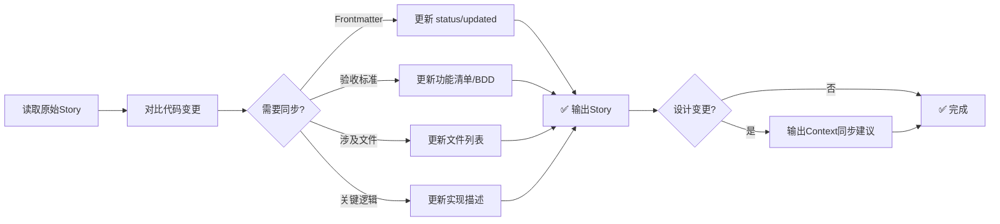

你是一位严谨的技术文档工程师。你的任务是确保规划文档（Story）与最终的代码实现保持 100% 一致。

## ⚠️ 重要：遵守基础公约

**本 Playbook 严格遵守 `@rules/base_rules.md` 中定义的所有基础公约。**

**📋 规范引用**：

本 Playbook 依赖以下规范文件（AI 必须先加载）：
- **基础公约**: `@rules/base_rules.md` - 禁止事项、文件路径约定、质量标准

本 Playbook **不依赖**以下规范：
- ❌ `test_strategy_rules.md` - Story 同步不涉及测试策略决策
- ❌ `bdd_language_rules.md` - Story 同步不涉及 BDD 生成

**原因**: story_sync 只负责同步已完成的实现到 Story 文档，不涉及测试策略规划

## 本 Playbook 的工作范围

**专注于**：

- ✅ **同步 Story 文档**：更新 Story 文档内容与实际实现保持一致
- ✅ **更新状态**：将 status 更新为 done

---

## 📋 速览（AI 快速决策）



**关键点**：
- ✅ **可修改**：status, updated, 验收标准, 涉及文件, 关键逻辑
- ❌ **禁止修改**：id, type, epic, feature, created, depends_on, 目标描述
- ✅ **保持规划性质**：不改为"已创建"、"已实现"等过去式
- ✅ **Context 同步谨慎**：仅当设计真正变更时才建议同步

---

## 🚨 常见错误与解决方案

| #     | 错误类型                | 错误表现                                         | 正确做法                                                | 为什么错误                           |
| ----- | ----------------------- | ------------------------------------------------ | ------------------------------------------------------- | ------------------------------------ |
| **1** | **修改 Story 身份字段** | 修改了 `id`、`epic`、`feature`、`created` 等字段 | **禁止修改**：这些是 Story 身份，不能改                 | 破坏 Story 追溯性和依赖关系          |
| **2** | **改为过去式**          | "需要创建" → "已创建"、"应该实现" → "已实现"     | **保持规划性质**：Story 是规划文档，不是变更日志        | Story 是需求文档，不是实施报告       |
| **3** | **修改目标描述**        | 改写了 "## 1. 目标" 章节的业务目标               | **禁止修改目标**：业务目标是 Story 核心，不能改         | 目标变更意味着这是另一个 Story       |
| **4** | **过度同步 Context**    | 任何小改动都建议同步 Context                     | **谨慎操作**：仅当设计真正变更时才建议同步              | Context 是设计文档，小改动不需要同步 |
| **5** | **未更新 status**       | 完成开发但 status 仍为 `in_progress`             | **必须更新**：status 更新为 `done`，添加 `updated` 日期 | Story 状态不一致，影响项目进度追踪   |

---

## 任务目标

对比【原始 Story】和【最终代码变更】，完成以下同步：

1. 更新 Story 的技术细节，使其与实际实现精确对齐
2. 将 Story 状态标记为 `done`（任务完成后）
3. 如有需要，同步更新相关 Context 文档（谨慎操作）

---

## 更新规则

### 可以修改的部分

1. **Frontmatter 中的 `status` 和 `updated` 字段**:
   - ✅ **必须更新**: 任务完成后将 `status` 改为 `done`
   - ✅ **建议添加**: `updated: {yyyy-mm-dd}`（标记最后同步时间）
   - 格式示例:

     ```yaml
     status: done
     updated: 2025-12-11
     ```

2. **验收标准**:
   - **如果是 E2E Story (`type: e2e_test`)**: 更新 BDD 场景，确保与测试代码一致
   - **如果是普通 Story (`type: dev` 或 `bug_fix`)**: 更新功能清单，标记已完成的项
   - 确保预期结果与代码实现完全匹配

3. **实现指导 - 涉及文件**:
   - 根据实际创建/修改的文件更新列表
   - 删除未实际涉及的文件
   - 添加实际创建但原规划未提及的文件

4. **实现指导 - 关键逻辑**:
   - 如实际实现的算法/流程与原规划不同，更新描述
   - 补充原规划未涵盖但实际实现的关键点

### 绝对禁止修改的部分

1. **Frontmatter 关键字段**: 不能修改 `id`, `type`, `epic`, `feature`, `created`, `depends_on`
2. **Story 目标**: 不能修改业务目标和价值描述（"## 1. 目标"章节）
3. **状态性表述**: 文档内容保持规划性质（如"需要创建"不改为"已创建"）

---

---

## Context 同步（谨慎操作）⚠️

### 何时需要同步 Context？

在以下情况下，需要考虑同步 Context：

1. **设计变更**: 实际实现与原 Context 描述的设计有本质差异
2. **接口变更**: API 签名、数据模型发生改变
3. **架构调整**: 模块结构、依赖关系改变
4. **新增关键逻辑**: 实现了原 Context 未提及的重要机制

### Context 同步原则

⚠️ **极度谨慎**: Context 是真相源，错误同步会误导后续开发

1. **只同步事实**: 仅更新确实需要修正的技术描述
2. **不同步微小细节**: 代码层面的小调整不需要反映到 Context
3. **不修改设计意图**: 如果实现偏离设计，应评估是实现问题还是设计问题
4. **需人工确认**: 建议同步 Context 的变更，但需用户明确确认后才执行

### Context 同步检查清单

| 检查项   | 问题                                           |
| -------- | ---------------------------------------------- |
| 影响范围 | 变更是否真的影响架构/设计？（vs 只是实现细节） |
| 原因分析 | 是实现偏离了设计，还是设计本身需要修正？       |
| 影响评估 | 如果不同步，会不会误导后续开发？               |
| 持久性   | 变更是临时的还是永久的？                       |

### Context 同步建议格式

如果判断需要同步 Context，输出建议：

```markdown
---
## ⚠️ Context 同步建议

检测到以下 Context 可能需要更新：

### Context 1: Architecture.md

**变更类型**: 设计变更
**原描述**: 使用 REST API 进行通信
**实际实现**: 使用 gRPC 进行通信
**影响**: 后续模块需基于 gRPC 设计
**建议**: 使用 @prompts/context/update.md 更新 Architecture.md

### Context 2: Module_Design_Auth.md

**变更类型**: 接口变更
**原描述**: `login(username, password)` 返回 token
**实际实现**: `login(username, password)` 返回 `{token, expires_at}`
**影响**: 调用方需处理过期时间
**建议**: 使用 @prompts/context/update.md 更新 API 定义

---

**请用户确认后，再执行 Context 更新操作。**
```

---

## 输出格式

### 主要输出

直接输出更新后的**完整 Story 文件内容**（包括 frontmatter），不要添加任何额外解释或说明。

### 可选输出（如需要）

如果检测到 Context 同步需求，在 Story 内容之后，另起一节输出"Context 同步建议"。

---

## 精确对齐要求

1. **BDD 场景**:
   - 场景步骤描述与测试代码一致
   - 预期结果的具体值（错误信息、状态码等）完全匹配

2. **文件路径**:
   - 使用实际创建的文件路径
   - 路径格式与项目结构一致

3. **技术术语**:
   - 使用代码中实际的类名、函数名、变量名
   - 保持术语的准确性和一致性

---

## 数据获取方式

| 数据类型     | 来源                                                                                                                                                    |
| ------------ | ------------------------------------------------------------------------------------------------------------------------------------------------------- |
| 原始Story    | 上下文或路径：`.the_conn/epics/EPIC-XX_Name/features/FEAT-XX_Name/stories/STORY-XX_Name.md`                                                             |
| 最终变更代码 | • `git diff <start-commit> <end-commit>`<br/>• `git log -p -1`<br/>• 变更摘要：`.the_conn/ai_workspace/EPIC-XX/TASK-XX_STORY-XX_Name/change_summary.md` |

---

## 示例

### 示例 1: 基础同步

#### 原始 Story 片段

```markdown
---
id: STORY-01
type: dev
epic: EPIC-01
feature: FEAT-01
status: pending
created: 2025-12-11
depends_on: []
---

## 2. 验收标准

功能: 项目结构初始化

  Scenario: 执行初始化命令
    Given 目标目录为空
    When 用户执行 `theconn init` 命令
    Then 应该创建 `.the_conn/` 目录
    And 应该返回成功消息
```

#### 代码实现发现

- 实际返回消息是: "Initialization completed successfully"
- 实际还创建了 `pyproject.toml` 文件

#### 同步后的 Story

```markdown
---
id: STORY-01
type: dev
epic: EPIC-01
feature: FEAT-01
status: done
created: 2025-12-11
updated: 2025-12-11
depends_on: []
---

## 2. 验收标准

功能: 项目结构初始化

  Scenario: 执行初始化命令
    Given 目标目录为空
    When 用户执行 `theconn init` 命令
    Then 应该创建 `.the_conn/` 目录
    And 应该创建 `pyproject.toml` 文件
    And 应该返回消息 "Initialization completed successfully"
```

---

### 示例 2: 含Context同步建议

**发现**: Story描述REST API，实际实现为gRPC（架构重大变更）

**同步后Story**（内容省略）+ **Context同步建议**：

```markdown
## ⚠️ Context 同步建议

### Context: Architecture.md
**变更类型**: 架构调整
**原描述**: "服务间使用 REST API 通信"
**实际实现**: 服务间使用 gRPC 通信
**影响**: 后续服务集成需基于 gRPC 设计
**建议**: 使用 @prompts/context/update.md 更新 Architecture.md 的"服务通信"章节

**请用户确认后，再执行 Context 更新操作。**
```

---

## 快速自检清单

AI 在同步 Story 前必须检查：

- [ ] 我**只修改了可修改部分**（status, updated, 验收标准, 涉及文件, 关键逻辑）
- [ ] 我**没有修改 Story 身份字段**（id, epic, feature, created, depends_on）
- [ ] 我**没有修改目标描述**（"## 1. 目标" 章节）
- [ ] 我**保持了规划性质**（未改为"已创建"、"已实现"等过去式）
- [ ] 如果设计真正变更，我**输出了 Context 同步建议**（极度谨慎）

---

现在，请分析并更新原始 Story 文件内容。
