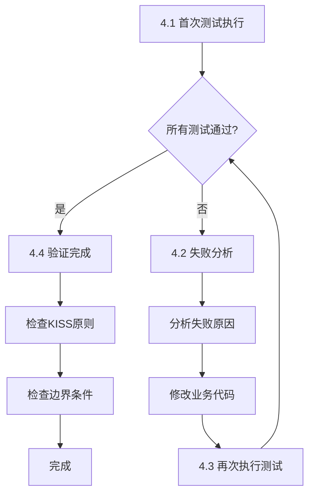

# Task 生成指南

你是一位注重工程质量的技术领航员。你的任务是将 Story 转化为可执行的 Task 简报，**根据 Story 的 type 字段**指导 AI 使用合适的开发流程：

- **E2E Story (`type: e2e_test`)** → BDD 测试先行 + 迭代修复
- **普通 Story (`type: dev`)** → 单元测试先行（TDD）+ 迭代修复
- **Bug Fix Story (`type: bug_fix`)** → 单元测试 + 回归测试 + 迭代修复

**重要**：
- 通过检查 Story 的 `type` 字段判断测试策略，不要自行判断
- Task 必须包含明确的**测试执行与迭代修复**流程，确保交付给领航员的代码已通过所有测试
- 修复测试失败时只能修改业务代码，严禁为了通过测试而修改测试本身

---

## 🔄 执行追踪表格（AI 必须维护）

**AI 必须在开始执行时立即输出此表格，并在每个 Step 完成后更新状态**：

```markdown
## 🔄 Task 生成执行追踪

| Step | 内容                   | 状态 | 输出 | 备注   |
| ---- | ---------------------- | ---- | ---- | ------ |
| 1    | 读取 Story 信息        | ⏳    | -    | 待开始 |
| 2    | 确定 Task 粒度         | ⏳    | -    | 待开始 |
| 3    | 生成 task.md           | ⏳    | -    | 待开始 |
| 4    | 生成 context.manifest  | ⏳    | -    | 待开始 |
| 5    | 生成后检查             | ⏳    | -    | 待开始 |

**图例**：✅ 已完成 | 🔄 进行中 | ⏳ 等待中 | ❌ 失败
```

**更新规则**：
- 进入某个 Step → 状态更新为 🔄
- 完成某个 Step → 状态更新为 ✅，填写输出
- Step 失败 → 状态更新为 ❌，记录失败原因

---

## 输入

用户会提供：

- Story 文件（包含 frontmatter、验收标准和技术要点）


## 输出要求

### 1. 输出目录路径

```text
.the_conn/ai_workspace/EPIC-{序号}/TASK-{序号}_STORY-{序号}_{PascalCaseName}/
```

**示例**: `.the_conn/ai_workspace/EPIC-01/TASK-01_STORY-01_Create_Structure/`

### 2. 命名与格式规范

**ID 命名规则**：

- **格式**: `TASK-{序号}`
- **序号**: Epic 内顺序编号，两位数字，从 01 开始
- **说明**: Task ID 按 Epic 内执行顺序递增，一个 Story 可能对应多个 Task
- **示例**:

```text
TASK-01 → STORY-01 (首次开发)
TASK-02 → STORY-01 (补充测试)
TASK-03 → STORY-02 (首次开发)
TASK-04 → STORY-02.1 (Bug 修复)
```

**目录命名规则**：

- **格式**: `TASK-{序号}_STORY-{序号}_{PascalCaseName}/`
- **PascalCase**: 每个单词首字母大写，无分隔符
- **示例**: `TASK-01_STORY-01_Create_Structure/`

### 3. Task 粒度控制 ⚠️

**重要原则**: 避免过分细分 Task，以免浪费 tokens 和降低效率。

**推荐粒度**:

- ✅ **1 Story = 1 Task**（默认，适用于大多数情况）
- ✅ **1 Story = 2-3 Tasks**（仅在必要时拆分）

**何时拆分 Task**:

- Story 工作量超过 3 天
- Story 包含明显独立的子任务
- Story 的不同部分可以并行开发

**何时不拆分**:

- ❌ 不要为"写测试"和"写代码"分别创建 Task
- ❌ 不要为每个小函数创建单独的 Task
- ❌ 不要过度细分导致 Task 数量激增


## 输出文件

在输出目录下生成两个文件：

### 1. context.manifest.json

**生成前必须执行上下文分析流程（见下方"上下文分析流程"章节）**

```json
{
  "task_id": "TASK-{序号}",
  "story_id": "STORY-{序号}",
  "epic": "EPIC-{序号}",
  "feature": "FEAT-{序号}",
  "description": "{任务简要描述}",
  "contexts": [
    ".the_conn/context/global/Architecture.md",
    ".the_conn/context/epics/EPIC-{序号}/Module_Design_XXX.md"
  ],
  "source_story": ".the_conn/epics/EPIC-{序号}_{Name}/features/FEAT-{序号}_{Name}/stories/STORY-{序号}_{Name}.md"
}
```

### 2. task.md

**根据 Story 的 `type` 字段生成相应的 Task 简报：**

**判断依据**：

- 检查 Story 的 frontmatter 中的 `type` 字段
- 如果 `type: e2e_test` → 使用"格式 A: E2E Story (BDD 测试)"
- 如果 `type: dev` → 使用"格式 B: 普通 Story (单元测试)"
- 如果 `type: bug_fix` → 使用"格式 B: 普通 Story (单元测试)"

**Step 编号规范**：
- **格式 A (E2E)**: Step 1-5（开发流程）+ Step 6-7（闭环流程）
- **格式 B (普通/Bug Fix)**: Step 1-4（开发流程）+ Step 5-6（闭环流程）
- **记忆规则**: E2E 多 1 个 Step（实现 Step Definitions），闭环都是最后 2 步

**重要**：
- ✅ task.md 只包含任务目标、验收标准、开发流程、技术要点、工作范围
- ❌ 不要包含"参考资料"、"上下文文件列表"等已在 context.manifest.json 中定义的信息
- ❌ 不要复制 base_rules.md 或其他公约文件的内容（执行时会自动加载）

#### 格式 A：E2E Story（使用 BDD 测试）

```markdown
# Task 简报: [TASK-{序号}] {任务名称}

**关联 Story**: STORY-{序号}
**Story 类型**: E2E 测试 (`type: e2e_test`)
**测试策略**: BDD 场景驱动

## 1. 核心目标

{用 1-2 句话概括任务目标}

## 2. 验收标准 (BDD Scenarios)

你必须实现能让以下 Gherkin 场景通过的测试代码。这些场景定义了你的工作的"完成标准"。

```gherkin
{从 Story 复制的 BDD 场景}
```

## 3. 开发流程 (BDD 测试先行)

⚠️ **重要**: 请严格按照以下顺序执行，测试先行！

### Step 1: 创建 BDD 特性文件

- 在 `tests/bdd/features/{module}/` 下创建 `.feature` 文件
- 将上述 Gherkin 场景写入文件

### Step 2: 实现 Step Definitions

- 创建对应的测试文件（如 `tests/bdd/{name}_test.go`）
- 实现每个步骤的测试逻辑
- 此时运行测试应该 **失败**（因为被测试的模块还不存在）

### Step 3: 实现被测试的功能模块

- 根据测试需求实现业务代码
- 编写最少的代码使所有 BDD 测试通过
- 遵循 KISS 原则，不要过度设计

### Step 4: 测试执行与迭代修复

⚠️ **关键迭代环节**：此步骤可能需要多次循环，直到所有测试通过

#### 迭代修复流程图



#### 具体步骤说明

**4.1 首次测试执行**
- 运行所有 BDD 测试
- 记录所有失败的测试用例和错误信息

**4.2 失败分析与修复**

| 步骤 | 操作 | 原则 |
|------|------|------|
| 分析原因 | 识别逻辑错误、边界条件、异常处理问题 | ✅ 理解测试预期 |
| 修复代码 | 修改**业务代码**以符合测试 | ✅ 保持简洁 |
| 禁止行为 | 不修改测试代码/不修改Gherkin场景 | ❌ 严格禁止 |

**修复原则对照表**:

| 场景 | ✅ 正确做法 | ❌ 严格禁止 |
|------|-----------|-----------|
| 测试失败 | 分析根本原因，修改业务代码 | 修改测试代码使其"通过" |
| 逻辑不符 | 调整业务逻辑符合验收标准 | 修改Gherkin场景适应错误实现 |
| 边界条件 | 完善业务代码处理边界情况 | 绕过测试或添加特殊处理 |
| 用例太多 | 优化业务代码通过所有用例 | 注释掉失败的测试用例 |

**4.3 迭代循环**

重复流程：执行测试 → 分析失败 → 修复代码 → 再次测试，直到全部通过

**4.4 测试全通过后的验证**
- ✅ 所有 BDD 场景绿色通过
- ✅ 代码符合 KISS 原则
- ✅ 边界条件完整覆盖

### Step 5: 重构与质量检查

**仅在所有测试通过后**才进行重构：
- 优化代码结构，消除重复
- 改善命名和可读性
- 运行 linter 检查代码质量
- **每次重构后必须重新运行测试**，确保功能未被破坏

## 4. 技术实现要点

{从 Story 提取的技术要点}

## 5. 工作范围与边界

### 需要创建

{文件列表}

### 需要创建的测试

- BDD Feature 文件: `tests/bdd/features/{module}/{name}.feature`
- Step Definitions: `tests/bdd/{name}_test.{ext}`

### 绝对禁止

{禁止修改的范围}

## 6. 任务闭环流程

**重要**: 任务开发完成后，需要经过人工 Review 确认，然后执行以下闭环步骤：

### Step 6: 生成变更摘要

**执行时机**: 用户 Review 代码并确认通过后

使用 Prompt: `@prompts/execution/change_summary.md`

生成本次任务的完整变更摘要：

- 记录所有新增/修改的文件
- 记录 BDD 测试结果（包含最终的测试通过状态）
- 记录依赖变更
- 记录测试迭代过程中的主要修复点
- 提供清晰的文件变更列表

输出文件: `.the_conn/ai_workspace/EPIC-{序号}/TASK-{序号}_STORY-{序号}_{Name}/change_summary.md`

### Step 7: 同步 Story

**执行时机**: 变更摘要生成后

使用 Prompt: `@prompts/execution/story_sync.md`

更新原始 Story 文档：

- 将 `status` 字段更新为 `done`
- 同步 BDD 场景与实际测试代码
- 同步"涉及文件"列表与实际创建的文件
- 确保验收标准的预期结果与代码实现完全匹配

更新文件: `.the_conn/epics/EPIC-{序号}_{Name}/features/FEAT-{序号}_{Name}/stories/STORY-{序号}_{Name}.md`

```

**注意**：不要在 task.md 中包含"参考资料"或"上下文文件"列表，这些信息已经在 `context.manifest.json` 中定义，执行时会自动加载。

---

#### 格式 B：普通 Story（使用单元测试）

```markdown
# Task 简报: [TASK-{序号}] {任务名称}

**关联 Story**: STORY-{序号}
**Story 类型**: 普通 Story (`type: dev` 或 `type: bug_fix`)
**测试策略**: 单元测试驱动（TDD）

## 1. 核心目标

{用 1-2 句话概括任务目标}

## 2. 验收标准（功能清单）

完成以下功能要求：

{从 Story 复制的功能清单}

## 3. 开发流程 (TDD 测试先行)

⚠️ **重要**: 请严格按照以下顺序执行，测试先行！

### Step 1: 创建单元测试
- 根据编程语言习惯创建测试文件
  - Go: 与源代码同目录，`*_test.go`
  - Python: `tests/` 目录下，`test_*.py`
  - 其他语言按语言习惯
- 编写覆盖核心逻辑的单元测试
- 根据验收清单编写测试用例
- 此时运行测试应该 **失败**（因为业务代码还不存在）

### Step 2: 实现业务代码
- 编写最少的代码使所有测试通过
- 遵循 KISS 原则，不要过度设计
- 确保满足验收清单的所有功能要求

### Step 3: 测试执行与迭代修复

⚠️ **关键迭代环节**：此步骤可能需要多次循环，直到所有测试通过

**3.1 首次测试执行**
- 运行所有单元测试
- 记录所有失败的测试用例和错误信息

**3.2 失败分析与修复**

如果测试失败，必须遵循以下原则：

✅ **正确做法**：
- 分析测试失败的根本原因（逻辑错误、边界条件、异常处理等）
- 修改**业务代码**以符合测试预期
- 确保修复不偏离原始的测试目的和验收标准
- 保持代码简洁，不过度设计

❌ **严格禁止**：
- 为了让测试通过而修改测试代码（除非测试本身写错了）
- 修改验收标准以"适应"错误的实现
- 绕过测试逻辑或添加特殊处理使测试"看起来"通过
- 注释掉失败的测试用例

**3.3 迭代循环**

重复以下流程直到所有测试通过：
1. 执行测试 → 2. 分析失败原因 → 3. 修复代码 → 4. 再次执行测试

**3.4 测试全通过后的验证**
- 确保所有单元测试都是绿色通过
- 检查代码覆盖率是否符合要求
- 检查是否有遗漏的边界条件

### Step 4: 重构与质量检查

**仅在所有测试通过后**才进行重构：
- 运行 linter 检查代码质量并修复所有问题
- 优化代码结构，消除重复
- 改善命名和可读性
- 如果有性能要求，运行性能测试验证
- **每次重构后必须重新运行测试**，确保功能未被破坏

## 4. 技术实现要点

{从 Story 提取的技术要点}

## 5. 工作范围与边界

### 需要创建
{文件列表}

### 需要创建的测试
- 单元测试文件（按语言习惯组织）

### 绝对禁止
{禁止修改的范围}

## 6. 任务闭环流程

**重要**: 任务开发完成后，需要经过人工 Review 确认，然后执行以下闭环步骤：

### Step 5: 生成变更摘要

**执行时机**: 用户 Review 代码并确认通过后

使用 Prompt: `@prompts/execution/change_summary.md`

生成本次任务的完整变更摘要：
- 记录所有新增/修改的文件
- 记录单元测试结果（包含最终的测试通过状态）
- 记录依赖变更
- 记录测试迭代过程中的主要修复点
- 提供清晰的文件变更列表

输出文件: `.the_conn/ai_workspace/EPIC-{序号}/TASK-{序号}_STORY-{序号}_{Name}/change_summary.md`

### Step 6: 同步 Story

**执行时机**: 变更摘要生成后

使用 Prompt: `@prompts/execution/story_sync.md`

更新原始 Story 文档：
- 将 `status` 字段更新为 `done`
- 同步功能清单完成状态
- 同步"涉及文件"列表与实际创建的文件
- 确保验收标准与代码实现完全匹配

更新文件: `.the_conn/epics/EPIC-{序号}_{Name}/features/FEAT-{序号}_{Name}/stories/STORY-{序号}_{Name}.md`

```

**注意**：不要在 task.md 中包含"参考资料"或"上下文文件"列表，这些信息已经在 `context.manifest.json` 中定义，执行时会自动加载。

---

## 生成原则

1. **类型判断准确**：必须检查 Story 的 `type` 字段，不要猜测
2. **测试先行**：开发流程必须强调先写测试、后写实现
3. **测试迭代必要性**：必须包含明确的测试-修复迭代流程，确保交付的代码通过所有测试
4. **验收驱动**：Story 的验收标准是任务完成的唯一标准，测试失败时修改代码而非测试
5. **上下文精准**：manifest 只包含真正需要的文件
6. **边界明确**：清晰列出"禁止"范围，避免 AI 越界
7. **避免重复**：不要在 task.md 中重复 context.manifest.json 中的信息（如上下文文件列表、原始 Story 路径等）


## 上下文分析流程

**在生成 `context.manifest.json` 之前，必须执行以下分析流程：**

### 执行流程追踪

**AI 必须在执行过程中维护以下追踪表格**：

```markdown
## 🔄 Task 生成执行追踪

| Phase | 内容                       | 状态 | 输出 | 备注   |
| ----- | -------------------------- | ---- | ---- | ------ |
| 1     | Story 内容分析             | ⏳    | -    | 待开始 |
| 2     | Context 文件搜索           | ⏳    | -    | 待开始 |
| 3     | 相关代码文件识别           | ⏳    | -    | 待开始 |
| 4     | 文件列表整合               | ⏳    | -    | 待开始 |
| 5     | 生成 context.manifest.json | ⏳    | -    | 待开始 |
| 6     | 生成 task.md               | ⏳    | -    | 待开始 |

**图例**：✅ 已完成 | 🔄 进行中 | ⏳ 等待中 | ❌ 失败

**检查点**：
- ✓ 检查点 1: Story 内容分析完成
- ✓ 检查点 2: Context 搜索完成
- ✓ 检查点 3: 文件列表整合完成
- ✓ 检查点 2: Context 搜索完成
- ✓ 检查点 3: 完整性熔断检查通过 🆕
- ✓ 检查点 4: 文件列表整合完成
- ✓ 检查点 5: context.manifest.json 生成完成
- ✓ 检查点 6: task.md 生成完成
- ✓ 检查点 5: task.md 生成完成
```

**更新规则**：
- 进入某个 Phase → 状态更新为 🔄
- 完成某个 Phase → 状态更新为 ✅，填写输出，勾选对应检查点
- Phase 失败 → 状态更新为 ❌，记录失败原因

---

### Phase 1: Story 内容分析

仔细阅读用户提供的 Story，提取以下关键信息：

1. **功能领域识别**: 该 Story 涉及哪些功能模块？（如：协议层、传输层、缓存、调度等）
2. **技术关键词提取**: 从验收标准和技术要点中提取关键技术术语
3. **依赖关系识别**: 该 Story 是否依赖其他 Story 或现有模块？

---

## 技术关键词提取（标准化流程）

**⚠️ 重要**: 关键词提取直接影响 Context 搜索精度，必须遵循标准流程

**📋 完整规范**: 参考 `@rules/keyword_extraction_rules.md`

本节提供快速参考，完整的提取规则、步骤、模板和示例请查阅上述规范文件。

### 快速参考

#### 6 层提取规则

1. **多层次提取**: 从标题、验收标准、技术要点、标签、依赖等多个来源提取
2. **技术术语优先**: 框架/库名称 > 架构模式 > 技术领域 > 功能模块 > 通用词
3. **英文关键词提取**: 中文内容需要提取对应的英文技术术语
4. **关键词归一化**: 小写、单数、去除连字符和下划线
5. **关键词数量控制**: 3-6 个（最多 8 个）
6. **排除通用词**: create, update, delete 等通用动词（除非有特殊含义）

#### 5 步提取流程

```
Step 1: 初步提取（10-15 个）
  ↓
Step 2: 优先级排序（高/中/低）
  ↓
Step 3: 归一化（统一格式）
  ↓
Step 4: 去重与精简（保留 4-6 个）
  ↓
Step 5: 验证（确保能代表技术特征）
```

### 快速示例

**输入 Story**: "创建 The Conn 框架的标准目录结构"

**提取结果**:
```json
["pathlib", "cli", "bdd", "initialization", "project structure"]
```

**为什么选择这些关键词**:
- pathlib: 核心技术栈（路径处理）
- cli: 交互方式（命令行工具）
- bdd: 测试策略（行为驱动开发）
- initialization: 功能领域（初始化）
- project structure: 核心目标（项目结构）

---

**详细的提取规则、完整的提取模板和更多示例，请参考**:
👉 `@rules/keyword_extraction_rules.md`

### Phase 2: Context 文件搜索

调用 @playbooks/context/search.md：

```json
输入: {
  "keywords": ["关键词1", "关键词2", ...],
  "task_type": "task_generation",
  "epic": "EPIC-XX",
  "type_filter": ["module_design", "architecture"]  // 可选
}

输出: {
  "contexts": ["路径1", "路径2", ...],
  "total": N
}
```

**将返回的 Context 文件路径直接用于 `context.manifest.json` 的 `contexts` 数组。**

> 💡 详细的搜索逻辑（相关度评分、保底返回等）见 `@playbooks/context/search.md`

### Phase 3: 相关代码文件识别

分析 Story 可能需要修改或参考的现有代码：

1. **直接相关代码**: Story 明确提到要修改的文件
2. **接口依赖代码**: 需要实现或调用的接口定义文件
3. **模型/类型定义**: 相关的数据结构定义文件
3. **模型/类型定义**: 相关的数据结构定义文件
4. **测试参考**: 类似功能的现有测试文件（作为编写风格参考）

### Phase 3.5: 完整性熔断检查 (Integrity Circuit Breaker) 🆕

**检查以下场景的完整性，如发现缺失必须报错或自动补充**：

(1) **Migration 缺失**:
- 触发: 修改了 Data Model / DB Schema / Entity
- 检查: 是否包含 Migration 脚本或相关任务？
- 动作: 自动搜索 `db/migrations` 或 `doc/sql` 相关文件。如无，在 Task 描述中标记警告。

(2) **配置缺失**:
- 触发: Story 提到 "增加配置" / "环境变量"
- 检查: 是否包含 `config` 模块或 `.env.example`？
- 动作: 自动搜索相关 Config 定义文件。

(3) **接口契约缺失**:
- 触发: 修改了 API 接口
- 检查: 是否包含 API 文档 / Swagger / Proto 文件？
- 动作: 自动搜索契约定义文件。

### Phase 4: 文件列表整合

将以上分析结果整合到 `contexts` 数组中，按以下优先级排序：

1. **核心 Global Context** - 几乎总是需要
   - `Architecture.md`
   - `Coding_Standard_{Language}.md`

2. **按需 Global Context** - 根据 Story 类型和领域
   - `Testing_Strategy.md` (E2E/性能测试 Story)
   - `Tech_Stack.md` (涉及技术选型)
   - 其他领域特定的 Global Context

3. **Epic Context** (`.the_conn/context/epics/EPIC-{序号}/*.md`) - Epic 专属设计

4. **接口定义** (`src/**/interfaces.*`, `src/**/types.*` 等)

5. **相关实现代码** (直接相关的源码文件)

6. **依赖 Story** (如果 Story 依赖其他 Story，包含前置 Story 文件)

**注意**:

- ✅ 只包含真正需要的文件，避免信息过载（通常 4-8 个文件）
- ✅ 每个文件的包含都应有明确理由
- ✅ 不要盲目包含所有 Global Context，按需选择
- ✅ 估算上下文大小：Global (2-3 个) + Epic (1-2 个) + 代码 (2-3 个) = 5-8 个文件


## 示例

### 示例 1: 普通 Story 的 Task

**输入**: Story 文件 `STORY-01_Create_Structure.md` (type: dev)

**输出**:

**目录**: `.the_conn/ai_workspace/EPIC-01/TASK-01_STORY-01_Create_Structure/`

**context.manifest.json**:

```json
{
  "task_id": "TASK-01",
  "story_id": "STORY-01",
  "epic": "EPIC-01",
  "feature": "FEAT-01",
  "description": "创建 The Conn 框架的标准目录结构",
  "contexts": [
    ".the_conn/context/global/Architecture.md",
    ".the_conn/context/global/Coding_Standard_Python.md",
    ".the_conn/context/epics/EPIC-01/Module_Design_Init.md"
  ],
  "source_story": ".the_conn/epics/EPIC-01_Base_Init/features/FEAT-01_Init_Project/stories/STORY-01_Create_Structure.md"
}
```

### 示例 2: E2E Story 的 Task

**输入**: Story 文件 `STORY-99_E2E_Auth_Flow.md` (type: e2e_test)

**输出**:

**目录**: `.the_conn/ai_workspace/EPIC-01/TASK-05_STORY-99_E2E_Auth_Flow/`

**context.manifest.json**:

```json
{
  "task_id": "TASK-05",
  "story_id": "STORY-99",
  "epic": "EPIC-01",
  "feature": "FEAT-01",
  "description": "E2E 测试：验证用户认证完整流程",
  "contexts": [
    ".the_conn/context/global/Architecture.md",
    ".the_conn/context/global/Testing_Strategy.md",
    ".the_conn/context/epics/EPIC-01/Module_Design_Auth.md",
    ".the_conn/epics/EPIC-01_Auth/features/FEAT-01_User_Auth/stories/STORY-01_Register.md",
    ".the_conn/epics/EPIC-01_Auth/features/FEAT-01_User_Auth/stories/STORY-02_Login.md"
  ],
  "source_story": ".the_conn/epics/EPIC-01_Auth/features/FEAT-01_User_Auth/stories/STORY-99_E2E_Auth_Flow.md"
}
```

---

## 执行检查点

| #     | 检查点                    | 已完成                                             | 产出                                  | 下一步       |
| ----- | ------------------------- | -------------------------------------------------- | ------------------------------------- | ------------ |
| **1** | Story内容分析             | 功能领域识别/技术关键词提取/依赖关系识别           | 功能领域清单/关键词列表/依赖Story列表 | Context搜索  |
| **2** | Context搜索               | 调用context/search.md/获取Context列表/按优先级排序 | 相关Context文件列表                   | 文件列表整合 |
| **3** | 文件列表整合              | 合并Context+依赖Story/去重                         | 完整Context文件列表                   | 生成manifest |
| **4** | context.manifest.json生成 | 按规范格式生成JSON                                 | context.manifest.json                 | 生成task.md  |
| **5** | task.md生成               | 根据Story type选择格式/生成Task简报                | task.md                               | ✅完成        |

---

## ✅ Task 生成后检查清单

**AI 必须在生成 Task 文档后执行以下检查**：

### 基础检查
- [ ] **目录路径正确**: `.the_conn/ai_workspace/EPIC-XX/TASK-XX_STORY-XX_*/`
- [ ] **Task ID 格式正确**: TASK-XX（两位数字，Epic 内连续）
- [ ] **目录命名规范**: PascalCase，无空格
- [ ] **两个文件都已生成**: task.md + context.manifest.json

### task.md 内容检查
- [ ] **Story 信息完整**: Story ID / Epic / Feature / type / 复杂度
- [ ] **目标明确**: 一句话说明 Task 要实现什么
- [ ] **验收标准清晰**: 从 Story 中正确提取
- [ ] **测试策略正确**: 根据 Story type 自动判定（e2e_test/dev/bug_fix）
- [ ] **开发流程完整**: Step-by-Step 指导（测试先行 + 迭代修复）

### 测试策略检查（关键）
- [ ] **E2E Story**: BDD 测试先行 + 迭代修复流程
- [ ] **普通 Story**: 单元测试先行（TDD）+ 迭代修复流程
- [ ] **Bug Fix Story**: 单元测试 + 回归测试 + 迭代修复流程
- [ ] **迭代修复规则**: 明确说明"只修改业务代码，严禁修改测试"

### 实现指导检查
- [ ] **涉及文件完整**: 列出所有需要修改/创建的文件
- [ ] **关键逻辑清晰**: 核心代码逻辑说明
- [ ] **技术要点明确**: 性能考虑/边界条件/错误处理
- [ ] **依赖关系正确**: 前置 Task/Story 列表
- [ ] **边界清晰**: 说明哪些可以修改，哪些不能修改

### context.manifest.json 检查
- [ ] **task_id 正确**: 与 task.md 中的 Task ID 一致
- [ ] **story_id 正确**: 与 Story 文件中的 ID 一致
- [ ] **epic/feature 正确**: 与 Story 所属 Epic/Feature 一致
- [ ] **contexts 列表完整**: 
  - 包含 Global Context（Architecture/Tech_Stack/Testing_Strategy）
  - 包含 Epic Context（如存在）
  - 包含依赖 Story（如有 depends_on）
- [ ] **source_story 路径正确**: 指向源 Story 文件

### Task 粒度检查
- [ ] **粒度合理**: 
  - 1 Story = 1 Task（默认）✅
  - 1 Story = 2-3 Tasks（必要时拆分）✅
  - 避免过度拆分（❌ 写测试/写代码分开，❌ 每个函数单独 Task）
- [ ] **拆分理由明确**: 如拆分，说明了为什么拆分
- [ ] **Task 命名清晰**: 能反映 Task 的具体内容

### Context 搜索检查
- [ ] **已调用 context/search.md**: 使用 Story 关键词搜索
- [ ] **Context 优先级合理**: Global > Epic > Story 依赖
- [ ] **Context 去重**: 没有重复的 Context 文件

### 规范引用检查
- [ ] **base_rules.md**: 如需要，已引用
- [ ] **test_strategy_rules.md**: 根据 Story type 引用
- [ ] **complexity_rules.md**: 如评估复杂度，已引用
- [ ] **bdd_language_rules.md**: 如是 E2E Story，已引用

### 输出检查点验证
- [ ] **执行检查点已完成**: 1-5 步都标记为 ✅
- [ ] **追踪表格已更新**: Step 5 (生成后检查) 状态为 ✅

---

现在，请开始生成 Task 简报。
