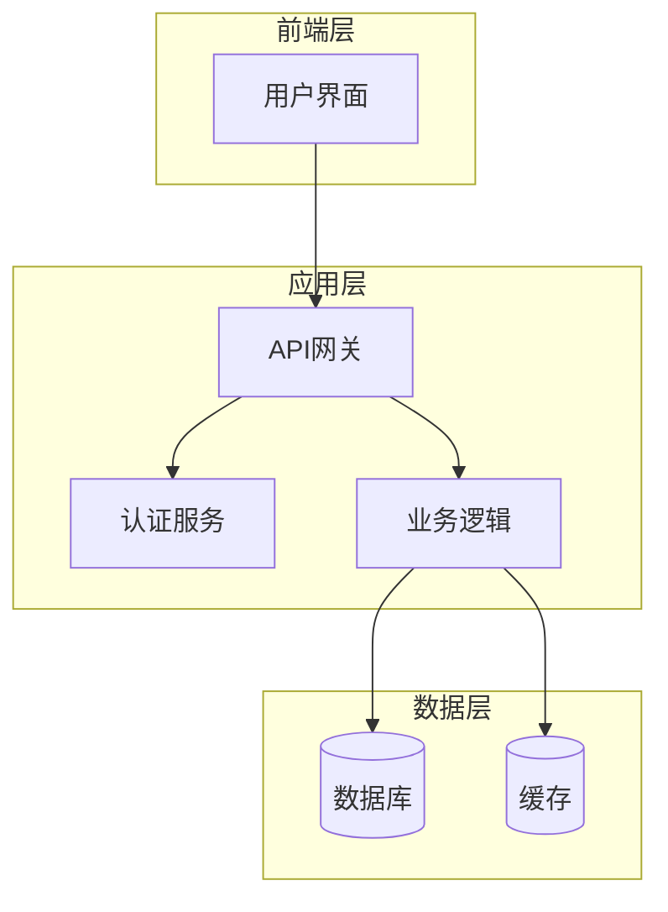
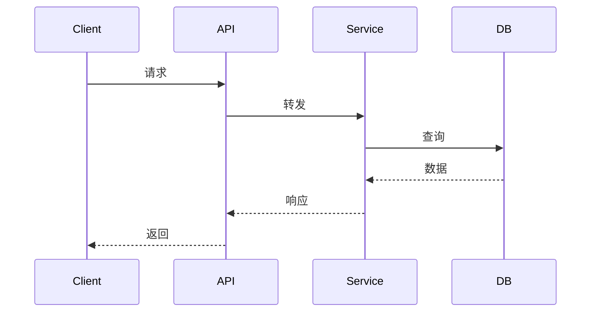
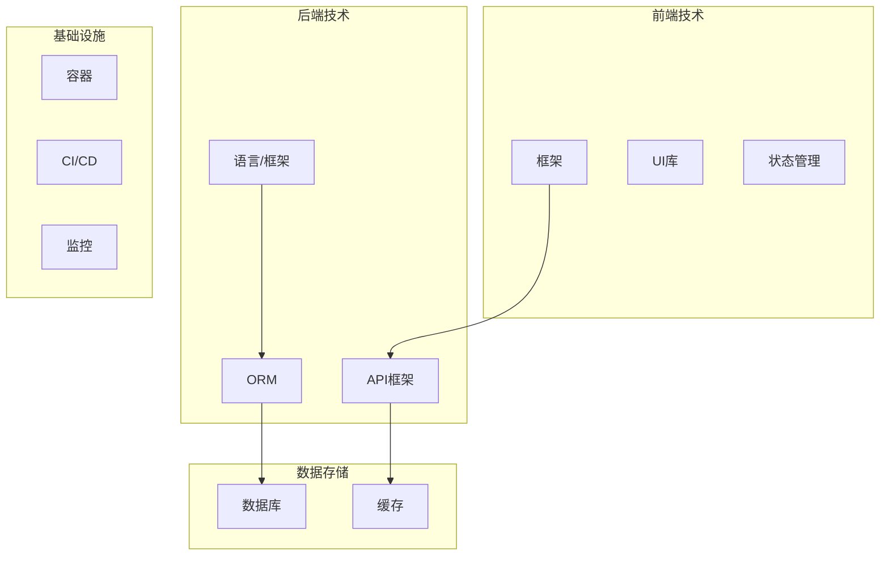
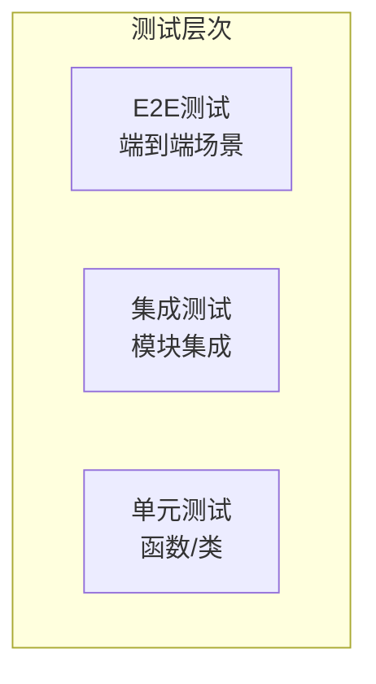
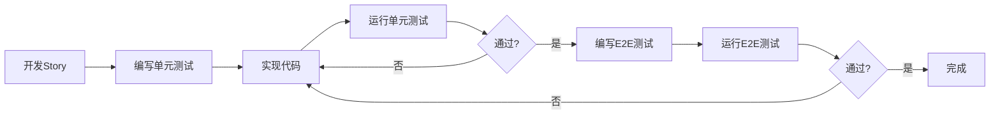

# 项目初始化指南

你的任务是为新项目初始化 The Conn 框架的完整目录结构和基础 Context 文档。

## ⚠️ 重要：遵守基础公约

**本 Playbook 严格遵守 `@rules/base_rules.md` 中定义的所有基础公约。**

**📋 上下文依赖**：

本 Playbook 依赖以下规范文件（AI 必须先加载）：
- **基础公约**: `@rules/base_rules.md` - 禁止修改 docs/、命名规范、文件路径约定等

本 Playbook **不依赖**以下规范：
- ❌ `test_strategy_rules.md` - 测试策略由项目自定义
- ❌ `bdd_language_rules.md` - BDD 规范由项目自定义

**原因**: 
- project_init 生成的是**项目级配置文档**，不是框架规范的副本
- 项目可以根据实际情况自定义测试策略和 BDD 规范
- 生成的文档应引用框架规范，而不是复制内容

## 本 Playbook 的工作范围

**专注于**：

- ✅ **创建目录结构**：初始化 The Conn 目录结构
- ✅ **生成初始文档**：创建基础 Context 文档和用户文档

---

## 输入

用户会提供：

- 项目名称
- 项目简介
- 主要编程语言（可选，AI 可自动分析）
- 技术栈（可选，AI 可自动分析）

**智能分析模式**：

如果项目代码已存在，AI 应：
1. 自动分析项目结构和代码文件
2. 识别主要编程语言（通过文件扩展名和数量）
3. 检测技术栈（通过依赖文件如 package.json、requirements.txt、go.mod 等）
4. 生成初步分析报告，展示给用户确认
5. 用户确认或补充信息后，生成最终 Context 文档

---

## 输出要求

### 1. 创建目录结构

```
project_root/
├── .the_conn/
│   ├── epics/
│   ├── context/
│   │   ├── global/
│   │   └── epics/
│   └── ai_workspace/
│
├── src/
├── tests/
│   └── bdd/
│       └── features/
└── README.md
```

### 2. 生成初始 Context 文档

根据项目类型，在 `.the_conn/context/global/` 下创建以下文档：

#### 必需文档

**1. Architecture.md** - 系统架构

```yaml
---
type: architecture
scope: global
title: 系统架构
created: {yyyy-mm-dd}
updated: {yyyy-mm-dd}
tags: [architecture]
---

# 系统架构

## 1. 概述与目标
{项目核心目标和适用场景}

## 2. 核心设计原则
- {原则1}
- {原则2}

## 3. 系统架构

### 3.1 架构概览



**说明**: 根据实际项目调整上述架构图，删除不需要的组件，添加项目特有的模块。

### 3.2 模块间通信



**说明**: 根据实际项目调整通信流程。

## 4. 主要模块职责

| 模块    | 职责       | 依赖       |
| ------- | ---------- | ---------- |
| {模块1} | {职责描述} | {依赖模块} |
| {模块2} | {职责描述} | {依赖模块} |

## 5. 技术栈

| 类别   | 技术选型 | 用途   |
| ------ | -------- | ------ |
| {类别} | {技术}   | {说明} |
```

**2. Tech_Stack.md** - 技术栈

```yaml
---
type: tech_stack
scope: global
title: 技术栈
created: {yyyy-mm-dd}
updated: {yyyy-mm-dd}
tags: [tech-stack]
---

# 技术栈

## 技术栈层次结构



**说明**: 根据实际项目调整技术栈结构，删除不需要的层次（如纯后端项目可删除前端技术）。

## 编程语言
- **主语言**: {语言} ({版本})
- **其他语言**: {语言} ({用途})

## 核心框架/库

| 类别   | 技术     | 版本   | 用途       | 选型理由     |
| ------ | -------- | ------ | ---------- | ------------ |
| {类别} | {技术名} | {版本} | {用途说明} | {为什么选择} |

## 开发工具
- **构建工具**: {工具}
- **包管理**: {工具}
- **测试框架**: {框架}
- **BDD 工具**: {工具}

## 部署环境
- **运行环境**: {环境}
- **容器**: {Docker/其他}
- **编排**: {K8s/其他}
```

**3. Coding_Standard_{Language}.md** - 编码规范

```yaml
---
type: coding_standard
scope: global
title: {语言} 编码规范
created: {yyyy-mm-dd}
updated: {yyyy-mm-dd}
tags: [coding-standard, {language}]
---

# {语言} 编码规范

## 1. 代码风格
- **命名约定**: {说明}
- **缩进**: {空格/Tab}

## 2. 最佳实践
- {实践1}

## 3. 禁止事项
- {禁止1}

## 4. 代码组织
- {组织规则}
```

**4. Testing_Strategy.md** - 测试策略

```yaml
---
type: testing_strategy
scope: global
title: 测试策略
created: {yyyy-mm-dd}
updated: {yyyy-mm-dd}
tags: [testing]
---

# 测试策略

## 1. 测试理念
本项目采用**单元测试 + E2E 测试**分层策略。

## 2. 测试金字塔



**说明**: E2E 测试数量少但覆盖关键流程，单元测试数量多但范围小。

## 3. 测试工具

| 测试类型 | 工具   | 用途       | 覆盖范围 |
| -------- | ------ | ---------- | -------- |
| 单元测试 | {框架} | 函数/类    | 核心逻辑 |
| E2E 测试 | {工具} | 端到端场景 | 主流程   |

## 4. 测试流程



## 5. BDD 配置
- **关键字**: 统一使用英文 (Given/When/Then)
- **描述语言**: {中文/英文}
- **Feature 文件位置**: `tests/bdd/features/`
- **Step Definitions 位置**: `tests/bdd/`

## 6. 测试覆盖率目标
- 单元测试: ≥ {百分比}%
- E2E 场景: 核心流程 100%

## 7. 参考规范
详细的测试策略规范请参考 The Conn 框架文档：
- Story 类型与测试策略: `@rules/test_strategy_rules.md`
- BDD 语言配置规范: `@rules/bdd_language_rules.md`

使用 The Conn 框架进行开发时，AI 会自动遵循这些规范。
```

**重要原则**:
- ✅ 根据项目实际情况填充内容，不使用占位符
- ✅ 生成的是**项目级配置**，不是框架规范的副本
- ✅ 在文档中引用框架规范文件（如Testing_Strategy.md引用@rules/），而不是复制内容
- ✅ 允许项目根据实际情况自定义配置

### 3. 生成 .gitignore

在 `.the_conn/.gitignore` 中添加：

```gitignore
ai_workspace/
context/
docs/
epics/
playbooks/
rules/
.version
```

---

## 生成原则

1. **智能分析优先**: 如果项目代码已存在，先分析再生成，避免手动输入
2. **用户确认机制**: 分析结果必须经用户确认或补充后才生成文档
3. **文档定位**: 生成的 Context 文档是**项目级配置**，不是框架规范的副本
4. **内容精简**: 只包含项目特定的配置和选择，不重复框架规范
5. **规范引用**: 在文档中引用框架规范文件，而不是复制内容
6. **可定制性**: 允许项目根据实际情况调整配置
7. **Context 文档**: 根据项目实际情况填充内容，不要使用占位符
8. **文件命名**: 严格遵循 PascalCase 规范
9. **Frontmatter**: 所有字段必填，日期使用 `yyyy-mm-dd` 格式
10. **目录权限**: 确保创建的目录有写权限
11. **幂等性**: 重复执行不覆盖已有文件
12. **用户文档保护**: `.the_conn/docs/` 目录下的文档仅在初始化时创建，后续**严格禁止任何 AI Playbook 修改 `.the_conn/docs/` 目录中的任何文件**

---

## 示例

### Go 项目示例

**用户输入**:

```
项目名称: DataStream
项目简介: 高可靠低延迟的信令传输系统
主要语言: Go
技术栈: godog (BDD), testify (单元测试)
```

**生成的 Context**:

- `Architecture.md` - 包含微服务架构说明
- `Tech_Stack.md` - 列出 Go 1.21, godog, testify 等
- `Coding_Standard_Go.md` - Go 编码规范（gofmt, golangci-lint）
- `Testing_Strategy.md` - BDD 中文，godog 配置

---

现在，请根据用户提供的项目信息初始化 The Conn 项目。
