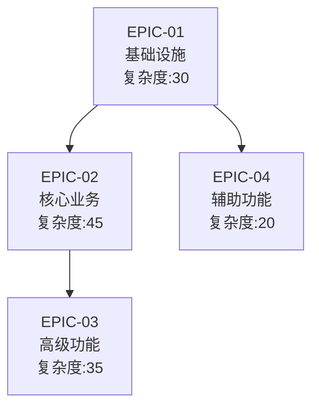
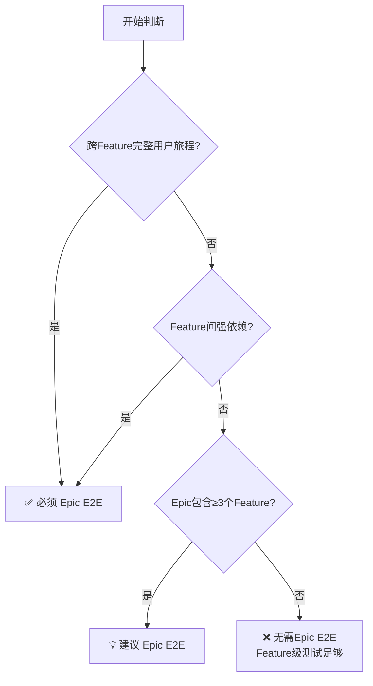
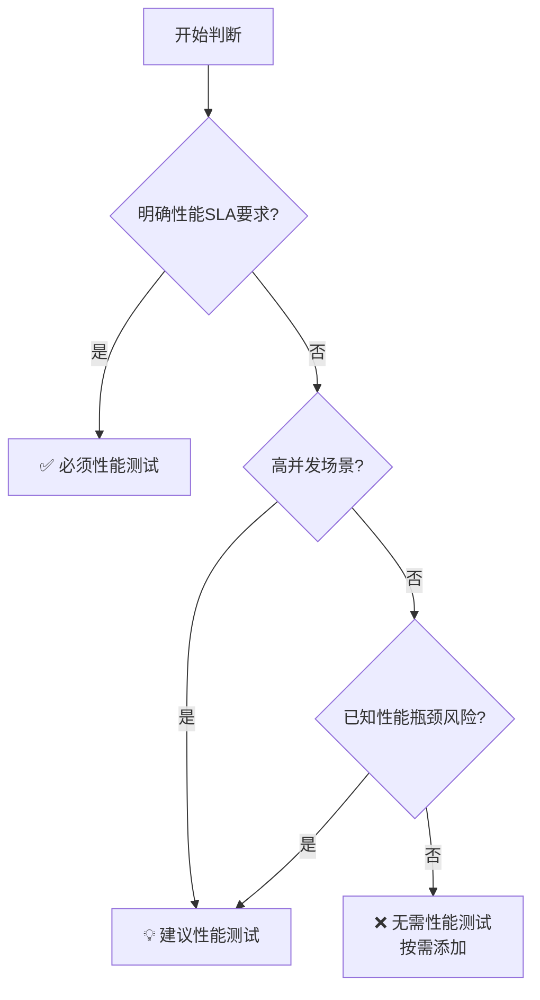

# Epic 规划生成指南

根据需求文档生成 Epic 规划文件。

## ⚠️ 重要：遵守基础公约

**本 Playbook 严格遵守 `@rules/base_rules.md` 中定义的所有基础公约。**

**📋 规范引用**：

本 Playbook 依赖以下规范文件（AI 必须先加载）：
- **基础公约**: `@rules/base_rules.md` - 禁止事项、文件路径约定、质量标准
- **测试策略**: `@rules/test_strategy_rules.md` - Story 类型判断、测试决策规则

## 本 Playbook 的工作范围

**专注于**：生成 Epic 规划文档（创建 Epic README.md 文件）

**自动初始化**：
- AI 会自动检测 Epic 目录是否已存在
- 如果目录不存在，会先调用 `epic_init.md` 创建目录结构
- 然后生成 Epic 规划内容
- 用户无需手动执行 `tc epic-init`

**使用说明**：
- **推荐**：直接使用 `tc epic <名称>`，AI 会自动处理初始化
- **高级用法**：如果只需要创建目录结构而不生成规划内容，可以使用 `tc plan epic-init <名称>`

---

## 命名与格式规范

### ID 命名规则

- **格式**: `EPIC-{序号}`
- **序号**: 全局唯一，两位数字，从 01 开始
- **示例**: `EPIC-01`, `EPIC-02`, `EPIC-10`

### 目录命名规则

- **格式**: `EPIC-{序号}_{PascalCaseName}`
- **PascalCase**: 每个单词首字母大写，无分隔符
- **示例**: `EPIC-01_Base_Init`, `EPIC-02_DataStream`

### 文件路径

```text
.the_conn/epics/EPIC-{序号}_{PascalCaseName}/README.md
```

**示例**: `.the_conn/epics/EPIC-01_Base_Init/README.md`

### Frontmatter 规范

```yaml
---
id: EPIC-01
status: pending
created: yyyy-mm-dd
depends_on: []
---
```

**字段说明**：

- `status`: `pending` (未完成) 或 `done` (已完成)
- `created`: 格式 `yyyy-mm-dd`
- `depends_on`: 依赖的其他 Epic ID 列表，无依赖写 `[]`

---

## 输出格式

### Standard Mode 格式

```markdown
# EPIC-{序号}: {Epic 名称}

- **业务价值**: {一句话说明核心价值}
- **范围**: {包含的功能模块}
- **关键指标**: {可衡量的成功指标}
- **创建日期**: {yyyy-mm-dd}
```

### Pro Mode 格式⭐

```markdown
# EPIC-{序号}: {Epic 名称}（限界上下文）

- **业务价值**: {一句话说明核心价值}
- **范围**: {包含的功能模块}
- **关键指标**: {可衡量的成功指标}
- **创建日期**: {yyyy-mm-dd}

## 限界上下文说明

- **上下文名称**: {名称}
- **核心域标识**: 核心域 🔴 / 支撑域 🟡 / 通用域 🟢
- **上下文职责**: {一句话说明}
- **上下文边界**: {说明}

## 上下文映射关系

| 关系类型 | 上下文 | 映射模式 | 说明 |
|---------|-------|---------|------|
| 上游依赖 | EPIC-XX | Customer-Supplier / Partnership | {说明} |
| 下游依赖 | EPIC-YY | Conformist / ACL | {说明} |

**参考**: Review Phase 1.5 领域分析 / ADR-XXX

```

---

## 生成原则

1. **业务价值**: 清晰、可量化，从用户/业务视角描述
2. **范围边界**: 明确包含哪些功能模块，不包含哪些
3. **关键指标**: 必须可通过数据验证（如功能数量、性能指标、测试覆盖率）
4. **命名规范**: Epic 名称使用 PascalCase
5. **粒度控制**: 默认使用较粗的粒度，按大的业务领域划分，避免 Epic 过多过细
6. **测试战略**: 规划 Epic 级别的测试里程碑，确保整体质量保障
7. **依赖关系**: 明确 Epic 之间的依赖关系和建议顺序

---

## Epic 粒度控制标准

**核心原则**：默认使用较粗的粒度，按大的业务领域划分，避免 Epic 过多过细。

| 维度         | 推荐范围 | 过大信号 | 过小信号 | 处理建议             |
| ------------ | -------- | -------- | -------- | -------------------- |
| Feature 数量 | 3-5 个   | >7 个    | <2 个    | 拆分/合并            |
| Story 总数   | 8-25 个  | >35 个   | <8 个    | 拆分/改为 Feature    |
| 复杂度总和   | 30-70 分 | >90 分   | <20 分   | 拆分/合并到其他 Epic |

**拆分策略对比**:

| 策略类型     | ✅ 好例子                             | ❌ 坏例子                             |
| ------------ | ------------------------------------ | ------------------------------------ |
| 业务领域拆分 | 用户管理/商品管理/订单管理           | 前端/后端/数据库                     |
| 技术架构拆分 | 基础框架/业务功能（仅限基础设施）    | 数据库层/缓存层/API 层               |
| 用户旅程拆分 | 用户注册与认证/完整购物流程          | 注册/登录/找回密码（过细）           |
| Story 粒度   | 复杂度≥2.0/完整功能点/按模块边界拆分 | 复杂度<2.0/过度碎片化/按实现细节拆分 |

---

## Epic 依赖关系规划

### 依赖关系类型

**1. 技术依赖**：
- 后续 Epic 需要前置 Epic 的技术基础
- 示例：EPIC-02（业务功能）依赖 EPIC-01（基础框架）

**2. 数据依赖**：
- 后续 Epic 需要前置 Epic 创建的数据结构
- 示例：EPIC-03（数据分析）依赖 EPIC-02（数据采集）

**3. 业务依赖**：
- 业务流程上的先后关系
- 示例：EPIC-03（支付）依赖 EPIC-02（订单）

**4. 资源依赖**：
- 共享相同的开发资源或环境
- 建议：避免过度并行，合理安排顺序

### 依赖关系表示

在 Epic 文档的 Frontmatter 中：

```yaml
---
id: EPIC-02
status: pending
created: 2025-12-22
depends_on:
  - EPIC-01  # 依赖基础框架
---
```

### 开发顺序建议

**输出格式**（在 Epic 规划文档末尾）：

```markdown
## Epic 依赖关系与开发顺序

### 依赖关系图



### 依赖关系说明

| Epic    | 依赖    | 类型     | 原因         |
| ------- | ------- | -------- | ------------ |
| EPIC-02 | EPIC-01 | 技术依赖 | 需要基础框架 |
| EPIC-03 | EPIC-02 | 业务依赖 | 需要用户数据 |
| EPIC-04 | EPIC-01 | 技术依赖 | 需要基础组件 |

### 建议开发顺序

**阶段1: 基础设施**
- EPIC-01（关键路径，必须优先）
- 复杂度: 30分

**阶段2: 并行开发**
- EPIC-02（核心业务，优先级高）
- EPIC-04（辅助功能，可并行）
- 复杂度: 65分（并行总计）

**阶段3: 高级功能**
- EPIC-03（依赖EPIC-02）
- 复杂度: 35分

**关键路径**: EPIC-01 → EPIC-02 → EPIC-03（总计110分）

### 并行机会

| 时段  | 并行Epic          | 原因       | 建议优先级              |
| ----- | ----------------- | ---------- | ----------------------- |
| 阶段2 | EPIC-02 + EPIC-04 | 无直接依赖 | 优先EPIC-02（核心业务） |

### 风险提示

| Epic    | 风险等级 | 风险描述                       | 应对措施               |
| ------- | -------- | ------------------------------ | ---------------------- |
| EPIC-01 | 🔴高      | 关键路径，延期影响所有后续Epic | 优先资源投入，密切监控 |
| EPIC-03 | ⚠️中      | 依赖链最长，风险累积           | 提前规划，预留缓冲时间 |
```

---

## 测试里程碑规划规则

**📋 详细的测试决策规则参考**: `@playbooks/planning/feature_planning.md` 的"自动生成测试 Story"部分

### Epic 级 E2E 测试决策规则



**判断标准**:
- **完整用户旅程**: 用户操作跨越多个 Feature（如注册→登录→使用功能）
- **强依赖**: 一个 Feature 的输出是另一个 Feature 的输入
- **Feature 数量**: ≥3 个时建议增加 Epic 级验证

### Epic 级性能测试决策规则



### 生成的 Epic 文档中的测试输出格式

**规则**：
1. ✅ 只列出需要的测试 Story 及简要理由
2. ✅ 按功能开发顺序排列
3. ❌ 不包含详细的决策原理说明
4. ❌ 不包含时间规划（Week 1-2 等）

**输出格式**：

```markdown
## 测试里程碑

### Feature 级别测试
各 Feature 根据其特征规划测试 Story（详见各 Feature 规划）

### Epic 级别测试（如果需要）

**STORY-999: Epic_E2E_{EpicName}**
- **类型**: E2E 测试 (type: e2e_test)
- **目的**: 验证跨 Feature 的完整用户旅程
- **理由**: Epic 包含 3 个以上 Feature，需要验证端到端集成
- **测试路径**: `tests/bdd/features/{module}/epic_{name}_flow.feature`
- **执行顺序**: 所有 Feature 完成后

**STORY-997: Performance_{EpicName}**（如果需要）
- **类型**: 性能测试 (type: perf_test)
- **目的**: 验证系统整体性能表现
- **理由**: 存在高并发场景，需要验证系统容量
- **执行顺序**: 所有 Feature 完成后
```

---

## 示例

### 示例 1: Standard Mode - 不需要 Epic 级测试的 Epic

```markdown
# EPIC-01: 基础初始化

- **业务价值**: 为用户提供标准化的项目结构，支撑后续 AI 辅助开发
- **范围**: 目录结构初始化、模板文件生成、CLI 工具
- **关键指标**: 目录结构创建成功率 100%，模板文件完整性 100%
- **创建日期**: 2025-12-11

## Features 概览

- FEAT-01: 初始化项目结构
- FEAT-02: 生成模板文件

## 测试里程碑

### Feature 级别测试
各 Feature 根据其特征规划测试 Story（详见各 Feature 规划）

### Epic 级别测试
无需 Epic 级别测试（仅 2 个独立 Feature，无跨 Feature 依赖）

## Epic 依赖关系与开发顺序

**依赖关系**：
- 无前置依赖（首个 Epic）

**建议开发顺序**：

```text
EPIC-01 (基础初始化)
```

**并行机会**：
- 无（单一 Epic）

**风险提示**：
- 作为基础 Epic，需要优先完成以支撑后续开发
```

### 示例 2: Pro Mode - 需要 Epic 级测试的 Epic⭐

```markdown
# EPIC-02: 订单上下文（限界上下文）

- **业务价值**: 提供核心订单处理能力，实现高可靠的订单生命周期管理
- **范围**: 订单创建、状态流转、库存扣减、订单查询
- **关键指标**: 订单处理成功率 99.9%，P95 响应时间 < 500ms
- **创建日期**: 2025-12-25

## 限界上下文说明

- **上下文名称**: 订单上下文 (Order Context)
- **核心域标识**: 核心域 🔴
- **上下文职责**: 管理订单全生命周期，协调库存扣减和支付流程
- **上下文边界**: 
  - 包含：订单聚合、订单项、折扣规则
  - 不包含：支付处理（支付上下文负责）、库存管理（库存上下文负责）

## 上下文映射关系

| 关系类型 | 上下文 | 映射模式 | 说明 |
|---------|-------|---------|------|
| 下游依赖 | EPIC-03: 支付上下文 | Customer-Supplier | 订单创建后调用支付 |
| 下游依赖 | EPIC-04: 库存上下文 | Customer-Supplier | 订单创建时扣减库存 |
| 上游依赖 | EPIC-03: 支付上下文 | Conformist | 接收支付完成事件 |

**上下文通信**:
- 订单 → 支付: 同步调用（立即反馈）
- 订单 → 库存: 同步调用（事务保证）
- 支付 → 订单: 异步事件（PaymentCompleted）

**参考**: Review Phase 1.5 领域分析 / ADR-001（异步消息架构）

## Features 概览

- FEAT-01: Order 聚合（订单核心逻辑）
- FEAT-02: 订单查询服务（CQRS 读模型）
- FEAT-03: 订单事件处理（集成层）

## 测试里程碑

### Feature 级别测试
各 Feature 根据其特征规划测试 Story（详见各 Feature 规划）

### Epic 级别测试

**STORY-999: Epic_E2E_OrderManagement**
- **类型**: E2E 测试 (type: e2e_test)
- **目的**: 验证订单创建 → 库存扣减 → 支付 → 订单确认的完整流程
- **理由**: Epic 涉及 3 个限界上下文的集成，需要验证端到端一致性
- **测试路径**: `tests/bdd/features/order/epic_order_flow.feature`
- **执行顺序**: 所有 Feature 完成后

**STORY-997: Performance_Order**
- **类型**: 性能测试 (type: perf_test)
- **目的**: 验证订单系统的高并发性能
- **理由**: 核心域，峰值场景需支持 1000 TPS
- **执行顺序**: FEAT-01, FEAT-02 完成后

## Epic 依赖关系与开发顺序

**依赖关系**：
- 依赖 EPIC-01（技术依赖：需要基础框架）
- 被 EPIC-03, EPIC-04 依赖（业务依赖：支付和库存需要订单事件）

**建议开发顺序**：

```text
EPIC-01 (基础框架)
    ↓
EPIC-02 (订单上下文) ← 核心域，优先开发
    ↓
并行: EPIC-03 (支付) + EPIC-04 (库存)
```

**并行机会**：
- FEAT-01 和 FEAT-02 可并行（读写分离）

**风险提示**：
- 🔴 核心域，延期影响整体业务价值
- 🔴 涉及 3 个上下文集成，复杂度高
- ⚠️ 性能要求高，需要充分的性能测试
```

---

现在，请根据用户提供的需求文档生成 Epic 规划。
