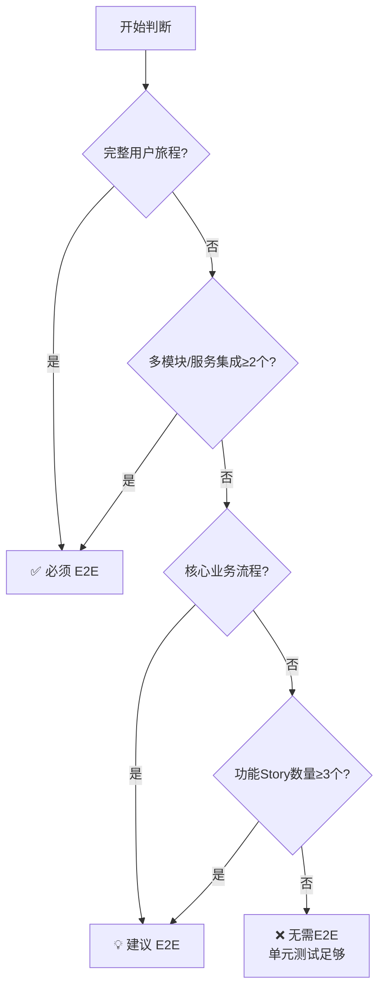
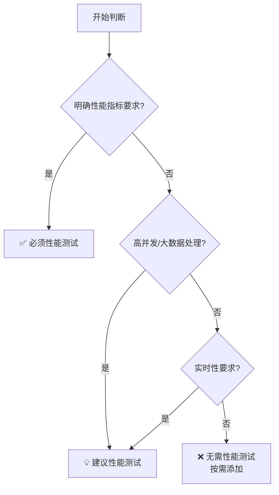

# Feature 规划生成指南

根据需求文档或 Epic 生成 Feature 规划文件。

## ⚠️ 重要：遵守基础公约

**本 Playbook 严格遵守 `@rules/base_rules.md` 中定义的所有基础公约。**

**📋 规范引用**：

本 Playbook 依赖以下规范文件（AI 必须先加载）：
- **基础公约**: `@rules/base_rules.md` - 禁止事项、文件路径约定、质量标准
- **测试策略**: `@rules/test_strategy_rules.md` - Story 类型判断、测试决策规则
- **复杂度评估**: `@rules/complexity_rules.md` - 复杂度评分标准

## 本 Playbook 的工作范围

**专注于**：生成 Feature 规划文档（创建 Feature README.md 文件）

---

## 命名与格式规范

### ID 命名规则

- **格式**: `FEAT-{序号}`
- **序号**: Epic 内唯一，两位数字，从 01 开始
- **示例**: `FEAT-01`, `FEAT-02`, `FEAT-10`

### 目录命名规则

- **格式**: `FEAT-{序号}_{PascalCaseName}`
- **PascalCase**: 每个单词首字母大写，无分隔符
- **示例**: `FEAT-01_Init_Project`, `FEAT-02_Generate_Templates`

### 文件路径

```
.the_conn/epics/EPIC-{序号}_{Name}/features/FEAT-{序号}_{PascalCaseName}/README.md
```

**示例**: `.the_conn/epics/EPIC-01_Base_Init/features/FEAT-01_Init_Project/README.md`

### Frontmatter 规范

```yaml
---
id: FEAT-01
status: pending
created: yyyy-mm-dd
depends_on: []
---
```

**字段说明**：

- `status`: `pending` (未完成) 或 `done` (已完成)
- `created`: 格式 `yyyy-mm-dd`
- `depends_on`: 依赖的其他 Feature ID 列表，无依赖写 `[]`

---

## 输出格式

```markdown
# Feature: FEAT-{序号} {Feature 名称}

- **所属 Epic**: EPIC-{序号}
- **目标**: {一句话说明功能目标}
- **包含的故事**: STORY-{序号}, STORY-{序号}, ...
- **验收标准**:
  - {端到端验收项1}
  - {端到端验收项2}
- **创建日期**: {yyyy-mm-dd}
```

---

## 生成原则

1. **目标描述**: 从用户/业务视角描述，说明"为什么"和"价值是什么"
2. **Story 拆分**: 按功能模块或职责边界拆分，每个 Story 有清晰的实现范围
3. **验收标准**: 端到端的用户流程，可实际验证
4. **命名规范**: Feature 名称使用 PascalCase
5. **粒度控制**: 优先按完整功能模块划分，每个 Feature 包含 2-5 个 Story 即可
6. **便于 AI 编码**: 确保每个 Story 的边界清晰，接口明确，依赖关系简单
7. **测试规划**: 根据 Feature 特征自动规划测试 Story

---

## 自动生成测试 Story (智能引导)

### 测试 Story 决策逻辑



**判断标准**:
- **完整用户旅程**: 用户从开始到结束的完整操作流程
- **多模块集成**: 涉及数据库、缓存、API、消息队列等多个系统
- **核心业务流程**: 直接影响业务目标的关键功能
- **Story 数量**: ≥3 个功能 Story 时建议增加集成验证

### 性能测试判断



**性能测试 Story 特点**:
- ID: STORY-97（Feature 级） | Type: `perf_test`
- 验收标准: 性能指标（响应时间、吞吐量、并发等）
- 测试场景: 负载测试、压力测试、容量测试、峰值测试、稳定性测试
- 生成方式: 使用 `@playbooks/planning/performance_test_story.md`

### 生成的 Feature 文档中的测试输出格式

**规则**：
1. ✅ 只列出需要的测试 Story 及简要理由（1-2 句话）
2. ✅ 按功能开发顺序排列
3. ❌ 不包含详细的多维度评估过程
4. ❌ 不包含决策框架说明

**输出格式**：

```markdown
## 包含的 Story

### 功能开发 Story
- STORY-01: {功能1描述}
- STORY-02: {功能2描述}
- STORY-03: {功能3描述}

### 测试 Story（按开发顺序）

**STORY-99: E2E_{FeatureName}_Flow**
- **类型**: E2E 测试 (type: e2e_test)
- **目的**: 验证 STORY-01 → STORY-02 → STORY-03 的完整集成
- **理由**: Feature 包含 3 个功能 Story 且涉及数据库和 API 集成
- **测试路径**: `tests/bdd/features/{module}/{feature}_flow.feature`
- **执行顺序**: STORY-01, STORY-02, STORY-03 完成后

**STORY-97: Performance_{FeatureName}**（如果需要）
- **类型**: 性能测试 (type: perf_test)
- **目的**: 验证高并发场景下的性能表现
- **理由**: 涉及实时数据处理，需要验证性能指标
- **执行顺序**: STORY-99 完成后
```

### 测试 Story 命名规范

| Story 类型 | 命名格式                             | Story Type  | 示例                            |
| --- | --- | --- | --- |
| E2E 测试   | `STORY-99_E2E_{FeatureName}_Flow`    | `e2e_test`  | `STORY-99_E2E_Auth_Flow`        |
| 集成测试   | `STORY-98_Integration_{FeatureName}` | `e2e_test`  | `STORY-98_Integration_Payment`  |
| 性能测试   | `STORY-97_Performance_{FeatureName}` | `perf_test` | `STORY-97_Performance_DataSync` |

**编号约定**: 测试 Story 使用 97-99 编号，与功能 Story 区分

**Story type 字段**：

- E2E 测试 Story: `type: e2e_test`
- 性能测试 Story: `type: perf_test`
- 生成方式: 使用 `@playbooks/planning/e2e_story.md` 生成 E2E Story

### 决策示例

| 场景     | Feature  | Story数/平均复杂度 | 分析维度                | 决策                        |
| --- | --- | --- | --- | --- |
| 核心业务 | 用户认证 | 4个/5.0分          | ✅完整流程+高集成+高风险 | ✅必须STORY-99:E2E_Auth_Flow |
| 技术模块 | 配置管理 | 2个/2.3分          | ❌内部模块+低集成+低风险 | ❌无需E2E，单元测试足够      |

---

## Feature 复杂度评估

| 评分维度          | 计算公式                 | 说明                                                                       |
| --- | --- | --- |
| Story数量影响     | Story数量×0.5（上限3.0） | -                                                                          |
| 平均Story复杂度   | Σ(Story复杂度)/Story数量 | -                                                                          |
| 集成复杂度        | 低(1.0)/中(2.0)/高(3.0)  | 低:单一模块依赖少<br/>中:2-3个模块少量外部依赖<br/>高:≥4个模块多个外部依赖 |
| **Feature复杂度** | **三者之和**             | 1.0-4.0:低复杂度✅<br/>4.1-7.0:中等复杂度⚠️<br/>7.1-10.0+:高复杂度🔴          |

**评分示例**:

| Feature  | Story数 | 平均复杂度 | 集成复杂度 | 总分  | 等级 |
| --- | --- | --- | --- | --- | --- |
| 用户认证 | 4个→2.0 | 4.875      | 高(3.0)    | 9.875 | 🔴高  |
| 配置管理 | 2个→1.0 | 2.25       | 低(1.0)    | 4.25  | ⚠️中  |

---

## 示例

### 示例 1: 不需要测试 Story 的 Feature

```markdown
# Feature: FEAT-01 初始化项目结构

- **所属 Epic**: EPIC-01
- **目标**: 提供 CLI 命令一键初始化 The Conn 项目结构
- **包含的故事**: STORY-01, STORY-02
- **验收标准**:
  - 用户执行 `theconn init` 后，所有必需目录和文件创建成功
  - 生成的模板文件内容完整且格式正确
  - 重复执行不会覆盖已有文件
- **创建日期**: 2025-12-11

## 包含的 Story

### 功能开发 Story
- STORY-01: 创建目录结构
- STORY-02: 生成模板文件

### 测试 Story
无需 Feature 级 E2E 测试（仅 2 个独立 Story，单元测试足够）
```

### 示例 2: 需要测试 Story 的 Feature

```markdown
# Feature: FEAT-02 用户认证

- **所属 Epic**: EPIC-02
- **目标**: 提供完整的用户认证流程
- **包含的故事**: STORY-03, STORY-04, STORY-05, STORY-99
- **验收标准**:
  - 用户可以通过邮箱/密码注册和登录
  - 认证令牌自动刷新
  - 支持记住登录状态
- **创建日期**: 2025-12-17

## 包含的 Story

### 功能开发 Story
- STORY-03: 用户注册接口
- STORY-04: 用户登录接口
- STORY-05: Token 刷新机制

### 测试 Story（按开发顺序）

**STORY-99: E2E_Auth_Flow**
- **类型**: E2E 测试 (type: e2e_test)
- **目的**: 验证注册 → 登录 → Token 刷新的完整认证流程
- **理由**: Feature 构成完整用户旅程且涉及多系统集成（数据库、缓存、API）
- **测试路径**: `tests/bdd/features/auth/auth_flow.feature`
- **执行顺序**: STORY-03, STORY-04, STORY-05 完成后

**STORY-97: Performance_Auth**
- **类型**: 性能测试 (type: perf_test)
- **目的**: 验证认证接口的高并发性能
- **理由**: 认证是高频访问场景，需要确保 P95 响应时间 < 200ms
- **执行顺序**: STORY-99 完成后
```

---

现在，请根据用户提供的材料生成 Feature 规划。
