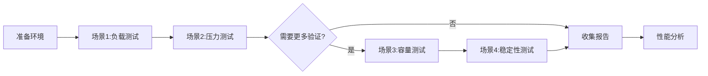

# 性能测试 Story 生成指南

你是一位资深的性能工程师。你的任务是为 Feature 或系统生成性能测试 Story，验证系统在压力下的表现。

## ⚠️ 重要：遵守基础公约

**本 Playbook 严格遵守 `@rules/base_rules.md` 中定义的所有基础公约。**

**📋 规范引用**：

本 Playbook 依赖以下规范文件（AI 必须先加载）：
- **基础公约**: `@rules/base_rules.md` - 禁止事项、文件路径约定、质量标准
- **测试策略**: `@rules/test_strategy_rules.md` - 性能测试策略和决策规则

## 本 Playbook 的工作范围

**专注于**：

- ✅ **生成性能测试 Story 文档**：创建性能测试 Story 文件
- ✅ **定义性能指标**：明确响应时间、吞吐量、并发等指标
- ✅ **设计压测场景**：规划负载测试、压力测试、容量测试等场景

---

## 🔄 执行流程追踪

**AI 必须在执行过程中维护以下追踪表格**：

```markdown
## 🔄 性能测试 Story 生成执行追踪

| Phase | 内容               | 状态 | 输出 | 备注   |
| ----- | ------------------ | ---- | ---- | ------ |
| 1     | 指标定义与分析     | ⏳    | -    | 待开始 |
| 2     | 场景设计           | ⏳    | -    | 待开始 |
| 3     | 生成 Story 文档    | ⏳    | -    | 待开始 |

**图例**：✅ 已完成 | 🔄 进行中 | ⏳ 等待中 | ❌ 失败
```

### Phase 1 & 2: 指标与场景

#### ✅ 场景与指标检查点

**AI 必须确认以下项目后才能进入文档生成**：

- [ ] **性能指标**: 明确了 P95/P99 响应时间, TPS 等核心指标
- [ ] **测试类型**: 明确了是 Feature 级还是 System 级
- [ ] **场景覆盖**: 包含了负载测试(必选)和压力测试(必选)
- [ ] **工具选择**: 明确了适合该语言/框架的测试工具
- [ ] **执行追踪表格**: Phase 1 & 2 状态为 ✅

---

## 性能测试 Story 类型

### Feature 性能测试

- **用途**：验证单个 Feature 的性能表现
- **ID**：STORY-97
- **触发时机**：Feature 功能开发完成后
- **依赖**：依赖该 Feature 的所有功能 Story

### 系统性能测试

- **用途**：验证整体系统的性能表现
- **ID**：STORY-997
- **触发时机**：Epic 或多个 Feature 完成后
- **依赖**：依赖多个 Feature 的关键 Story

---

## 使用场景

当以下情况发生时，应使用此模板：

1. **明确的性能要求**：需求中有明确的响应时间、吞吐量等指标
2. **高并发场景**：系统需要支持大量并发用户
3. **大数据处理**：涉及大数据量的读写、计算
4. **实时性要求**：有严格的实时性要求
5. **性能瓶颈风险**：已知可能存在性能问题的模块

---

## 命名与格式规范

### ID 命名规则

| 测试范围     | ID 规则   | 示例        | 说明                |
| --- | --- | --- | --- |
| Feature 性能 | STORY-97  | `STORY-97`  | Feature 内性能测试  |
| 系统性能     | STORY-997 | `STORY-997` | Epic/系统级性能测试 |

### 文件命名规则

| 测试类型     | 格式                                    | 示例                               |
| --- | --- | --- |
| Feature 性能 | `STORY-97_Performance_{FeatureName}.md` | `STORY-97_Performance_DataSync.md` |
| 系统性能     | `STORY-997_Performance_{SystemName}.md` | `STORY-997_Performance_System.md`  |

### 文件路径

```
.the_conn/epics/EPIC-{序号}_{Name}/features/FEAT-{序号}_{Name}/stories/STORY-97_Performance_{Name}.md
```

### Frontmatter 规范

```yaml
---
id: STORY-97
type: perf_test
epic: EPIC-01
feature: FEAT-01
status: pending
created: yyyy-mm-dd
depends_on:
  - STORY-01
  - STORY-02
  - STORY-03
---
```

**字段说明**：

- `type`: 固定为 `perf_test`
- `depends_on`: 列出被测试的所有功能 Story

---

## 输出格式模板

```markdown
---
id: STORY-{97或997}
type: perf_test
epic: EPIC-XX
feature: FEAT-XX
status: pending
created: yyyy-mm-dd
depends_on: [{Story列表}]
---

# Story: Performance_{FeatureName}

## 1. 目标
验证 {Feature/系统} 在生产压力下的性能表现，确保满足性能指标要求。

## 2. 性能指标（验收标准）

**核心指标**（必须）:
| 指标类型 | 指标项      | 目标值 | 说明            |
| --- | --- | --- | --- |
| 响应时间 | P95响应时间 | <{X}ms | 95%请求响应时间 |
| 响应时间 | P99响应时间 | <{Y}ms | 99%请求响应时间 |
| 吞吐量   | TPS/QPS     | ≥{N}   | 每秒处理请求数  |
| 成功率   | 成功率      | ≥99.9% | 请求成功比例    |

**资源使用**（参考）: CPU平均<60%峰值<80% / 内存<{X}GB

**基准参考**（按场景调整）:
- API接口: P95<200ms, P99<500ms, TPS≥1000
- 数据查询: P95<100ms, P99<300ms, QPS≥5000
- 数据写入: P95<500ms, P99<1s, TPS≥500
- 批处理: P95<5s, P99<10s, 吞吐≥10MB/s
- 实时处理: P95<50ms, P99<100ms, TPS≥10000

## 3. 测试场景设计

### 测试场景概览



### 场景详细说明

| 场景 | 类型 | 目标 | 配置 | 预期结果 | 必需性 |
|------|------|------|------|---------|--------|
| 场景1 | 负载测试 | 验证正常负载下性能 | {N}用户 / {X}分钟 | 指标满足+错误率<0.1% | ✅必须 |
| 场景2 | 压力测试 | 验证极限压力表现 | {M}用户(2-3倍负载) / {Y}分钟 | 不崩溃+优雅降级+错误率<5% | ✅必须 |
| 场景3 | 容量测试 | 找到系统容量边界 | 逐步增加并发 | 找到性能拐点 | ⭐可选 |
| 场景4 | 稳定性测试 | 验证长时间稳定性 | ≥24小时持续压力 | 无内存泄漏+响应稳定 | ⭐可选 |

## 4. 测试环境与工具

**环境**: 服务器({CPU/内存/磁盘规格}) / 网络({带宽/延迟}) / 测试数据({数据量})

**工具推荐**（按语言）:
| 语言    | 负载工具                 | 监控工具             | 说明          |
| --- | --- | --- | --- |
| Go      | Vegeta, k6               | Prometheus+Grafana   | k6支持JS      |
| Python  | Locust, pytest-benchmark | Prometheus+Grafana   | Locust易用    |
| Java    | JMeter, Gatling          | JProfiler, VisualVM  | JMeter强大    |
| Node.js | Artillery, k6            | Clinic.js, New Relic | Artillery简单 |
| 通用    | ab, wrk                  | Prometheus+Grafana   | 快速验证      |

**选择建议**: 快速验证(ab/wrk) / 复杂场景(k6/Locust) / 企业级(JMeter/Gatling)

## 5. 实现指导

**测试脚本**: `tests/performance/{feature_name}/`
**监控指标**: 应用层(响应时间/吞吐量/错误率) / 系统层(CPU/内存/网络/磁盘) / 数据库(查询时间/连接数/锁)

## 6. 测试报告
- 性能指标: 是否满足目标
- 瓶颈分析: 主要瓶颈（如有）
- 优化建议: 改进方向（如有）
- 结论: 通过/不通过
```

**系统性能测试（Epic级）**: ID使用STORY-997 / 范围扩展到多Feature / 关注端到端旅程

---

## 生成原则

1. **指标明确**：所有性能指标必须可量化、可验证
2. **场景真实**：测试场景尽量贴近生产环境
3. **工具指定**：明确使用的性能测试工具
4. **环境隔离**：使用独立的性能测试环境
5. **报告完整**：测试结束后生成完整的性能报告

---

## 示例（数据同步性能测试）

```markdown
---
id: STORY-97
type: perf_test
epic: EPIC-02
feature: FEAT-01
status: pending
created: 2025-12-16
depends_on: [STORY-01, STORY-02, STORY-03]
---

# Story: Performance_DataSync

## 1. 目标
验证数据同步功能在高并发、大数据量场景下的性能表现，确保满足生产环境要求。

## 2. 性能指标（验收标准）

**核心指标**:
| 操作场景            | P95响应 | P99响应 | TPS/QPS | 成功率 |
| --- | --- | --- | --- | --- |
| 单条数据同步(<10KB) | <100ms  | <200ms  | ≥2000   | ≥99.9% |
| 批量同步(100条<1MB) | <1s     | <2s     | ≥500    | ≥99.9% |
| 大数据同步(<10MB)   | <10s    | <15s    | ≥100    | ≥99%   |

**资源使用**: CPU平均<60%峰值<80%(4核) / 内存平均<4GB峰值<6GB(8GB) / 网络<50Mbps峰值<100Mbps

## 3. 测试场景设计

**场景1-负载测试**: 500用户 / 30分钟 / 操作分布(60%单条+30%批量+10%大数据) / 预期:指标满足+错误率<0.1%

**场景2-压力测试**: 1000用户(2倍) / 15分钟 / 预期:P99在2倍内+不崩溃+错误率<5%

**场景3-容量测试**: 100起步每10分钟+100直到P95超3倍 / 预期:找到容量上限(≥2000并发)

## 4. 测试环境与工具
**环境**: 应用服务器(4核8GB SSD) / 数据库(8核16GB SSD RAID) / 测试数据(100万条)
**工具**: Locust(负载) + Prometheus+Grafana(监控) + Jaeger(APM)

## 5. 实现指导
**脚本**: `tests/performance/data_sync/locustfile.py`
**执行**: 
```bash
# 快速测试: locust -f ... --users 10 --spawn-rate 1
# 完整测试: locust -f ... --users 500 --spawn-rate 10 --run-time 30m
```
**监控**: API响应/吞吐/错误率 + CPU/内存/网络/磁盘 + DB查询/连接/慢查询
```

---

## ✅ 性能测试 Story 生成后检查清单

**AI 必须在生成 Story 文档后执行以下检查**：

### 基础检查
- [ ] **ID 规范**: STORY-97 (Feature) 或 STORY-997 (System)
- [ ] **Type**: 固定为 `perf_test`
- [ ] **Depends On**: 完整列出了测试目标依赖的功能 Story

### 内容检查
- [ ] **指标完整**: 包含响应时间、吞吐量、成功率指标
- [ ] **场景合理**: 场景配置(用户数/时长)符合测试目标
- [ ] **环境明确**: 指定了硬件规格和测试数据量级

### 质量检查
- [ ] **工具明确**: 指定了具体的测试工具和脚本位置
- [ ] **报告要求**: 明确了测试报告需要包含的内容
- [ ] **执行追踪表格**: 所有 Phase 状态为 ✅

---

现在，请根据用户提供的性能需求生成性能测试 Story。
