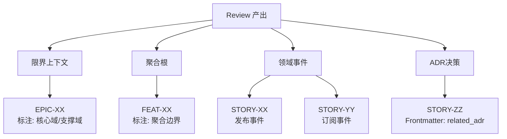
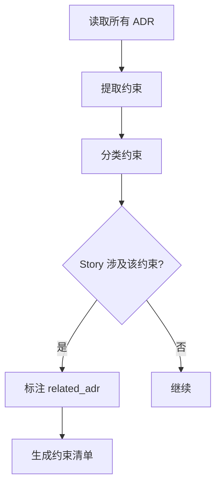
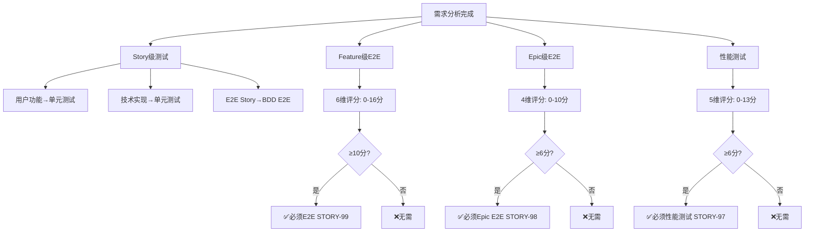
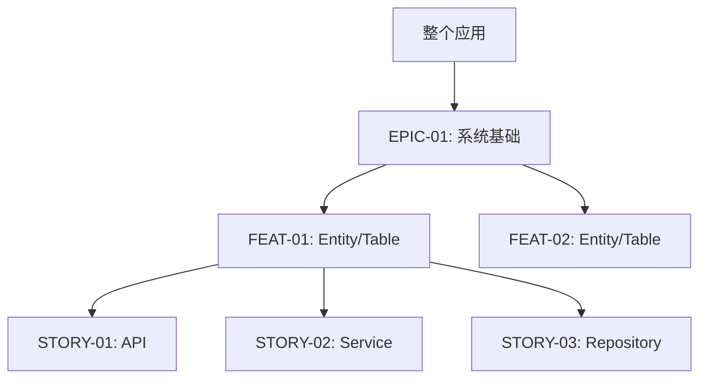
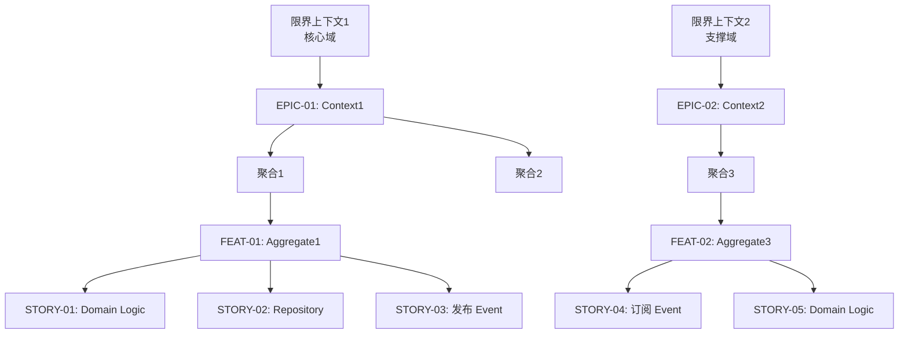
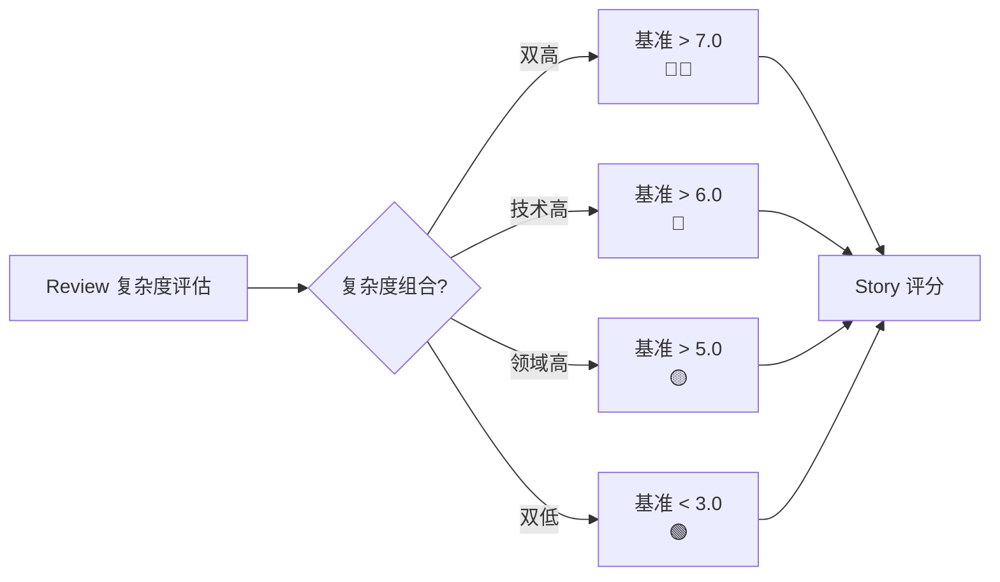
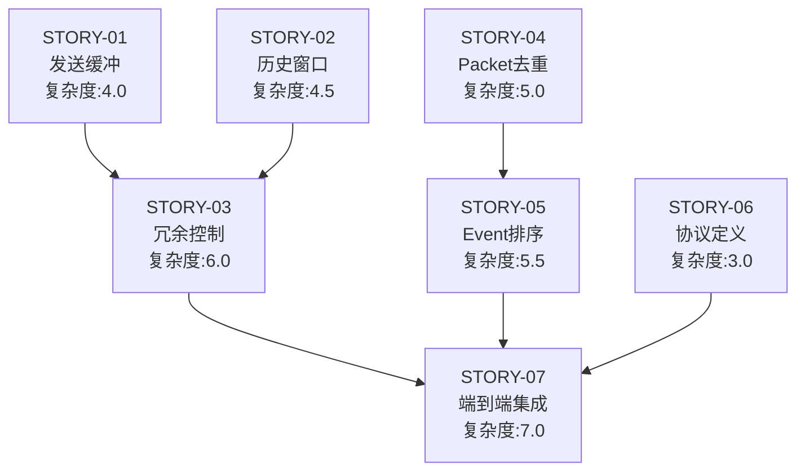
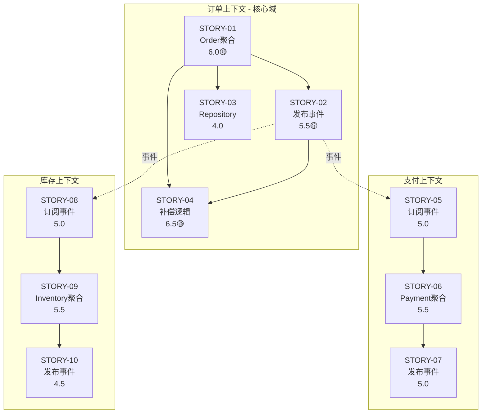

# 需求拆解指南（批量生成规划）

你是一位资深的敏捷教练和技术架构师。你的任务是将需求文档和技术方案拆解为完整的 Epic、Features 和 Stories 规划。

## ⚠️ 重要：遵守基础公约

**本 Playbook 严格遵守 `@rules/base_rules.md` 中定义的所有基础公约。**

**📋 规范引用**：

本 Playbook 依赖以下规范文件（AI 必须先加载）：
- **基础公约**: `@rules/base_rules.md` - 禁止事项、文件路径约定、质量标准
- **测试策略**: `@rules/test_strategy_rules.md` - Story 类型判断、测试决策规则
- **复杂度评估**: `@rules/complexity_rules.md` - 复杂度评分标准
- **BDD 语言配置**: `@rules/bdd_language_rules.md` - BDD 关键字和描述语言规范

## 本 Playbook 的工作范围

**专注于**：

- ✅ **生成规划文档**：Epic、Feature、Story 规划文件
- ✅ **需求拆解**：将需求拆解为可开发的任务
- ✅ **依赖分析**：分析任务之间的依赖关系
- ✅ **复杂度评估**：使用复杂度评分（1.0-10.0 分）而非时间估算

**原因**：本阶段是**规划阶段**，重点是"拆解需求"。

**命名规范说明**：详见各规划 Playbook（`epic_planning.md`、`feature_planning.md`、`story_writing.md`）

---

## 输入

用户会提供：

1. **需求文档**（PRD、用户故事、功能列表等）
2. **技术方案**（已通过 `requirements_review.md` 讨论确定）

---

## 输出流程

### 执行流程追踪

**AI 必须在执行过程中维护以下追踪表格**：

```markdown
## 🔄 需求拆解执行追踪

| Phase | 内容               | 状态 | 输出 | 备注   |
| ----- | ------------------ | ---- | ---- | ------ |
| 1     | 需求分析与配置确认 | ⏳    | -    | 待开始 |
| 2     | Epic 拆解          | ⏳    | -    | 待开始 |
| 3     | Feature 拆解       | ⏳    | -    | 待开始 |
| 4     | Story 规划         | ⏳    | -    | 待开始 |
| 5     | 输出完整大纲       | ⏳    | -    | 待开始 |
| 6     | 用户确认大纲       | ⏳    | -    | 待开始 |
| 7     | 生成详细文档       | ⏳    | -    | 待开始 |

**图例**：✅ 已完成 | 🔄 进行中 | ⏳ 等待中 | ❌ 失败
```

**更新规则**：
- 进入某个 Phase → 状态更新为 🔄
- 完成某个 Phase → 状态更新为 ✅，填写输出
- Phase 失败 → 状态更新为 ❌，记录失败原因

---

### Phase 1: 架构承接与配置确认

#### 1.1 读取 Review 产出（必须执行）


**AI 必须读取的文件**:

| 类型 | 路径 | 提取内容 |
|------|------|---------|
| Review 记录 | Review 讨论历史 | 模式标识（Standard/Pro） |
| ADR | `.the_conn/architecture/decisions/ADR-*.md` | 架构约束清单 |
| 领域分析 | Review Phase 1.5 输出 | 限界上下文、聚合、领域事件 |
| 复杂度评估 | Review Phase 3 输出 | 领域复杂度、技术复杂度 |

#### 1.2 模式判定与映射规则

**判定逻辑**:

| Review 模式 | 映射策略 | Epic 来源 | Feature 来源 | Story 特征 |
|------------|---------|----------|-------------|-----------|
| **Standard** | 功能模块拆分 | 整个应用 或 功能模块 | Entity/Table/页面 | MVC 标准拆分 |
| **Pro** | DDD 战略/战术拆分 | 限界上下文 | 聚合根 | 战术设计任务 |

**Pro Mode 映射规则**⭐:



| Review 产出 | Breakdown 映射 | Epic 内记录 | Feature 内记录 | Story 内记录 |
|------------|---------------|------------|---------------|-------------|
| 限界上下文 | Epic | 上下文名称<br/>核心域标识 | - | - |
| 聚合根 | Feature | - | 聚合边界<br/>一致性策略 | - |
| 领域事件 | Story (Inter-process) | - | 事件清单 | `domain_event` 字段 |
| ADR 决策 | Story 约束 | - | - | `related_adr` 字段 |

#### 1.3 ADR 约束检查（自动化）

**检查流程**:



**约束分类表**（AI 内部维护）:

| 约束类型 | ADR 示例 | 影响 Story 字段 | Story 实现指导要求 |
|---------|---------|----------------|-------------------|
| 通信模式 | ADR-001: 异步消息 | `related_adr: [ADR-001]` | 禁止同步 API |
| 数据存储 | ADR-002: PostgreSQL | `related_adr: [ADR-002]` | 禁止提及 MySQL |
| 一致性策略 | ADR-003: Saga | `related_adr: [ADR-003]` | 需要补偿逻辑 |
| 聚合边界 | ADR-004: Order 聚合 | `related_adr: [ADR-004]` | 遵循聚合边界 |

#### 1.4 复杂度继承机制

**基准调整规则**（基于 Review Phase 3 复杂度评估）:

| Review 复杂度组合 | Story 评分基准 | 标识 |
|------------------|---------------|------|
| 领域高 + 技术低 | > 5.0 | 🟡 精细建模 |
| 领域低 + 技术高 | > 6.0 | 🔴 技术复杂 |
| 双高 | > 7.0 | 🔴🔴 分阶段 |
| 双低 | < 3.0 | 🟢 快速实现 |

**AI 必须执行**: 在生成 Story 大纲时，根据 Review 评估自动调整复杂度基准。

#### 1.5 Context 与配置确认

| Step | 任务 | 操作 |
|------|------|------|
| **1** | 检查 Context | 读取 `.the_conn/context/global/`: Tech_Stack/Testing_Strategy/Architecture |
| **2** | 确认配置 | 缺失→仅询问缺失项<br/>BDD 格式: 英文关键字+项目语言 (参考 `@rules/bdd_language_rules.md`) |
| **3** | 应用测试策略 | **完整规则见 `@rules/test_strategy_rules.md`** |

**测试策略速查**（完整规则见`@rules/test_strategy_rules.md`）：



**输出格式示例**：
```markdown
📊 Feature E2E分析: FEAT-01 用户认证
| 维度 | 得分 | 理由 |
总分 15/16 → ✅必须E2E (STORY-99)
触发: 总分≥10 + 风险3分(一票通过)
```

  
### Phase 2: 生成拆解大纲

#### 2.1 拆解策略路由（自动判定）

**Standard Mode 拆解策略**:



**Pro Mode 拆解策略**⭐:



**拆解对比表**:

| 模式 | Epic 拆分 | Feature 拆分 | Story 拆分 |
|------|----------|-------------|-----------|
| **Standard** | 整个应用 或 功能模块 | Entity/Table/页面 | API → Service → Repository → DTO |
| **Pro** | 限界上下文（标注核心域） | 聚合根（标注聚合边界） | Domain Logic → Repository → Events → DTO Assembler → ACL (if needed) |

#### 2.2 领域事件特殊处理（Pro Mode）

**事件 → Story 映射规则**:

| Review 识别的事件 | Breakdown Story | Story 类型 | Frontmatter 字段 |
|------------------|----------------|-----------|-----------------|
| OrderCreated | STORY-XX: Publish_OrderCreated_Event | Inter-process | `domain_event: OrderCreated` |
| PaymentCompleted | STORY-YY: Handle_PaymentCompleted_Event | Inter-process | `domain_event: PaymentCompleted` |

**Story 命名规范**:
- 发布: `STORY-XX: Publish_{EventName}_Event`
- 订阅: `STORY-YY: Handle_{EventName}_Event`

#### 2.3 复杂度继承与基准调整

**AI 必须根据 Review Phase 3 复杂度评估调整评分**:



**复杂度标识**（在大纲中标注）:

| 标识 | 基准 | 含义 | Story 注意事项 |
|------|------|------|---------------|
| 🔴🔴 | > 7.0 | 双高复杂度 | 分阶段实施、POC 验证 |
| 🔴 | > 6.0 | 技术复杂 | 技术预研、性能测试 |
| 🟡 | > 5.0 | 领域复杂 | 精细建模、充分测试 |
| 🟢 | < 3.0 | 简单实现 | 快速开发、标准模式 |

#### 2.4 生成大纲格式

**重要**: 先展示大纲，等用户确认后再生成详细文档！


```markdown
# 需求拆解大纲

## Epic 规划

### EPIC-01: {Epic 名称}
- **业务价值**: {价值描述}
- **包含 Features**: FEAT-01, FEAT-02

### EPIC-02: {Epic 名称}
- **业务价值**: {价值描述}
- **包含 Features**: FEAT-03

## Feature 规划

### FEAT-01: {Feature 名称}
- **所属 Epic**: EPIC-01
- **目标**: {目标描述}
- **包含 Stories**: 
  - 功能 Story: STORY-01, STORY-02, STORY-03
  - 测试 Story: STORY-99 (E2E 测试，自动建议)

### FEAT-02: {Feature 名称}
- **所属 Epic**: EPIC-01
- **目标**: {目标描述}
- **包含 Stories**: 
  - 功能 Story: STORY-04, STORY-05
  - 测试 Story: 无需（<3 个功能 Story）

### FEAT-03: {Feature 名称}
- **所属 Epic**: EPIC-02
- **目标**: {目标描述}
- **包含 Stories**: 
  - 功能 Story: STORY-06, STORY-07, STORY-08
  - 测试 Story: STORY-98 (E2E 测试，自动建议)
  - 性能测试: STORY-97 (如果检测到性能瓶颈)

## Story 概要

### 功能开发 Story

| ID       | Story名称   | Feature | 类型 | 目标       | 测试策略 | 依赖     | 复杂度 |
| -------- | ----------- | ------- | ---- | ---------- | -------- | -------- | ------ |
| STORY-01 | {Story名称} | FEAT-01 | dev  | {简要目标} | 单元测试 | 无       | 3.5    |
| STORY-02 | {Story名称} | FEAT-01 | dev  | {简要目标} | 单元测试 | STORY-01 | 2.0    |

...（列出所有功能 Story）

### 测试 Story（自动规划）

| ID       | Story名称                 | Feature | 类型      | 目标                    | 依赖           | 复杂度 | 说明     |
| -------- | ------------------------- | ------- | --------- | ----------------------- | -------------- | ------ | -------- |
| STORY-99 | E2E_{FeatureName}_Flow    | FEAT-01 | e2e_test  | 验证STORY-01~03完整流程 | STORY-01,02,03 | 4.0    | 自动建议 |
| STORY-97 | Performance_{FeatureName} | FEAT-03 | perf_test | 验证高并发性能指标      | STORY-06,07,08 | 5.0    | 性能敏感 |

**性能测试详细指标**:
- 响应时间: P95 < {X}ms, P99 < {Y}ms
- 吞吐量: TPS ≥ {N}
- 并发能力: 支持 {M} 并发用户
- 测试场景: 负载测试、压力测试、容量测试

**测试路径**:
- Feature 文件: `tests/bdd/features/{module}/{feature_name}_flow.feature`
- Step Definitions: `tests/bdd/{language}_test.{ext}`

## 依赖关系与开发顺序

```mermaid
graph TB
    S01[STORY-01<br/>{名称}<br/>复杂度:3.5]
    S02[STORY-02<br/>{名称}<br/>复杂度:2.0]
    S04[STORY-04<br/>{名称}<br/>复杂度:4.0]
    S05[STORY-05<br/>{名称}<br/>复杂度:3.0]
    
    S01 --> S02
    S04 --> S05
    S02 --> S99[STORY-99<br/>E2E测试<br/>复杂度:4.0]
    S05 --> S99
```

**图例说明**:
- 箭头表示依赖关系（从被依赖指向依赖者）
- 同一水平线的 Story 可以并行开发
- 复杂度数值帮助评估工作量

### 并行开发建议

**第一批** (无依赖，可并行开发):
- STORY-01, STORY-04
- 总复杂度: 7.5分

**第二批** (依赖第一批):
- STORY-02, STORY-05
- 总复杂度: 5.0分

**第三批** (最终集成):
- STORY-99 (E2E 测试)
- 复杂度: 4.0分

**总体复杂度**: 16.5分（关键路径: STORY-01 → STORY-02 → STORY-99 = 9.5分）

---

**📋 测试配置确认**（已从 Context 或用户获取）：
- 编程语言: {语言}
- BDD 框架: {框架}
- BDD 格式: 英文关键字 + 项目交互语言描述 (Given/When/Then...)
- 测试策略: 混合策略（自动应用）

**⚠️ 请用户确认：**
1. **Epic/Feature/Story 的划分是否合理？**
2. **粒度是否合适？** 
   - 边界是否清晰？（每个 Story 的职责和范围是否明确）
   - 是否拆得太细？（是否可以合并为更完整的功能模块）
   - 是否拆得太粗？（是否包含多个独立的功能单元，建议拆分）
3. **依赖关系是否正确？**
4. **是否便于 AI 编码？**（每个 Story 的输入输出、接口边界是否明确）
5. **测试 Story 规划是否合理？**
   - E2E 测试 Story 的位置和时机
   - 性能测试 Story 是否需要（如果有建议）

请用户确认大纲后，继续 Phase 3


---

### 用户反馈与迭代

展示大纲后，等待用户反馈。用户可能会提出调整：

**常见反馈类型**:

| 反馈                | 处理方式                              |
| ------------------- | ------------------------------------- |
| "EPIC-01 太大了"    | 拆分为 2 个 Epic，重新分配 Features   |
| "STORY-03 依赖不对" | 调整 `depends_on` 字段，更新依赖图    |
| "缺少某个功能"      | 补充到合适的 Epic/Feature，新增 Story |
| "STORY-05 粒度太细" | 合并到其他 Story                      |
| "Feature 顺序不对"  | 调整 Feature 编号和顺序               |

**迭代流程**:

```text
展示大纲 v1
  ↓
用户反馈调整
  ↓
展示大纲 v2
  ↓
用户再次反馈（可选）
  ↓
用户确认："确认，请生成详细文档"
  ↓
生成 Phase 3
```

**重要原则**: 可以多轮迭代，直到用户满意。不要急于生成文件。

---

**等待用户确认**: 用户输入"**确认，请生成详细文档**"后，继续 Phase 3

---

### Phase 3: 生成详细文档

用户确认大纲后，按以下顺序生成文档：

**重要提示**: 生成 Epic 规划文档后，建议用户使用 `@prompts/context/extract.md` 从 Epic 规划中提取 Epic 专属的 Context 文档（如模块设计、数据模型等），存放到 `.the_conn/context/epics/EPIC-XX/` 目录。

#### 3.1 生成 Epic 文档

参考 `@prompts/planning/epic_planning.md` 的规则，为每个 Epic 生成：

- 文件路径: `.the_conn/epics/EPIC-{序号}_{Name}/README.md`
- 内容: Epic 规划（业务价值、范围、指标）

#### 3.2 生成 Feature 文档

参考 `@prompts/planning/feature_planning.md` 的规则，为每个 Feature 生成：

- 文件路径: `.the_conn/epics/EPIC-{序号}_{Name}/features/FEAT-{序号}_{Name}/README.md`
- 内容: Feature 规划（目标、Story 列表、验收标准）

#### 3.3 生成 Story 文档

参考 `@prompts/planning/story_writing.md` 的规则，为每个 Story 生成：

- 文件路径: `.the_conn/epics/.../stories/STORY-{序号}_{Name}.md`
- 内容: 完整的 Story（目标、BDD 场景、实现指导）

**重要**:

- 在生成 Story 前，确认项目的 BDD 配置（语言、测试库、Feature 文件语言）
- 如果缺失，先提醒用户提供

---

## 拆解原则

### Epic 拆分

1. **业务领域**: 按业务领域或功能模块划分
2. **交付价值**: 每个 Epic 应该有独立的业务价值
3. **规模适中**: 1 个 Epic 包含 2-4 个 Features（默认偏粗，避免过度拆分）
4. **边界清晰**: Epic 之间职责不重叠
5. **粒度控制**: 优先考虑较粗的粒度，一个中型项目通常 1-3 个 Epic 即可

**示例**:

```text
✅ 好的拆分:
EPIC-01: 基础框架
EPIC-02: 数据传输
EPIC-03: 监控告警

❌ 不好的拆分:
EPIC-01: 功能开发（范围太大）
EPIC-02: 其他功能（边界不清）
```

### Feature 拆分

1. **用户视角**: 从用户能感知的功能划分
2. **独立交付**: 每个 Feature 完成后应该是可用的增量
3. **规模适中**: 1 个 Feature 包含 2-5 个 Stories（默认偏粗，避免碎片化）
4. **端到端**: Feature 应该是完整的端到端流程
5. **粒度控制**: 优先合并相关功能，不要为了拆而拆

**示例**:

```text
✅ 好的拆分:
FEAT-01: 项目初始化
FEAT-02: 模板生成
FEAT-03: CLI 工具

❌ 不好的拆分:
FEAT-01: 后端开发（太笼统）
FEAT-02: 数据库设计（不是用户视角）
```

### Story 拆分

1. **边界清晰**: 每个 Story 按模块边界或功能边界划分，职责单一
2. **独立可测**: 每个 Story 有明确的输入输出，可独立编写测试
3. **接口明确**: Story 的对外接口和依赖关系清晰，便于 AI 理解和实现
4. **BDD 完整**: 每个 Story 有完整的 BDD 验收场景
5. **价值导向**: Story 完成后应该有可交付的价值
6. **粒度控制**: 宁粗勿细，按功能完整性拆分，不要为了拆而拆

**示例**:

```text
✅ 好的拆分（按功能模块边界）:
STORY-01: 实现项目结构初始化模块（包含目录创建、权限检查、幂等性处理）
STORY-02: 实现模板文件生成模块（包含模板加载、变量替换、文件写入）
STORY-03: 实现 CLI 命令解析模块（包含参数解析、帮助信息、错误处理）

❌ 不好的拆分:
STORY-01: 写代码（太笼统，边界不清）
STORY-02: 创建一个目录（太细碎，没有功能完整性）
STORY-03: 修改 init.py 的第 10-50 行（关注实现细节而非功能边界）
```

---

## ID 编号规则

### 自动编号逻辑

1. **Epic 编号**:
   - 全局唯一
   - 按生成顺序: EPIC-01, EPIC-02, EPIC-03, ...
   - 两位数字，不足补零

2. **Feature 编号**:
   - Epic 内唯一
   - 按 Epic 内顺序: FEAT-01, FEAT-02, ...
   - 两位数字，不足补零

3. **Story 编号**:
   - Epic 内唯一（不是 Feature 内）
   - 按 Epic 内顺序: STORY-01, STORY-02, ...
   - 跨 Feature 连续编号
   - 两位数字，不足补零

**示例**:

```text
EPIC-01
├── FEAT-01
│   ├── STORY-01
│   ├── STORY-02
│   └── STORY-03
└── FEAT-02
    ├── STORY-04  ← 继续 Epic 内编号
    └── STORY-05

EPIC-02
├── FEAT-03
│   ├── STORY-01  ← Epic-02 的第一个 Story，重新从 01 开始
│   └── STORY-02
```

---

## 依赖关系处理

### 识别依赖

1. **技术依赖**: Story B 需要 Story A 的代码才能实现
2. **数据依赖**: Story B 需要 Story A 创建的数据结构
3. **流程依赖**: 逻辑上必须先完成 Story A 才能开始 Story B

### 标注依赖

在 Story Frontmatter 中：

```yaml
depends_on:
  - STORY-01
  - STORY-03
```

### 建议开发顺序

根据依赖关系，生成建议的开发顺序：

- 无依赖的 Story 可以并行开发
- 有依赖的 Story 必须等依赖完成

---

## 质量检查清单

生成大纲后，自检：

- [ ] **Epic 粒度**: 是否按业务领域或子系统合理划分？
- [ ] **Feature 独立性**: 每个 Feature 是否独立可交付？
- [ ] **Story 边界**: 每个 Story 的职责和边界是否清晰？
- [ ] **便于 AI 编码**: 每个 Story 的输入输出、接口是否明确？
- [ ] **依赖合理**: 依赖关系是否真实存在？是否有循环依赖？
- [ ] **ID 连续**: Epic/Feature/Story 编号是否连续无跳号？
- [ ] **命名清晰**: 名称是否准确描述功能模块？

---

## 完整示例

### 示例 1: Standard Mode（技术项目）

#### 输入

**需求文档**:

```text
项目: DataStream 可靠传输
需求: 
1. 解决 UDP 丢包问题
2. 实现 99.9% 到达率
3. 低延迟（无 ACK 等待）
```

**技术方案**:

```text
核心: 3次冗余 + 动态捎带
协议: JSON 格式
语言: Go + godog (BDD)
模式: Standard Mode（技术项目，无复杂领域模型）
```

#### 输出大纲

```markdown
# 需求拆解大纲（Standard Mode）

## 模式标识
**评审模式**: Standard Mode  
**理由**: 技术项目，单一服务，无复杂领域模型

## Epic 规划

### EPIC-01: DataStream 可靠传输
- **业务价值**: 解决 UDP 丢包问题，实现高可靠信令传输
- **包含 Features**: FEAT-01, FEAT-02, FEAT-03

## Feature 规划

### FEAT-01: 发送端核心组件
- **所属 Epic**: EPIC-01
- **目标**: 实现发送缓冲、历史窗口、冗余控制
- **包含 Stories**: STORY-01, STORY-02, STORY-03

### FEAT-02: 接收端去重排序
- **所属 Epic**: EPIC-01
- **目标**: 实现 Packet 去重和 Event 排序
- **包含 Stories**: STORY-04, STORY-05

### FEAT-03: 协议与集成
- **所属 Epic**: EPIC-01
- **目标**: 定义协议格式，完成端到端集成
- **包含 Stories**: STORY-06, STORY-07

## Story 概要

### 功能开发 Story

| ID       | Story名称        | Feature | 类型 | 目标                           | 测试策略 | 依赖           | 复杂度 |
| -------- | ---------------- | ------- | ---- | ------------------------------ | -------- | -------------- | ------ |
| STORY-01 | 发送缓冲队列模块 | FEAT-01 | dev  | 队列管理、线程安全、容量控制   | 单元测试 | 无             | 4.0    |
| STORY-02 | 历史窗口管理模块 | FEAT-01 | dev  | 窗口维护、数据过期、查询接口   | 单元测试 | 无             | 4.5    |
| STORY-03 | 冗余控制器模块   | FEAT-01 | dev  | 冗余策略、发送控制、状态追踪   | 单元测试 | STORY-01,02    | 6.0    |
| STORY-04 | Packet去重模块   | FEAT-02 | dev  | ID管理、去重逻辑、内存优化     | 单元测试 | 无             | 5.0    |
| STORY-05 | Event排序模块    | FEAT-02 | dev  | 序列号处理、排序算法、输出保序 | 单元测试 | STORY-04       | 5.5    |
| STORY-06 | 协议定义模块     | FEAT-03 | dev  | 数据格式、序列化、版本兼容     | 单元测试 | 无             | 3.0    |
| STORY-07 | 端到端集成       | FEAT-03 | dev  | 模块组装、接口对接、端到端测试 | BDD E2E  | STORY-03,05,06 | 7.0    |

**复杂度统计**:
- 功能开发: 35.0分
- **总计**: 35.0分

## 依赖关系与开发顺序



### 并行开发建议

**第一批** (无依赖，可并行开发):
- STORY-01, STORY-02, STORY-04, STORY-06
- 总复杂度: 16.5分

**第二批** (依赖第一批):
- STORY-05 (依赖 STORY-04)
- 复杂度: 5.5分

**第三批** (依赖第一、二批):
- STORY-03 (依赖 STORY-01, STORY-02)
- 复杂度: 6.0分

**第四批** (最终集成):
- STORY-07 (依赖 STORY-03, STORY-05, STORY-06)
- 复杂度: 7.0分

**关键路径**: STORY-01 → STORY-03 → STORY-07 (总计 17.0分)
**总体复杂度**: 35.0分
```

---

### 示例 2: Pro Mode（DDD 业务项目）⭐

#### 输入

**需求文档**:

```text
项目: 电商订单系统
需求:
1. 用户下单购买商品
2. 订单自动扣减库存
3. 支持多种支付方式
4. 订单状态实时跟踪
```

**技术方案**（来自 requirements_review）:

```text
模式: Pro Mode
架构: DDD（领域驱动设计）

限界上下文:
- 订单上下文（核心域）
- 支付上下文（支撑域）
- 库存上下文（支撑域）

聚合根:
- Order（订单上下文）
- Payment（支付上下文）
- Inventory（库存上下文）

领域事件:
- OrderCreated（订单创建）
- PaymentCompleted（支付完成）
- InventoryReserved（库存预留）

ADR:
- ADR-001: 异步消息驱动架构（Kafka）
- ADR-002: PostgreSQL 数据库
- ADR-003: 最终一致性（Saga）

复杂度评估:
- 订单上下文: 领域复杂度高（多种业务规则）+ 技术复杂度中（需要高并发）
```

#### 输出大纲

```markdown
# 需求拆解大纲（Pro Mode）

## 模式标识
**评审模式**: Pro Mode  
**理由**: 跨服务、核心域重构、复杂业务规则、需要 DDD 战略/战术设计

## 架构承接说明

**Review 映射**:
- 限界上下文（3个）→ Epic（3个）
- 聚合根（3个）→ Feature（3个）
- 领域事件（3个）→ Story（6个：发布3+订阅3）

**ADR 约束清单**:
| ADR | 约束类型 | 约束内容 | 影响范围 |
|-----|---------|---------|---------|
| ADR-001 | 通信模式 | 上下文间使用异步消息（Kafka） | Story 禁止同步 API |
| ADR-002 | 数据库 | PostgreSQL | Story 禁止提及 MySQL |
| ADR-003 | 一致性 | 最终一致性（Saga） | Story 需要补偿逻辑 |

**复杂度继承**:
- 订单上下文（领域高+技术中）→ Story 基准 > 5.5 分 🟡

## Epic 规划

### EPIC-01: 订单上下文（核心域 🔴）
- **业务价值**: 核心订单处理能力，支撑业务收入增长
- **限界上下文**: Order Context
- **包含 Features**: FEAT-01（Order 聚合）
- **上下文映射**: Customer-Supplier（下游：支付、库存）

### EPIC-02: 支付上下文（支撑域 🟡）
- **业务价值**: 提供多种支付方式，提升支付成功率
- **限界上下文**: Payment Context
- **包含 Features**: FEAT-02（Payment 聚合）
- **上下文映射**: Conformist（上游：订单）

### EPIC-03: 库存上下文（支撑域 🟡）
- **业务价值**: 实时库存管理，防止超卖
- **限界上下文**: Inventory Context
- **包含 Features**: FEAT-03（Inventory 聚合）
- **上下文映射**: Conformist（上游：订单）

## Feature 规划

### FEAT-01: Order 聚合（订单核心逻辑）
- **所属 Epic**: EPIC-01
- **聚合边界**: Order（聚合根） + OrderItem（实体）
- **一致性策略**: 聚合内强一致（事务），聚合间最终一致（事件）
- **包含 Stories**: STORY-01, STORY-02, STORY-03, STORY-04

### FEAT-02: Payment 聚合（支付处理）
- **所属 Epic**: EPIC-02
- **聚合边界**: Payment（聚合根） + Transaction（实体）
- **一致性策略**: 聚合内强一致，跨上下文最终一致
- **包含 Stories**: STORY-05, STORY-06, STORY-07

### FEAT-03: Inventory 聚合（库存管理）
- **所属 Epic**: EPIC-03
- **聚合边界**: Inventory（聚合根） + StockItem（实体）
- **一致性策略**: 聚合内强一致，跨上下文最终一致
- **包含 Stories**: STORY-08, STORY-09, STORY-10

## Story 概要（Pro Mode 战术设计）

### 功能开发 Story

| ID | Story名称 | Feature | 类型 | 战术任务 | 相关ADR | 领域事件 | 复杂度 | 依赖 |
|----|---------|---------|------|---------|---------|---------|--------|------|
| STORY-01 | Order聚合根逻辑 | FEAT-01 | dev | Domain Logic | ADR-002 | - | 6.0🟡 | 无 |
| STORY-02 | 发布OrderCreated事件 | FEAT-01 | dev | Event Publisher | ADR-001,003 | OrderCreated | 5.5🟡 | STORY-01 |
| STORY-03 | OrderRepository实现 | FEAT-01 | dev | Repository | ADR-002 | - | 4.0 | STORY-01 |
| STORY-04 | 订单取消补偿逻辑 | FEAT-01 | dev | Saga补偿 | ADR-003 | OrderCancelled | 6.5🟡 | STORY-01,02 |
| STORY-05 | 订阅OrderCreated | FEAT-02 | dev | Event Handler | ADR-001 | OrderCreated | 5.0 | STORY-02 |
| STORY-06 | Payment聚合根逻辑 | FEAT-02 | dev | Domain Logic | ADR-002 | - | 5.5 | STORY-05 |
| STORY-07 | 发布PaymentCompleted | FEAT-02 | dev | Event Publisher | ADR-001,003 | PaymentCompleted | 5.0 | STORY-06 |
| STORY-08 | 订阅OrderCreated | FEAT-03 | dev | Event Handler | ADR-001 | OrderCreated | 5.0 | STORY-02 |
| STORY-09 | Inventory聚合根逻辑 | FEAT-03 | dev | Domain Logic | ADR-002 | - | 5.5 | STORY-08 |
| STORY-10 | 发布InventoryReserved | FEAT-03 | dev | Event Publisher | ADR-001 | InventoryReserved | 4.5 | STORY-09 |

**复杂度标识**: 🟡 = 基准 > 5.5（领域复杂度高）

**复杂度统计**:
- EPIC-01: 22.0分（核心域）
- EPIC-02: 15.5分
- EPIC-03: 15.0分
- **总计**: 52.5分

### 测试 Story（按 Feature 规划）

| ID | Story名称 | Feature | 类型 | 目的 | 依赖 |
|----|---------|---------|------|------|------|
| STORY-99 | E2E_Order_Flow | FEAT-01 | e2e_test | 验证订单创建→事件发布→持久化 | STORY-01,02,03,04 |
| STORY-98 | E2E_Payment_Flow | FEAT-02 | e2e_test | 验证订阅→支付→事件发布 | STORY-05,06,07 |
| STORY-97 | E2E_Inventory_Flow | FEAT-03 | e2e_test | 验证订阅→库存扣减→事件发布 | STORY-08,09,10 |
| STORY-96 | Epic_E2E_OrderSystem | EPIC-01 | e2e_test | 验证订单→支付→库存完整流程 | STORY-99,98,97 |

## 依赖关系与开发顺序（Pro Mode）



### 并行开发建议（Pro Mode）

**阶段1: 订单上下文（核心域优先）**
- STORY-01（Order聚合根）
- 复杂度: 6.0分
- 🔴 关键路径，必须优先

**阶段2: 订单上下文完善**
- 并行：STORY-02（事件发布）+ STORY-03（Repository）
- 复杂度: 9.5分

**阶段3: 下游上下文（并行开发）**
- 并行：STORY-05,06,07（支付）+ STORY-08,09,10（库存）
- 复杂度: 31.0分（两个上下文并行）

**阶段4: 补偿逻辑 + E2E 测试**
- STORY-04（补偿）
- STORY-99, 98, 97, 96（E2E测试）

**关键路径**: STORY-01 → STORY-02 → STORY-05 → STORY-06 → STORY-96（Epic E2E）
**并行机会**: 支付和库存上下文可完全并行开发
```

---

**请确认大纲，输入"确认，请生成详细文档"继续**


## 拆解质量标准

### Epic 层级

- ✅ 每个 Epic 有独立的业务价值
- ✅ Epic 边界清晰，职责不重叠
- ✅ 1 个 Epic 包含 1-5 个 Features
- ✅ Epic 名称使用 PascalCase

### Feature 层级

- ✅ 每个 Feature 从用户视角可感知
- ✅ Feature 独立可交付
- ✅ 1 个 Feature 包含 2-8 个 Stories
- ✅ Feature 有明确的端到端验收标准

### Story 层级

- ✅ 按功能模块或职责边界划分，每个 Story 职责单一
- ✅ Story 有完整的 BDD 验收场景
- ✅ Story 独立可测试，输入输出明确
- ✅ 接口和依赖关系清晰，便于 AI 编码
- ✅ 避免过度拆分，保持功能完整性，宁粗勿细

---

## 常见问题

### Q1: 一个需求太大，如何拆分？

**策略**:

1. 先按业务领域拆分 Epic
2. 再按用户流程拆分 Feature
3. 最后按实现单元拆分 Story

**示例**:

```text
大需求: 用户管理系统

Epic 拆分:
├── EPIC-01: 用户认证（登录、注册、登出）
├── EPIC-02: 权限管理（角色、权限、授权）
└── EPIC-03: 用户画像（资料、偏好、行为）
```

### Q2: 多个 Story 之间有依赖怎么办？

**处理方式**:

1. 在 Story Frontmatter 的 `depends_on` 中明确标注
2. 生成依赖关系图，帮助规划开发顺序
3. 建议并行开发无依赖的 Story，缩短总工期

### Q3: 需求变化了怎么办？

**应对方式**:

1. 小变化: 修改对应的 Story
2. 大变化: 可能需要新增 Feature 或 Epic
3. 使用 `@prompts/context/update.md` 更新技术方案

---

## 生成后的检查

生成所有文档后，执行最终检查：

- [ ] 所有文件路径正确，目录结构符合规范
- [ ] 所有 ID 编号连续无跳号
- [ ] 所有 Frontmatter 字段完整且格式正确
- [ ] 所有依赖关系正确标注
- [ ] 所有文件名使用 PascalCase
- [ ] BDD 场景格式统一，符合项目配置

---

## 执行检查点

| #       | 检查点             | 已完成                                     | 产出                             | 下一步            |
| ------- | ------------------ | ------------------------------------------ | -------------------------------- | ----------------- |
| **1**   | 需求分析与配置确认 | Context检查/测试配置/需求分析/性能场景识别 | 测试配置清单/功能模块/依赖图     | 生成大纲          |
| **2**   | 拆解大纲生成       | Epic/Feature/Story规划/测试决策/依赖分析   | 完整大纲/测试评分表/依赖图       | **⏸️等待用户确认** |
| **2.1** | 大纲迭代（可选）   | 收集反馈/调整大纲/生成v{N}                 | 更新大纲v{N}                     | **⏸️继续等待确认** |
| **3**   | 用户确认大纲       | 用户输入"确认，请生成详细文档"             | -                                | 开始Phase 3       |
| **4**   | Epic文档生成       | 所有Epic README.md                         | Epic文档（EPIC-XX/README.md）    | 生成Feature文档   |
| **5**   | Feature文档生成    | 所有Feature README.md                      | Feature文档（FEAT-XX/README.md） | 生成Story文档     |
| **6**   | Story文档生成      | 所有Story .md + BDD场景                    | Story文档（STORY-XX_*.md）       | 质量检查          |
| **7**   | 质量检查           | 路径/ID/Frontmatter/依赖/命名/BDD格式      | 完整规划文档体系                 | ✅任务完成         |

---

现在，请根据用户提供的需求文档和技术方案开始需求拆解。
