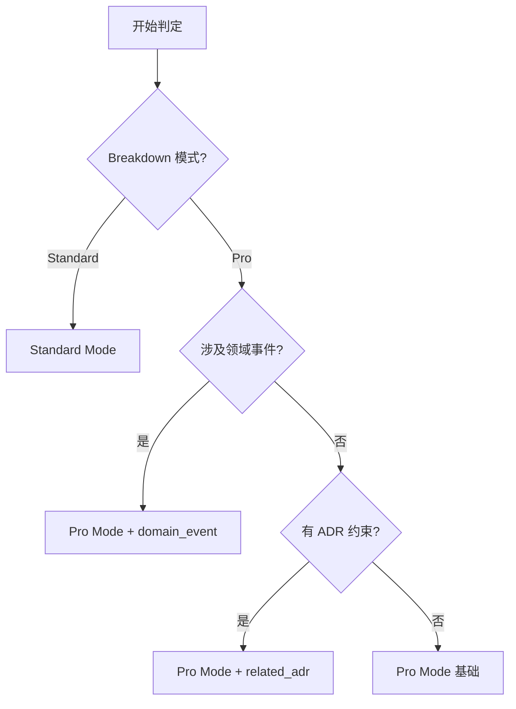

# Story 生成指南

你是一位资深的敏捷教练。你的任务是根据需求文档或 Feature，生成结构化的普通 Story 文件（功能开发 Story）。

## ⚠️ 重要：遵守基础公约

**本 Playbook 严格遵守 `@rules/base_rules.md` 中定义的所有基础公约。**

**📋 规范引用**：

本 Playbook 依赖以下规范文件（AI 必须先加载）：
- **基础公约**: `@rules/base_rules.md` - 禁止事项、文件路径约定、质量标准
- **测试策略**: `@rules/test_strategy_rules.md` - Story 类型判断、测试策略
- **复杂度评估**: `@rules/complexity_rules.md` - 复杂度评分标准

## 本 Playbook 的工作范围

**专注于**：

- ✅ **生成普通 Story 文档**：创建功能开发 Story 文件
- ✅ **编写功能清单**：使用功能清单作为验收标准
- ✅ **设计指导**：在"实现指导"中使用代码片段说明设计

**不包括**：

- ❌ E2E Story：请使用 `@playbooks/planning/e2e_story.md`
- ❌ Bug Fix Story：请使用 `@playbooks/planning/bug_fix_story.md`

---

## 🔄 执行追踪表格（AI 必须维护）

**AI 必须在开始执行时立即输出此表格，并在每个 Step 完成后更新状态**：

```markdown
## 🔄 Story 生成执行追踪

| Step | 内容               | 状态 | 输出 | 备注   |
| ---- | ------------------ | ---- | ---- | ------ |
| 1    | 模式判定           | ⏳    | -    | 待开始 |
| 2    | 提取需求信息       | ⏳    | -    | 待开始 |
| 3    | 生成 Story 文档    | ⏳    | -    | 待开始 |
| 4    | 生成后检查         | ⏳    | -    | 待开始 |

**图例**：✅ 已完成 | 🔄 进行中 | ⏳ 等待中 | ❌ 失败
```

**更新规则**：
- 进入某个 Step → 状态更新为 🔄
- 完成某个 Step → 状态更新为 ✅，填写输出
- Step 失败 → 状态更新为 ❌，记录失败原因

---

## 🎯 模式判定（AI 必须执行）

**AI 必须根据以下标准判定使用哪种模式**：

| 判定维度 | Standard Mode | Pro Mode |
|---------|--------------|----------|
| **来源** | requirements_breakdown 判定为 Standard | requirements_breakdown 判定为 Pro |
| **Frontmatter 字段** | 基础字段（id/type/epic/feature/status/created/depends_on） | + related_adr / domain_event / aggregate |
| **实现指导内容** | MVC 标准拆分（Controller/Service/Repository） | DDD 战术设计（Domain Logic/Repository/Event Publisher） |
| **典型场景** | CRUD、标准业务逻辑 | 领域事件、聚合设计、复杂业务规则 |

**判定流程**：



**输出要求**：

- **Standard Mode**: 使用标准 Frontmatter + 功能清单验收标准
- **Pro Mode**: 使用扩展 Frontmatter + 领域事件说明（如适用）

---

## 命名与格式规范

### ID 命名规则

| 类型  | 格式           | 示例       | 说明        |
| --- | --- | --- | --- |
| Story | `STORY-{序号}` | `STORY-01` | Epic 内唯一 |

### 文件命名规则

| 类型       | 格式                               | 示例                           |
| --- | --- | --- |
| Story 文件 | `STORY-{序号}_{PascalCaseName}.md` | `STORY-01_Create_Structure.md` |

**PascalCase 规则**：每个单词首字母大写，无分隔符

### 文件路径

```text
.the_conn/epics/EPIC-{序号}_{Name}/features/FEAT-{序号}_{Name}/stories/STORY-{序号}_{Name}.md
```

### Frontmatter 规范

**Standard Mode**:

```yaml
---
id: STORY-01
type: dev
epic: EPIC-01
feature: FEAT-01
status: pending
created: yyyy-mm-dd
depends_on: []
---
```

**Pro Mode**⭐:

```yaml
---
id: STORY-01
type: dev
epic: EPIC-01
feature: FEAT-01
status: pending
created: yyyy-mm-dd
depends_on: []
related_adr:           # 🆕 相关 ADR 列表
  - ADR-001
  - ADR-003
domain_event: OrderCreated  # 🆕 如果是事件相关 Story
aggregate: Order            # 🆕 所属聚合（可选）
---
```

**字段说明**：

- `type`: 固定为 `dev`（开发 Story）
- `status`: `pending` (未完成) 或 `done` (已完成)
- `created`: 格式 `yyyy-mm-dd`
- `depends_on`: 依赖的 Story ID 列表，无依赖写 `[]`

---

## 输入

用户会提供以下材料：

- Feature 规划文件
- 具体的功能需求描述
- 技术任务描述

---

## 输出格式

### Standard Mode 格式

```markdown
---
id: STORY-{序号}
type: dev
epic: EPIC-{序号}
feature: FEAT-{序号}
status: pending
created: yyyy-mm-dd
depends_on: []
---

# Story: {名称}

## 1. 目标

{为什么需要这个功能？要达成什么目标？1-3 句话，从业务/用户价值角度描述}

## 2. 验收标准（功能清单）

完成以下功能要求：

- [ ] {功能要求1}
- [ ] {功能要求2}
- [ ] {功能要求3}
- [ ] 单元测试覆盖率 ≥ {X}%
- [ ] 所有测试通过，代码通过 linter 检查

**验证方式**：
- 运行单元测试
- 手动验证关键功能点
- Code Review

## 3. 实现指导

**复杂度评估**: {1.0-10.0 分}（参考 `@rules/complexity_rules.md`）

**涉及文件**:
- `{文件路径}` - {说明}

**关键逻辑**:
- {算法/流程/接口说明}

**依赖**:
- 依赖的 Story: {STORY-XX}
- 外部依赖: {第三方库}

**波及分析 (Impact Analysis)**:
- [ ] 数据模型变动 -> 检查: Migration, API Schema, Service Layer
- [ ] 配置变动 -> 检查: 环境变量, 启动脚本, 文档
- [ ] 外部接口变动 -> 检查: 前端调用, 第三方集成, Mock Data

**边界**:
- 禁止修改: {范围}

```

### Pro Mode 格式⭐

```markdown
---
id: STORY-{序号}
type: dev
epic: EPIC-{序号}
feature: FEAT-{序号}
status: pending
created: yyyy-mm-dd
depends_on: []
related_adr:
  - ADR-001
domain_event: {EventName}  # 如果适用
aggregate: {AggregateName}  # 如果适用
---

# Story: {名称}

## 1. 目标

{为什么需要这个功能？要达成什么目标？1-3 句话，从业务/用户价值角度描述}

## 2. 验收标准（功能清单）

完成以下功能要求：

- [ ] {功能要求1}
- [ ] {功能要求2}
- [ ] {功能要求3}
- [ ] 单元测试覆盖率 ≥ {X}%
- [ ] 所有测试通过，代码通过 linter 检查

**验证方式**：
- 运行单元测试
- 验证领域事件发布（如适用）
- Code Review

## 3. 实现指导

**复杂度评估**: {1.0-10.0 分}（参考 `@rules/complexity_rules.md`）

### 架构约束（基于 ADR）

**ADR-001: {标题}**
- ✅ {必须遵守的约束}
- ❌ {禁止的行为}
- 📖 参考：ADR-001 第 X 节

**ADR-003: {标题}**
- ✅ {必须遵守的约束}
- ❌ {禁止的行为}
- 📖 参考：ADR-003 第 Y 节

### 战术设计任务

| 任务类型 | 说明 |
|---------|------|
| **Domain Logic** | • 聚合根：{名称}<br>• 不变性规则：{规则}<br>• 业务方法：{列举} |
| **Domain Events** | • 发布/订阅：{事件名}<br>• 携带数据：{列举}<br>• 时机：{说明} |
| **Repository** | • 接口：{列举}<br>• 实现：{技术栈} |
| **DTO Assembler** | • 映射：{Aggregate → DTO}<br>• 用途：{说明} |
| **ACL（如需要）** | • 位置：{说明}<br>• 转换：{外部模型 → 内部模型} |

**涉及文件**:
- `{文件路径}` - {说明}

**关键逻辑**:
- {算法/流程/接口说明}

**依赖**:
- 依赖的 Story: {STORY-XX}
- 外部依赖: {第三方库}

**波及分析 (Impact Analysis)**:
- [ ] 领域模型变动 -> 检查: DTO Assembler, Repository 实现, 数据库 Schema
- [ ] 领域事件变动 -> 检查: 消费者(Consumer), 消息契约(Contract), 幂等性处理
- [ ] 接口变动 -> 检查: ACL 层, 对外 API 文档

**边界**:
- 聚合边界：{说明}
- 禁止修改：{范围}

```

---

## Frontmatter 字段说明

**Standard Mode 字段（必填）**:

| 字段 | 类型 | 说明 | 示例 |
|------|------|------|------|
| `id` | string | Story ID | `STORY-01` |
| `type` | enum | 固定为 `dev` | `dev` |
| `epic` | string | 所属 Epic ID | `EPIC-01` |
| `feature` | string | 所属 Feature ID | `FEAT-01` |
| `status` | enum | `pending` / `done` | `pending` |
| `created` | date | 格式 `yyyy-mm-dd` | `2025-12-25` |
| `depends_on` | array | 依赖 Story ID 列表 | `[]` 或 `[STORY-01]` |

**Pro Mode 额外字段（可选）**⭐:

| 字段 | 类型 | 说明 | 示例 | 何时使用 |
|------|------|------|------|---------|
| `related_adr` | array | 相关 ADR 列表 | `[ADR-001, ADR-003]` | Story 受 ADR 约束时 |
| `domain_event` | string | 领域事件名称 | `OrderCreated` | Story 涉及事件发布/订阅 |
| `aggregate` | string | 所属聚合根 | `Order` | Story 属于某个聚合 |

---

## 功能清单编写规则

### 清单原则

1. **用户视角**：从用户能感知的功能描述
2. **可验证**：每项都可以明确验证是否完成
3. **具体明确**：避免模糊描述，使用具体指标
4. **完整覆盖**：包含功能要求 + 质量要求

### 清单内容

**功能要求**（必需）：

- 用户可见的功能点
- 业务规则和约束
- 数据验证规则
- 错误处理要求

**质量要求**（必须包含）：

- 单元测试覆盖率要求（根据模块类型设定，参考上文"测试覆盖率要求"）
- 性能指标（如响应时间，如有要求）
- 代码质量要求（如 linter 通过，必须）

### 示例对比

❌ **不好的清单**：

- [ ] 实现登录功能
- [ ] 写代码
- [ ] 测试

✅ **好的清单**：

- [ ] 用户可以使用邮箱和密码登录
- [ ] 密码错误3次后锁定账户30分钟
- [ ] 登录成功后生成 JWT Token
- [ ] 登录失败显示明确的错误提示
- [ ] 单元测试覆盖率 ≥ 80%
- [ ] 所有测试通过，代码通过 linter 检查

---

## 生成原则

1. **目标清晰**：目标描述简洁，说明"为什么"和"价值是什么"
2. **清单具体**：功能清单可验证、可测试
3. **范围明确**：涉及文件和边界清晰
4. **单一职责**：一个 Story 只做一件事
5. **独立可测**：Story 完成后可以独立测试
6. **测试先行**：强调单元测试的重要性

---

## 示例（功能开发Story）

### Standard Mode 示例

```markdown
---
id: STORY-01
type: dev
epic: EPIC-01
feature: FEAT-01
status: pending
created: 2025-12-16
depends_on: []
---

# Story: 用户注册功能

## 1. 目标
为系统增加用户注册功能，允许新用户通过邮箱创建账号，提升用户增长和访问便利性。

## 2. 验收标准（功能清单）
- [ ] 用户可通过邮箱注册账号
- [ ] 密码强度符合安全策略（≥8位,含大小写+数字+特殊字符）
- [ ] 邮箱地址验证（格式+唯一性）
- [ ] 注册成功后发送欢迎邮件
- [ ] 单元测试覆盖率 ≥ 80%
- [ ] 所有测试通过+代码通过linter检查

**验证方式**: 单元测试+手动验证+Code Review

## 3. 实现指导
**复杂度**: 4.5分（标准业务逻辑+邮件集成）

**涉及文件**:
- `src/auth/register.py` - 注册逻辑
- `src/utils/email.py` - 邮件发送
- `tests/test_register.py` - 单元测试

**关键逻辑**:
- 邮箱格式验证（正则）+唯一性检查（数据库查询）
- 密码强度校验（8位+大小写+数字+特殊字符）
- 密码加密存储（bcrypt哈希）

**依赖**: SMTP服务配置（环境变量）

**边界**: 禁止修改现有登录模块
```

### Pro Mode 示例⭐

```markdown
---
id: STORY-02
type: dev
epic: EPIC-02
feature: FEAT-01
status: pending
created: 2025-12-25
depends_on: [STORY-01]
related_adr:
  - ADR-001  # 异步消息架构
  - ADR-003  # 最终一致性策略
domain_event: OrderCreated
aggregate: Order
---

# Story: 发布 OrderCreated 事件

## 1. 目标
在订单创建成功后，发布 OrderCreated 领域事件，通知下游上下文（库存、支付）进行后续处理，实现上下文间的解耦和最终一致性。

## 2. 验收标准（功能清单）
- [ ] 订单创建成功后自动发布 OrderCreated 事件
- [ ] 事件包含必要数据：orderId, items, totalPrice, userId
- [ ] 事件发布失败时记录日志并告警
- [ ] 事件消息幂等（支持重复消费）
- [ ] 单元测试覆盖率 ≥ 80%
- [ ] 集成测试验证事件发布到 Kafka

**验证方式**: 单元测试+Kafka消费验证+Code Review

## 3. 实现指导
**复杂度**: 5.5分（事件发布+幂等性处理）

### 架构约束（基于 ADR）

**ADR-001: 异步消息驱动架构**
- ✅ 必须使用 Kafka 发布事件
- ❌ 禁止使用同步 HTTP 调用通知下游
- 📖 参考：ADR-001 第 3 节"上下文通信模式"

**ADR-003: 最终一致性（Saga）**
- ✅ 事件必须幂等（支持重复消费）
- ✅ 事件发布失败需要重试机制（3次）
- 📖 参考：ADR-003 第 4 节"一致性策略"

### 战术设计任务

| 任务类型 | 说明 |
|---------|------|
| **Domain Logic** | • 聚合根：Order<br>• 业务方法：publishCreatedEvent()<br>• 调用时机：Order.create() 成功后 |
| **Domain Events** | • 发布：OrderCreated<br>• 携带数据：orderId, items, totalPrice, userId, createdAt<br>• 时机：订单持久化成功后（确保数据已保存） |
| **Event Publisher** | • 实现：KafkaEventPublisher<br>• Topic：order-events<br>• 分区键：orderId（确保同一订单的事件有序） |
| **幂等性保证** | • 事件ID：生成唯一 eventId（UUID）<br>• 消费端去重：订阅方需检查 eventId |

**涉及文件**:
- `src/order/domain/order.py` - 聚合根，添加 publishCreatedEvent()
- `src/order/events/order_created.py` - 事件定义
- `src/infrastructure/kafka_publisher.py` - Kafka 发布器
- `tests/test_order_events.py` - 单元测试

**关键逻辑**:
```python
class Order(AggregateRoot):
    def create(self, items, user_id):
        # 1. 业务逻辑
        self.validate_items(items)
        self.calculate_total()
        
        # 2. 持久化
        self.save()  # 确保数据已保存
        
        # 3. 发布事件
        event = OrderCreated(
            event_id=generate_uuid(),  # 幂等性
            order_id=self.id,
            items=self.items,
            total_price=self.total,
            user_id=user_id,
            created_at=now()
        )
        EventPublisher.publish('order-events', event, partition_key=self.id)
        
        return self
```

**依赖**:
- STORY-01（订单创建逻辑）
- Kafka 集群（环境配置）

**边界**:
- 聚合边界：仅在 Order 聚合内发布事件
- 禁止修改：其他聚合的事件发布逻辑

**技术要点**:
- 事件发布失败处理：重试 3 次 + 告警
- 性能考虑：异步发布，不阻塞主流程
- 监控：记录事件发布成功/失败日志
```

---

## ✅ Story 生成后检查清单

**AI 必须在生成 Story 文档后执行以下检查**：

### 基础检查
- [ ] **文件路径正确**: `.the_conn/epics/EPIC-XX_*/features/FEAT-XX_*/stories/STORY-XX_*.md`
- [ ] **ID 格式正确**: STORY-XX（两位数字，Epic 内唯一）
- [ ] **文件命名规范**: PascalCase，无空格
- [ ] **Frontmatter 完整**: id / type / epic / feature / status / created / depends_on

### 模式检查
- [ ] **Standard Mode**: 基础字段完整
- [ ] **Pro Mode**: + related_adr / domain_event / aggregate（如适用）
- [ ] **模式一致**: 与 Breakdown/Epic/Feature 判定模式一致

### 内容检查
- [ ] **目标明确**: 一句话说明 Story 要实现什么
- [ ] **验收标准清晰**: Standard 用功能清单 / Pro 用功能清单+领域约束
- [ ] **验收标准可测试**: 每项标准都可以通过测试验证
- [ ] **实现指导完整**: 涉及文件 / 关键逻辑 / 技术要点 / 依赖 / 边界
- [ ] **波及分析完整**: 已检查 Data/Config/API 等联动影响

### Pro Mode 额外检查（如适用）
- [ ] **ADR 关联检查**: 尝试检索相关 ADR。如未找到，已提示用户创建或留空。
- [ ] **ADR 约束已标注**: related_adr 字段包含相关 ADR
- [ ] **ADR 约束说明完整**: 实现指导中说明了 ADR 的具体要求
- [ ] **领域事件已标注**: domain_event 字段（如是事件相关 Story）
- [ ] **聚合边界明确**: aggregate 字段 + 边界说明
- [ ] **战术设计任务清晰**: Domain Logic / Repository / Event Publisher 等

### 复杂度检查
- [ ] **复杂度已评估**: 1.0-10.0 分范围
- [ ] **复杂度合理**: 
  - 如 > 8.0 → 建议拆分
  - 如 < 1.0 → 建议合并
- [ ] **复杂度理由说明**: 说明了为什么是这个分数

### 依赖关系检查
- [ ] **depends_on 正确**: 列出了所有前置 Story
- [ ] **无循环依赖**: Story A 依赖 B，B 不能依赖 A
- [ ] **依赖存在**: 所有 depends_on 的 Story 都已规划

### 测试策略检查
- [ ] **测试要求明确**: 单元测试 / 集成测试 / E2E 测试
- [ ] **测试覆盖率**: 单元测试 ≥ 80%
- [ ] **BDD 场景**: 如需 BDD，场景完整（Given/When/Then）

### Standard Mode 特定检查
- [ ] **MVC 拆分清晰**: Controller / Service / Repository / DTO
- [ ] **CRUD 完整**: 如是 CRUD，包含增删改查

### Pro Mode 特定检查
- [ ] **领域逻辑优先**: Domain Logic 在最前
- [ ] **事件发布时机**: 明确何时发布事件
- [ ] **幂等性说明**: 如涉及事件，说明幂等性保证

---

现在，请根据用户提供的需求生成普通 Story。
