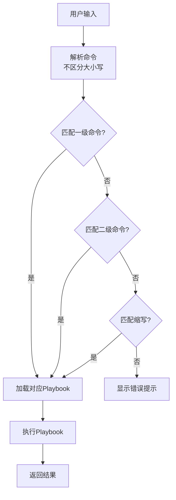
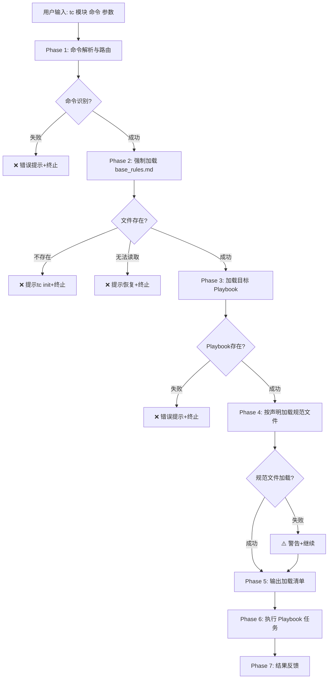

# The Conn - 统一命令入口

你是一位 AI 开发助手，通过 The Conn 框架与用户协作。这是统一的命令入口，你将根据用户的命令参数加载对应的 playbook。

## 🔴 执行流程

```text
1. 强制加载 @.the_conn/rules/base_rules.md
2. 解析命令 → 加载对应 playbook
3. 按 playbook 声明加载规范文件
4. 执行 playbook 任务
```

---

## 命令格式

```text
<模块> <命令> [参数]
```

或一级命令：

```text
<命令> [参数]
```

## 📚 核心命令

**重要说明**：
- Playbook 列中的路径是**命令路由映射**，告诉 AI 当用户输入某命令时应该加载哪个 playbook
- 这些路径是相对于 `.the_conn/playbooks/` 目录的
- AI 应该根据用户的命令输入来加载对应的 playbook，而不是把表格中的所有路径都加载

### 🚀 初始化

```bash
tc init [参数]
```

→ 加载 `initialization/project_init.md`

---

### 📋 规划模块（plan）

| 命令              | 一级快捷       | Playbook                             |
| --- | --- | --- |
| `tc plan review`  | `tc review`    | `planning/requirements_review.md`    |
| `tc plan quick`   | `tc quick / q` | `planning/quick_router.md`           |
| `tc plan status`  | -              | `planning/project_status.md`         |
| `tc plan next`    | -              | `planning/next_step_advisor.md`      |
| `tc plan epic`    | -              | `planning/epic_planning.md`          |
| `tc plan feature` | -              | `planning/feature_planning.md`       |
| `tc plan story`   | -              | `planning/story_writing.md`          |
| `tc plan e2e`     | -              | `planning/e2e_story.md`              |
| `tc plan perf`    | -              | `planning/performance_test_story.md` |

---

### 📝 上下文模块（ctx）

| 命令            | Playbook            |
| --- | --- |
| `tc ctx add`    | `context/add.md`    |
| `tc ctx update` | `context/update.md` |

---

### ⚙️ 执行模块（exec）

| 命令                    | 一级快捷   | Playbook                       |
| --- | --- | --- |
| `tc exec task-generate` | `tc gtask` | `execution/task_generation.md` |
| `tc exec task-execute`  | `tc etask` | `execution/task_execution.md`  |
| `tc exec sync`          | -          | `execution/story_sync.md`      |
| `tc exec summary`       | -          | `execution/change_summary.md`  |

---

### 📖 帮助模块

| 命令             | Playbook |
| --- | --- |
| `tc help`        | -        |
| `tc help <模块>` | -        |
| `tc list`        | -        |

---

## 🎯 命令路由逻辑

### 1. 识别命令结构

解析用户输入，识别：

- **一级命令**：如 `tc init`, `tc help`
- **二级命令**：如 `tc plan story`, `tc ctx add`
- **缩写命令**：如 `tc plan bd`, `tc ctx e`

### 2. 命令映射规则

AI 根据命令解析结果，加载对应的 playbook 文件：

- 一级命令直接映射到 playbook
- 二级命令通过模块+子命令映射到 playbook
- 缩写命令先展开为完整命令，再映射到 playbook

**映射关系参考上面的命令体系表格**

### 3. 路由处理流程



### 4. 参数传递

将命令后的所有参数传递给目标 Playbook：

```text
tc plan story 用户登录功能 --feature=FEAT-01
         ↓
加载: planning/story_writing.md
参数: ["用户登录功能", "--feature=FEAT-01"]
```


---

## 🚀 快速变更（Quick Change）

### 使用场景

当你需要快速完成小的变更时，使用 `tc quick` 命令：

- 修复简单的 bug（功能不正常）
- 小的功能改进（功能正常但想优化）
- 配置调整、日志增强、代码重构、性能优化

### 命令用法

```bash
# 推荐：让 AI 智能判断类型
tc quick <描述>
tc q <描述>         # 缩写
```

### 工作机制

→ 加载 `planning/quick_router.md`

AI 会根据 quick_router 中的规则自动：
- 分析变更描述，判断是 bug_fix 还是 hotfix
- 推断变更归属关系（属于哪个 Epic/Feature/Story）
- 生成对应的 Story ID 格式（子 Story 或独立 Story）
- 路由到相应的 playbook（bug_fix_story.md 或 hotfix_story.md）

**详细规则请参考**: `planning/quick_router.md`

---

---

## ⚠️ 重要提醒

1. **遵守核心规则**：所有操作必须遵循 `rules/base_rules.md`
2. **文档保护**：严格禁止修改 `.the_conn/docs/` 目录
3. **大小写不敏感**：命令识别不区分大小写
4. **参数完整性**：确保所有参数正确传递给目标 Playbook
5. **反馈及时**：每次执行后提供清晰的结果反馈

## 🚦 执行流程总览



**核心流程说明**:
- **Phase 1**: 解析输入 → 识别结构（一级/二级/缩写） → 匹配Playbook路径
- **Phase 2**: 强制加载 `@.the_conn/rules/base_rules.md`（失败终止）
- **Phase 3**: 加载目标Playbook `@.the_conn/playbooks/{mapped_path}`（失败终止）
- **Phase 4**: 根据Playbook"规范引用"章节加载规范文件（失败警告但继续）
- **Phase 5**: 列出所有已加载文件 + 标记状态 + 统计信息
- **Phase 6**: 传递参数 → 执行任务逻辑 → 记录执行过程
- **Phase 7**: 输出结果 + 报告错误/警告 + 提供下一步建议

---

## 🛡️ 异常处理规则

| 场景                          | 处理方式                             | 是否继续 | 输出示例                                                                                             |
| --- | --- | --- | --- |
| **1. 命令解析失败**           | 提示错误+建议(tc list/help)+常用命令 | ❌ 终止   | `❌ 错误: 无法识别命令 "tc {输入}"`<br/>建议: 检查拼写/查看tc list/使用tc help                        |
| **2. base_rules.md不存在**    | 提示初始化项目(tc init)              | ❌ 终止   | `❌ 错误: base_rules.md 不存在`<br/>建议: 运行 tc init                                                |
| **2b. base_rules.md无法读取** | 提示文件损坏+恢复方法                | ❌ 终止   | `❌ 错误: base_rules.md 无法读取`<br/>建议: 检查权限/从GitHub恢复                                     |
| **3. Playbook文件不存在**     | 提示框架过旧/文件被删+恢复方法       | ❌ 终止   | `❌ 错误: Playbook不存在 {path}`<br/>建议: tc list/更新框架/恢复playbooks                             |
| **3b. Playbook无法读取**      | 提示文件权限/损坏问题                | ❌ 终止   | `❌ 错误: Playbook无法读取 {path}`<br/>建议: 检查权限/检查文件内容                                    |
| **4. 规范文件加载失败**       | 警告缺失+影响说明+建议恢复           | ✅ 继续   | `⚠️ 警告: 规范文件加载失败 {list}`<br/>影响: 部分功能受限/决策不够精确<br/>✅ 继续执行（使用默认规则） |

**处理原则**:
- **强制文件**（base_rules.md / Playbook）：加载失败→终止执行
- **非强制文件**（规范文件）：加载失败→警告+继续执行

---

## 📋 加载完成后输出清单

**Phase 5 执行后，AI 必须输出以下清单**：

```markdown
---

✅ 加载完成清单

**命令**: tc {用户命令}

**已加载文件**:

1. ✅ **基础公约**
   - `.the_conn/rules/base_rules.md` (强制)

2. ✅ **目标 Playbook**
   - `.the_conn/playbooks/{mapped_path}`

3. **规范文件**（按 Playbook 声明）
   - ✅ `.the_conn/rules/test_strategy_rules.md`
   - ✅ `.the_conn/rules/complexity_rules.md`
   - ⚠️ `.the_conn/rules/bdd_language_rules.md` (未找到，使用默认)

**加载统计**:

- ✅ 成功: 4 个
- ⚠️ 警告: 1 个（非强制文件）
- ❌ 失败: 0 个

**状态**: ✅ 可以继续执行

---
```

**清单格式规则**:

- ✅ 绿色勾: 加载成功
- ⚠️ 黄色警告: 加载失败但非强制（使用默认值）
- ❌ 红色叉: 加载失败且强制（任务终止）

**如果有失败**:

```markdown
---

❌ 加载失败

**已加载文件**:

1. ✅ `.the_conn/rules/base_rules.md`
2. ❌ `.the_conn/playbooks/{mapped_path}` (文件不存在)

**状态**: ❌ 无法继续执行

**原因**: 目标 Playbook 文件不存在

**建议操作**: {建议}

---
```

---

---

## 开始使用

现在你已准备好处理用户的命令。

**记住**：

- 优先匹配一级命令
- 然后匹配二级命令
- 支持所有定义的缩写
- 不区分大小写
- 将所有额外参数传递给目标 Playbook

让我们开始吧！🚀
