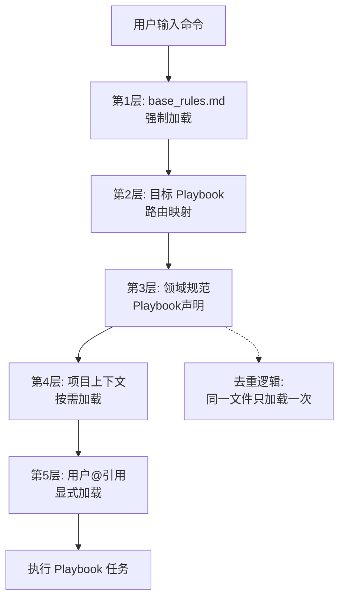
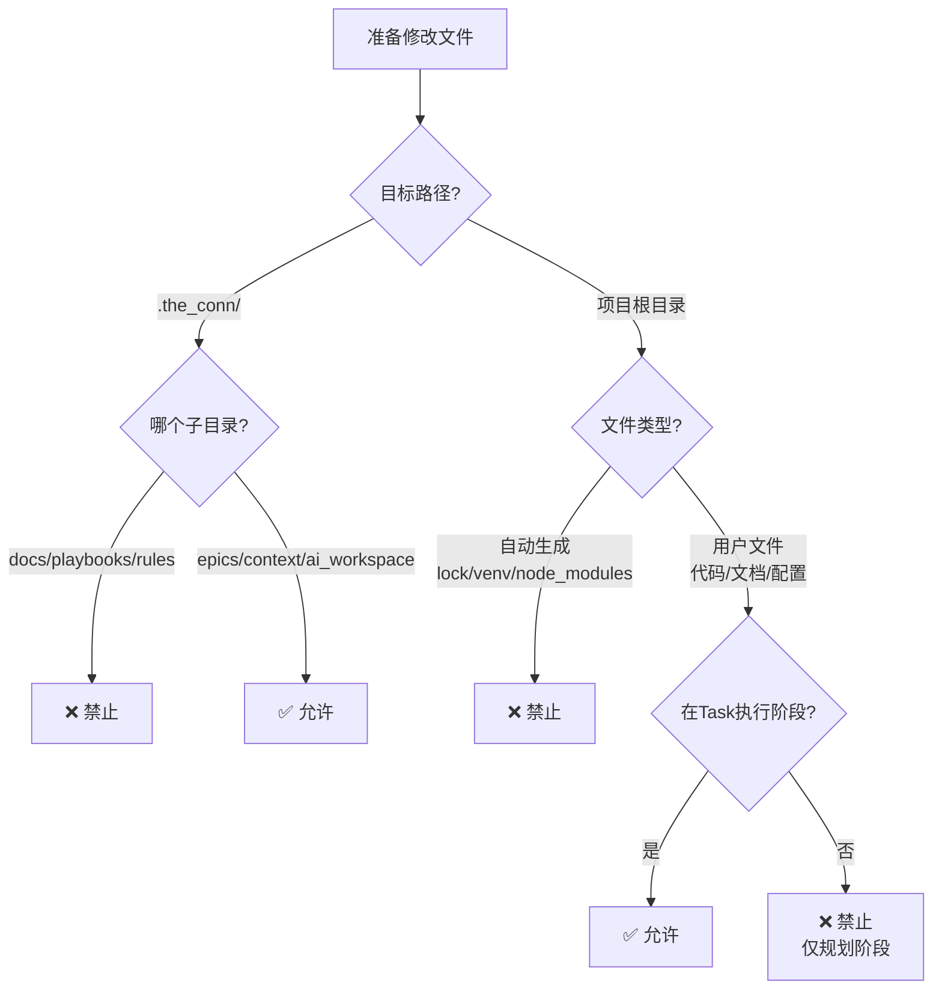
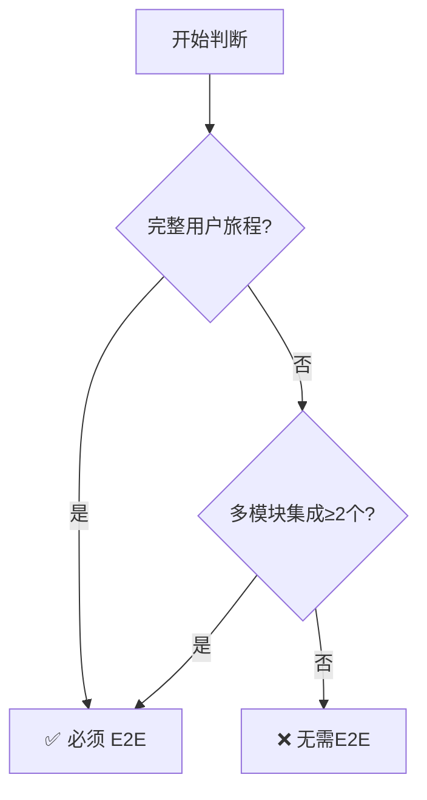
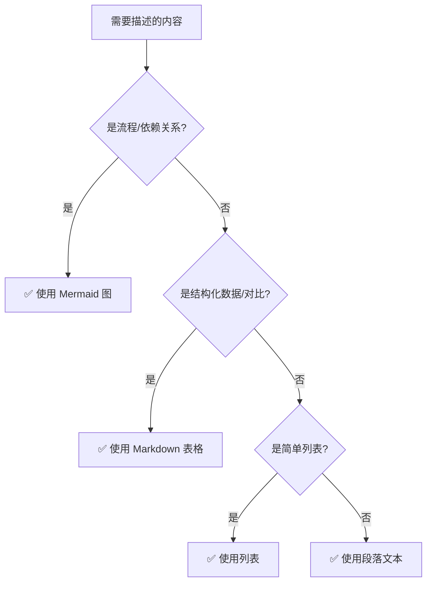
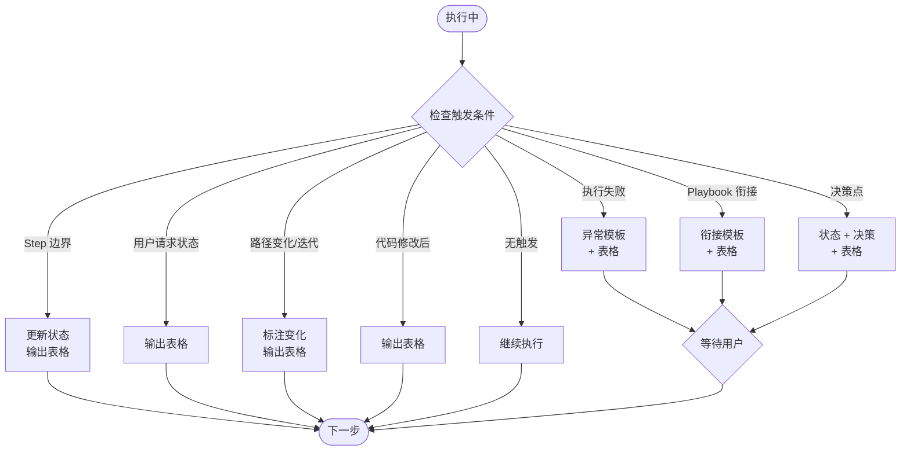
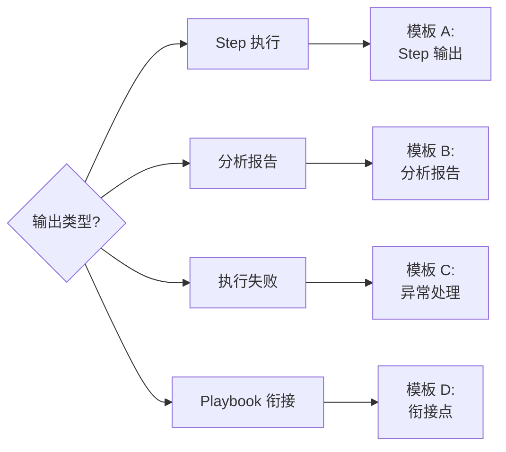
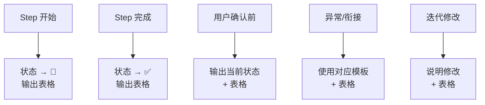

# The Conn Playbooks 基础公约

本文档定义了所有 AI Playbooks 必须遵守的基础规则和约束。

**重要性**：所有 Playbook 都必须严格遵守本公约，除非在特定 Playbook 中有明确的例外说明。

---

## 1. 核心原则

### 1.0 文件加载强制要求 🔴

**在执行任何命令之前，AI 必须按照以下分层策略加载上下文文件**：

#### 第一层：核心公约（所有命令必须加载）

```
rules/base_rules.md
```

**说明**：定义了所有 Playbook 必须遵守的基础规则和约束

#### 第二层：具体 Playbook

加载命令对应的 playbook 文件（通过 tc.md 的命令路由表映射）

#### 第三层：领域规范（按 Playbook 声明加载）

每个 Playbook 在开头的 **"📋 规范引用"** 部分声明了自己依赖的规范文件。

AI 必须按照 Playbook 的声明加载对应的规范文件。

**⚠️ 重要：去重加载**
- 同一个规范文件只加载一次，避免重复
- 如果多个 playbook 引用同一规范，AI 应自动去重
- 已加载的文件不需要重新加载

#### 第四层：项目上下文（按需加载）

由具体 playbook 决定是否加载：
- Epic/Feature/Story 规划文件
- Context 文档（`.the_conn/context/`）
- 用户文档（`.the_conn/docs/`）
- 项目配置文件

#### 第五层：用户引用文件

检查并加载用户 Prompt 中所有被 `@` 引用的文件

**重要区分**：
- ✅ **用户 Prompt 中的 @ 引用**：用户在对话中显式输入的 `@文件名`，这些需要加载
- ❌ **Playbook 文档内部的路径**：文档内部的路径说明（如表格中的 `planning/xxx.md`）是指令，不是引用，不需要额外加载

**执行流程图**：



**加载规则速查**：

| 层级 | 内容                               | 加载时机        | 去重       |
| ---- | ---------------------------------- | --------------- | ---------- |
| 1    | base_rules.md                      | 强制加载        | -          |
| 2    | 目标 Playbook                      | 强制加载        | -          |
| 3    | 领域规范（如 complexity_rules.md） | Playbook 声明时 | ✅ 自动去重 |
| 4    | 项目上下文（Epic/Story/Context）   | Playbook 需要时 | -          |
| 5    | 用户 @ 引用                        | 用户显式输入时  | -          |

---

### 1.1 职责分离原则

- **规划与实现分离**：规划阶段只生成文档，实现阶段才编写代码
- **意图与执行分离**：人类定义"做什么"，AI 执行"怎么做"
- **文档与代码同步**：确保规划文档与代码实现保持一致

### 1.2 The Conn 工作流

```
规划阶段 (Playbooks)
    ↓ 生成文档
Task 执行阶段 (唯一允许编写代码的环节)
    ↓ 编写实现
同步阶段 (Playbooks)
    ↓ 更新文档
```

---

## 2. 严格禁止事项 ❌

### 统一禁止规则矩阵

| 类别                  | 禁止 ❌                                 | 例外/允许 ✅                           | 判断依据       |
| --------------------- | -------------------------------------- | ------------------------------------- | -------------- |
| **代码实现**          | 业务逻辑、测试代码、构建脚本、配置实现 | task_execution.md 阶段可编写          | 是否在规划阶段 |
| **`.the_conn/` 目录** | `docs/`、`playbooks/`、`rules/`        | `epics/`、`context/`、`ai_workspace/` | 目录类型       |
| **项目根目录**        | 自动生成文件（见下表）                 | 用户编写的代码/文档/配置              | 文件类型       |
| **操作执行**          | 编译、构建、测试、Git、部署            | 无例外                                | 操作类型       |

### 2.1 代码实现限制

**规划阶段（默认）禁止编写**：
- ❌ 业务逻辑实现
- ❌ 测试实现（Step Definitions、单元测试）
- ❌ 构建/部署脚本
- ❌ 配置文件具体实现

**例外**：`task_execution.md` Playbook 可指导编写实际代码

### 2.2 文件修改限制

**2.2.1 `.the_conn/` 目录规则**

| 子目录          | 规则          | 说明               |
| --------------- | ------------- | ------------------ |
| `docs/`         | ❌ 禁止修改    | 用户文档，框架文档 |
| `playbooks/`    | ❌ 禁止修改    | AI 工作流定义      |
| `rules/`        | ❌ 禁止修改    | 基础规则定义       |
| `epics/`        | ✅ 可创建/修改 | 规划文档           |
| `context/`      | ✅ 可创建/修改 | 知识库文档         |
| `ai_workspace/` | ✅ 可创建/修改 | 临时工作文件       |

**2.2.2 项目根目录规则**

**禁止修改自动生成文件**：

| 文件类型   | 示例                                        | 原因           |
| ---------- | ------------------------------------------- | -------------- |
| 依赖锁文件 | `uv.lock`、`package-lock.json`、`yarn.lock` | 工具自动管理   |
| 虚拟环境   | `.venv/`、`venv/`、`node_modules/`          | 依赖安装目录   |
| 编译产物   | `dist/`、`build/`、`target/`                | 构建系统生成   |
| IDE配置    | `.vscode/`、`.idea/`（自动生成部分）        | 用户个性化配置 |

**允许修改用户文件**：
- ✅ 源代码文件（`.py`, `.ts`, `.go` 等）- Task 执行阶段
- ✅ 用户文档（`README.md`, `docs/` 等）- Task 执行阶段
- ✅ 配置文件（`.env.example`, `config.yaml` 等）- Task 执行阶段
- ✅ 测试文件（`tests/`, `__tests__/` 等）- Task 执行阶段

**⚠️ 重要**：即使是允许修改的文件，也必须在 Task 执行阶段，且遵循 `task_execution.md` 的指导。

### 2.3 操作限制

**禁止执行**：
- ❌ 编译、构建、测试执行
- ❌ 依赖安装/更新
- ❌ Git 操作（commit、push、merge 等）
- ❌ 部署、发布操作

**原因**：这些操作应由用户或 CI/CD 系统执行，AI 仅负责规划和代码生成。

---

### 快速决策流程



---

## 3. 允许事项 ✅

### 3.1 设计说明中的代码片段

**允许在文档中使用代码片段来说明设计**：

- ✅ 接口定义（interface、protocol）
- ✅ 数据结构定义（struct、class、type）
- ✅ API 签名（function signature）
- ✅ 示例代码（用于说明用法）
- ✅ 伪代码（用于说明算法）

**关键区别**：

```markdown
✅ 允许（设计说明）：
```go
// 接口定义
type Sender interface {
    Send(event Event) error
}
```

❌ 禁止（实际实现）：

```go
// 完整的实现代码
func (s *DefaultSender) Send(event Event) error {
    // 实现逻辑
    return s.queue.Push(event)
}
```

### 3.2 文档操作

**允许创建和修改以下文档**：

- ✅ Epic/Feature/Story 规划文档
- ✅ Context 文档（设计、架构、技术方案）
- ✅ Task 工作文档（ai_workspace/ 目录）
- ✅ 变更摘要、同步文档

---

### 3.3 边界案例指南 🎯

**统一决策矩阵**：

| 内容类型        | ✅ 允许（设计层面）          | ❌ 禁止（实现层面）       | 判断关键                  |
| --------------- | --------------------------- | ------------------------ | ------------------------- |
| **代码片段**    | 签名/接口/类型定义          | 函数体/循环/具体调用     | 有 `pass` 或仅注释 = 设计 |
| **Context文档** | 架构/职责/接口约定          | 函数调用顺序/变量赋值    | 描述"是什么"vs"怎么做"    |
| **Story文档**   | 验收标准/技术选型/性能要求  | 文件路径/函数名/实现步骤 | 用户视角 vs 实现视角      |
| **测试**        | BDD场景/测试清单/覆盖率要求 | Step实现/测试函数代码    | Gherkin vs 代码           |
| **文件操作**    | epics/context/ai_workspace  | docs/playbooks/rules     | 目录判断（见§2.2）        |

**快速判断流程**：

```mermaid
graph TD
    Q[准备生成内容] --> Q1{包含实现细节?}
    Q1 -->|函数体/循环/具体调用| Impl[❌ 禁止: 实现代码]
    Q1 -->|仅签名/注释/pass| Design[✅ 允许: 设计说明]
    
    Q1 -->|不确定| Q2{回答什么问题?}
    Q2 -->|"是什么"/"为什么"/<br/>"用什么技术"| Design
    Q2 -->|"怎么做"/"如何调用"/<br/>"变量如何命名"| Impl
    
    Design --> Q3{是否在Task执行阶段?}
    Impl --> Q3
    Q3 -->|规划阶段| CheckDesign{是设计?}
    CheckDesign -->|是| Allow[✅ 允许]
    CheckDesign -->|否| Deny[❌ 禁止]
    Q3 -->|Task执行阶段| AllowExec[✅ 允许<br/>遵循task_execution.md]
```

**典型示例**：

```python
# ✅ 允许：接口定义（设计）
class UserRepository:
    def find_by_id(user_id: int) -> User:
        """根据 ID 查找用户"""
        pass

# ❌ 禁止：包含实现（规划阶段）
class UserRepository:
    def find_by_id(self, user_id):
        return db.query("SELECT * FROM users WHERE id=?", user_id)
```

**边界判断4原则**：

1. **规划 vs 执行**：规划阶段只生成文档，Task执行阶段才写代码
2. **设计 vs 实现**：描述"是什么/为什么/用什么"✅，描述"怎么写代码"❌
3. **保护关键目录**：`.the_conn/docs/playbooks/rules/` 禁止修改
4. **Task执行例外**：`task_execution.md` 阶段可编写实现代码

---

## 4. 文件路径约定

### 4.1 目录结构

```
.the_conn/
├── docs/                # 用户文档（禁止修改）
├── playbooks/           # AI 操作剧本（本文件所在目录）
├── context/             # 知识库（可创建和修改）
├── epics/               # 规划文档（可创建和修改）
└── ai_workspace/        # 临时工作区（可创建和修改）
```

---

## 5. 文档生成规范

### 5.1 Markdown 格式

- 使用标准 Markdown 语法
- 代码块必须指定语言（如 ```go、```python）
- 表格必须对齐
- 使用合适的标题层级（# ## ### ####）

### 5.2 语言使用规范

**核心原则**：AI 默认使用用户对话语言生成所有文档。

**基本规则**：

- 中文对话 → 中文文档
- 英文对话 → 英文文档
- 技术术语保持项目约定（通常为英文）

### 5.3 命名规范

**核心原则**：所有代码和代码文件的命名必须使用英文。

**强制要求**：

- ✅ 函数名必须使用英文（驼峰命名或下划线命名）
- ✅ 变量名必须使用英文
- ✅ 类名/结构体名必须使用英文
- ✅ 接口名/协议名必须使用英文
- ✅ 代码文件名必须使用英文（如 `.py`、`.go`、`.ts` 等）
- ✅ 目录名必须使用英文（项目源代码目录）

**禁止使用**：

- ❌ 禁止使用中文、日文、韩文等非英文字符命名函数
- ❌ 禁止使用中文、日文、韩文等非英文字符命名代码文件
- ❌ 禁止使用拼音命名（除非是特定的专有名词）

**示例**：

```python
# ✅ 正确
def calculate_total_price(items):
    pass

# ❌ 错误
def 计算总价(items):
    pass

# ❌ 错误
def jisuanZongjia(items):
    pass
```

**例外**：

- 文档文件（`.md`）可以使用中文命名
- 测试数据、配置文件中的字符串内容可以使用任何语言
- 注释和文档字符串可以使用任何语言

**原因**：

- 保证代码的跨团队、跨地区可读性
- 避免编码问题和兼容性问题
- 符合国际化开发标准和最佳实践

---

### 5.4 BDD 语言规范 ✨

**核心原则**：
- ✅ **Keywords**: 强制英文（`Feature`, `Scenario`, `Given`, `When`, `Then` 等）
- ✅ **Descriptions**: 项目交互语言（检查 Context 或根据用户对话语言）

**详细规则**: 参考 `@rules/bdd_language_rules.md`

---

### 5.5 可视化与结构化内容规范 📊

**核心原则**：优先使用 Mermaid 图和标准 Markdown 表格来描述复杂信息，提升文档的可读性和信息密度。

#### 5.5.1 Mermaid 图使用规则

**优先使用场景**：
- ✅ **决策树/判断流程**：使用 `graph TD` 或 `graph LR` 展示条件分支
- ✅ **依赖关系**：使用 `graph TB` 展示 Epic/Feature/Story 依赖
- ✅ **工作流程**：使用 `graph TD` 展示步骤流程和迭代循环
- ✅ **时间线/进度**：使用 `gantt` 展示开发计划和里程碑
- ✅ **系统架构**：使用 `graph TB` 展示模块层次和交互
- ✅ **时序流程**：使用 `sequenceDiagram` 展示模块间通信

**禁止事项**：
- ❌ **不使用 style 属性**：所有 Mermaid 图不添加 `style` 样式（AI 消费，无需美化）
- ❌ **避免过度复杂**：单个图表节点数不超过 15 个（过多则拆分）

**示例**：

```markdown
### 测试 Story 决策逻辑

```

#### 5.5.2 表格使用规则

**优先使用场景**：
- ✅ **速查表/对比表**：展示多个选项的对比（如 ✅ vs ❌）
- ✅ **配置清单**：展示结构化的配置项（名称/类型/默认值/说明）
- ✅ **状态汇总**：展示 Epic/Feature/Story 的进度和状态
- ✅ **规则说明**：展示条件、规则、建议的对应关系
- ✅ **字段列表**：展示对象的属性和说明

**表格格式要求**：
- ✅ 必须使用标准 Markdown 表格语法
- ✅ 表头必须包含分隔符 `| --- | --- |`
- ✅ 列对齐可选（居中用 `:---:`，右对齐用 `---:`）
- ✅ 使用 emoji 提升可读性（如 ✅ ❌ ⚠️ 🔴 🟡 🟢）

**示例**：

```markdown
### 测试 Story 命名规范

| Story 类型 | 命名格式                             | Story Type  | 示例                            |
| ---------- | ------------------------------------ | ----------- | ------------------------------- |
| E2E 测试   | `STORY-99_E2E_{FeatureName}_Flow`    | `e2e_test`  | `STORY-99_E2E_Auth_Flow`        |
| 集成测试   | `STORY-98_Integration_{FeatureName}` | `e2e_test`  | `STORY-98_Integration_Payment`  |
| 性能测试   | `STORY-97_Performance_{FeatureName}` | `perf_test` | `STORY-97_Performance_DataSync` |
```

#### 5.5.3 选择指南

**决策流程**：



**优先级排序**：
1. **Mermaid 图** - 流程、依赖、架构、决策树
2. **Markdown 表格** - 对比、速查、配置、状态
3. **列表** - 简单的步骤、要点、规则
4. **段落文本** - 解释说明、背景描述

**组合使用建议**：
- ✅ Mermaid 图 + 表格：展示流程图后，用表格补充详细参数
- ✅ 表格 + 列表：表格展示概览，列表展开细节
- ✅ 图表 + 说明文本：图表可视化，文本补充解释

---

## 6. 与用户交互规范

### 6.1 讨论与决策

- **主动质疑**：对不合理的需求要勇于指出
- **提供选项**：给出 2-3 个方案供用户选择
- **等待确认**：重大决策前必须等待用户确认
- **记录决策**：重要的技术决策要记录理由

### 6.2 输出格式

- **清晰分段**：使用标题、列表、表格组织内容
- **突出重点**：使用 ⚠️、✅、❌ 等符号标记重要信息
- **简洁明了**：避免冗长的解释，突出关键信息

---

## 7. 质量标准

### 7.1 文档质量

- ✅ 语言精炼，表达准确
- ✅ 结构清晰，层次分明
- ✅ 格式规范，易于阅读
- ✅ 内容完整，无遗漏

### 7.2 设计质量

- ✅ 遵循 KISS 原则（Keep It Simple, Stupid）
- ✅ 避免过度设计
- ✅ 考虑可维护性和可扩展性
- ✅ 基于最佳实践

---

## 8. 执行前检查清单 ✓

**Playbook 执行完成前的自检表**：

| 检查项          | 规则要点                                                                | ✓   |
| --------------- | ----------------------------------------------------------------------- | --- |
| **禁止事项**    | 未编写实现代码（规划阶段）<br/>未修改 `.the_conn/docs/playbooks/rules/` | [ ] |
| **文档格式**    | Markdown规范<br/>代码块有语言标识<br/>表格对齐                          | [ ] |
| **Frontmatter** | 必填字段完整（title/type/complexity等）                                 | [ ] |
| **ID命名**      | 符合规范格式（EPIC-XX, FEAT-XX, STORY-XX）                              | [ ] |
| **复杂度评分**  | 使用1-10分评分，非时间估算                                              | [ ] |
| **追踪表格**    | 多步骤 Playbook 维护了追踪表格（§10）                                   | [ ] |

---

## 9. 例外情况

### 9.1 Task 执行阶段

**唯一例外**：`execution/task_generation.md` 生成的 Task 简报会指导 AI 编写实际代码。

这是 The Conn 框架中**唯一允许编写实现代码的环节**。

### 9.2 紧急修复

在极特殊情况下（如安全漏洞修复），可以在用户明确授权后突破某些限制，但必须：

1. 获得用户明确授权
2. 详细记录例外原因
3. 事后同步更新文档

---

## 10. 流程追踪机制 📊

### 10.1 追踪的重要性

**所有包含多步执行流程或衔接其他 Playbook 的 Playbook 必须实施流程追踪机制。**

**目的**：
1. **透明性** - 用户随时知道 AI 在执行哪一步
2. **可控性** - 用户可以在关键点介入
3. **可追溯** - 失败时快速定位问题
4. **标准化** - 统一的追踪格式和更新规则

### 10.2 追踪类型

#### A. 执行流程追踪

**适用场景**：Playbook 内部有多个步骤（Step/Phase）

**标准格式**：
```markdown
## 🔄 {Playbook 名称} 执行追踪

| Step/Phase | 内容 | 状态 | 输出 | 备注   |
| ---------- | ---- | ---- | ---- | ------ |
| 1          | XXX  | ⏳    | -    | 待开始 |
| 2          | XXX  | ⏳    | -    | 待开始 |

**图例**：✅ 已完成 | 🔄 进行中 | ⏳ 等待中 | ❌ 失败
```

**更新规则**：
- 进入某个 Step → 状态更新为 🔄
- 完成某个 Step → 状态更新为 ✅，填写输出
- Step 失败 → 状态更新为 ❌，记录失败原因

#### B. 衔接追踪

**适用场景**：Playbook 会调用其他 Playbook

**标准格式**：
```markdown
## 🔗 {工作流名称} 衔接追踪

**当前工作流**: {当前 Playbook} → {后续流程}

| Step | Playbook            | 状态 | 输出 | 备注   |
| ---- | ------------------- | ---- | ---- | ------ |
| 1    | {下一个 Playbook}   | ⏳    | -    | 待开始 |
| 2    | {再下一个 Playbook} | ⏳    | -    | 待开始 |

**图例**：✅ 已完成 | 🔄 进行中 | ⏳ 等待中 | ❌ 失败

**预计剩余步骤**: {N} 个
```

**更新规则**：
- 进入某个 Playbook → 状态更新为 🔄
- 完成某个 Playbook → 状态更新为 ✅，填写输出，更新"预计剩余步骤"
- Playbook 失败 → 状态更新为 ❌，暂停衔接，询问用户处理方式

**⚠️ 重要约定**：
- 衔接追踪表格**只包含被调用的其他 Playbook**
- **不包含当前 Playbook 自身**（当前 Playbook 的执行在"执行流程追踪"中体现）
- "当前工作流"说明可以提到当前 Playbook（如 `context/add → context/update`）

### 10.3 状态图例标准

**必须使用以下统一的状态图例**：

| 图标 | 含义   | 使用场景                     |
| ---- | ------ | ---------------------------- |
| ✅    | 已完成 | Step/Playbook 成功完成       |
| 🔄    | 进行中 | Step/Playbook 正在执行       |
| ⏳    | 等待中 | Step/Playbook 尚未开始       |
| ❌    | 失败   | Step/Playbook 执行失败       |
| ⚠️    | 警告   | Step/Playbook 有警告（可选） |

### 10.4 何时需要追踪

**必须实施追踪**：
- ✅ Playbook 有 3 个以上的执行步骤
- ✅ Playbook 会调用其他 Playbook（衔接）
- ✅ Playbook 是核心工作流的一部分

**无需追踪**：
- ❌ 单一任务的简单 Playbook（如 change_summary、story_sync）
- ❌ 工具类 Playbook（如 context/search）
- ❌ 查询类 Playbook（如 project_status）

### 10.5 异常处理标准

**当 Step/Playbook 失败时**，必须：

1. 更新状态为 ❌
2. 记录失败原因
3. 提供处理选项
4. 暂停流程，等待用户决策

**异常处理模板**：
```markdown
❌ {Step/Playbook} 执行失败

**失败原因**: {具体错误信息}

**当前状态**：
- ✅ {已完成的 Step 列表}
- ❌ {失败的 Step}
- ⏳ {未开始的 Step 列表}

**处理选项**：
1. 重试
2. 跳过，继续下一步
3. 终止流程

请选择 [1/2/3]:
```

### 10.6 追踪的强制性

**AI 必须**：
- ✅ 在适用的 Playbook 中维护追踪表格
- ✅ 实时更新追踪状态
- ✅ 遵循统一的格式和图例
- ✅ 在失败时使用标准异常处理模板

**AI 不得**：
- ❌ 跳过追踪更新
- ❌ 使用非标准的状态图例
- ❌ 在衔接追踪中包含当前 Playbook 自身
- ❌ 忽略失败状态

### 10.7 示例

**好的执行流程追踪**：
```markdown
## 🔄 Task 生成执行追踪

| Phase | 内容             | 状态 | 输出         | 备注        |
| ----- | ---------------- | ---- | ------------ | ----------- |
| 1     | Story 内容分析   | ✅    | 关键词: 5 个 | 已完成      |
| 2     | Context 文件搜索 | 🔄    | -            | 正在搜索... |
| 3     | 文件列表整合     | ⏳    | -            | 待开始      |
```

**好的衔接追踪**：
```markdown
## 🔗 完整拆解流程衔接追踪

**当前工作流**: requirements_review → 完整拆解流程

| Step | Playbook               | 状态 | 输出           | 备注                       |
| ---- | ---------------------- | ---- | -------------- | -------------------------- |
| 1    | epic_init              | ✅    | EPIC-01 已创建 | 已完成                     |
| 2    | context/add            | 🔄    | -              | 正在提取 Global Context... |
| 3    | requirements_breakdown | ⏳    | -              | 待开始                     |

**预计剩余步骤**: 2 个
```

---

### 10.8 输出标准化与状态恢复 🆕

#### 核心原则

❌ 不依赖"轮数判断"（AI 无法准确判断）  
✅ 依赖"触发条件"（明确、可判断）  
✅ 宁可多输出，也不要少输出（追踪表格轻量级）

---

#### 10.8.1 触发条件与决策流程

**AI 何时必须输出追踪表格？遵循以下决策流程**：



**7 个触发条件速查表**：

| #   | 触发条件         | 触发场景                                 | 输出要求                  |
| --- | ---------------- | ---------------------------------------- | ------------------------- |
| 1   | **Step 边界**    | 开始/完成任何 Step                       | 更新状态（🔄→✅），输出表格 |
| 2   | **用户请求**     | "状态"、"进度"、"到哪了"等关键词         | 立即输出表格              |
| 3   | **执行失败**     | 任何 Step/Playbook 失败                  | 异常模板 + 表格，等待用户 |
| 4   | **衔接点**       | Playbook 完成，调用下一个                | 衔接模板 + 表格           |
| 5   | **路径变化**     | 用户选择改变执行路径                     | 标注变化，输出表格        |
| 6   | **决策点**       | 需要用户确认的重要决策                   | 状态 + 决策 + 表格        |
| 7   | **迭代修改点** 🆕 | 代码修改后/测试失败后/用户提出修改建议后 | 简要说明修改 + 输出表格   |

**触发条件 7 的详细说明（覆盖迭代场景）**：

在 `task_execution` 等长流程中，经常出现以下迭代场景：

| 迭代场景          | 示例用户输入                       | AI 必须做什么                                                                               |
| ----------------- | ---------------------------------- | ------------------------------------------------------------------------------------------- |
| **代码修改后**    | "这里改成用缓存"、"把这个函数拆开" | 1. 确认理解修改意图<br/>2. 说明将要修改的内容<br/>3. **输出追踪表格**<br/>4. 执行修改       |
| **测试失败后**    | "测试报错了"、"这个case没过"       | 1. 分析失败原因<br/>2. 说明修复方案<br/>3. **输出追踪表格**<br/>4. 执行修复                 |
| **用户修改建议**  | "再试试这个方案"、"换个思路"       | 1. 确认新方案<br/>2. 对比新旧方案<br/>3. **输出追踪表格（标注路径变化）**<br/>4. 执行新方案 |
| **Review 讨论后** | "这里逻辑有问题"、"这个设计不太好" | 1. 确认问题点<br/>2. 说明调整方案<br/>3. **输出追踪表格**<br/>4. 执行调整                   |

**关键点**：
- 这些场景中用户通常**不会**主动说"状态"、"进度"等关键词
- 但这些是**执行路径的重要变化**，必须输出状态
- 即使在同一个 Step 内反复迭代，也要在每次迭代后输出

**示例**：

```markdown
## 🔄 代码修改 - 迭代 #3

### 修改内容
- 用户建议：将同步调用改为异步调用
- 修改文件：`src/api/handler.py`

### 📋 追踪表格更新

| Phase | 内容     | 状态 | 输出    | 备注           |
| ----- | -------- | ---- | ------- | -------------- |
| 4     | 实现功能 | 🔄    | 迭代 #3 | 修改为异步方式 |
| 5     | 编写测试 | ⏳    | -       | 待开始         |

---

现在修改代码...
```

---

#### 10.8.2 标准输出模板

**4 种强制模板 + 选择逻辑**：



**模板结构（简化版）**：

| 模板             | 使用场景               | 必含元素                                        |
| ---------------- | ---------------------- | ----------------------------------------------- |
| **A. Step 执行** | 每个 Step 的标准输出   | 状态标记 + 输入/过程/输出 + 追踪表格            |
| **B. 分析报告**  | 需要用户确认的分析结果 | 输入 + 分析结果 + 追踪表格 + 确认提示           |
| **C. 异常处理**  | Step/Playbook 失败     | 失败原因 + 已完成/失败/未完成 + 表格 + 处理选项 |
| **D. 衔接点**    | Playbook 间切换        | 执行结果 + 下一步说明 + 衔接表格 + 确认提示     |

**模板核心结构**（详细定义见各 Playbook）：

```markdown
## 🔄 Step X: [名称]
状态: 🔄 → ✅
输入/过程/输出
### 📋 追踪表格
[表格]
---
```

---

#### 10.8.3 强制输出规则

**必须输出的 5 个时机**：



**禁止行为清单**：

| ❌ 禁止                    | ✅ 必须              |
| ------------------------- | ------------------- |
| 连续多 Step 不输出表格    | 每个 Step 边界输出  |
| 省略表格列（状态/输出等） | 完整表格 5 列       |
| 模糊状态（"差不多了"）    | 明确符号（✅/🔄/⏳/❌） |
| 猜测是否需要输出          | 遵循触发条件        |
| 判断"对话轮数"            | 基于触发条件        |

---

#### 10.8.4 AI 自检与保护机制

**每个 Step 后自检（内部，不显式输出）**：

```
✓ 追踪表格已更新？
✓ 状态符号正确？（✅/🔄/⏳/❌）
✓ 输出列已填写？
✓ 是否触发了任何触发条件？→ 如果是，必须输出
✓ 格式符合模板？
```

**多轮对话保护（不依赖轮数）**：

- ✅ 每次触发条件都输出 → 用户始终知道状态
- ✅ 用户困惑时重新输出 → 关键词：不清楚、混乱、重新
- ✅ 决策点强制输出 → 即使无明确触发
- ✅ Playbook 切换输出 → 衔接表格
- ✅ **迭代修改必须输出** → 代码修改/测试/Review 后

**为什么不判断轮数**：
- AI 无法准确知道轮数
- 不同 IDE 定义不同
- 用户可能插入无关问题
- **触发条件更可靠**

**特别说明：etask 等长流程的迭代场景**：

在 `task_execution` 等涉及代码实现的长流程中，用户可能：
- 反复修改代码（"这里改一下"、"换个方式"）
- 测试失败后调试（"报错了"、"这个case没过"）
- Review 时讨论调整（"这里有问题"、"逻辑不对"）

**AI 必须在每次迭代后输出状态**：
1. 简要说明本次修改的内容
2. 更新追踪表格（可标注"迭代 #N"）
3. 让用户清楚当前进展

**即使在同一个 Step/Phase 内反复迭代，也要输出。**

---

#### 10.8.5 Playbook 声明（可选）

**包含多步骤/衔接的 Playbook 可在开头添加**：

```markdown
## 📋 执行规范
遵循 `@rules/base_rules.md` §10 流程追踪机制
```

---

#### 10.8.6 核心要点总结

| #   | 要点              | 说明                        |
| --- | ----------------- | --------------------------- |
| 1   | **基于触发条件**  | 7 个明确条件，不猜测        |
| 2   | **强制模板**      | 4 种模板覆盖所有场景        |
| 3   | **Step 边界输出** | 开始 🔄，完成 ✅              |
| 4   | **交互前后输出**  | 确认前后都输出              |
| 5   | **异常强制输出**  | 使用异常模板                |
| 6   | **衔接强制输出**  | 使用衔接模板                |
| 7   | **迭代必须输出**  | 代码修改/测试/Review 后输出 |
| 8   | **不依赖轮数**    | 轮数判断不可靠              |
| 9   | **宁可多输出**    | 表格轻量，用户可跳过        |

---

## 遵守声明

**所有 Playbook 在开头应包含以下声明**：

```markdown
## ⚠️ 重要：遵守基础公约

本 Playbook 严格遵守 `@rules/base_rules.md` 中定义的所有基础公约。
```

---

**最后更新**: 2025-12-25
**维护者**: The Conn Framework Team
