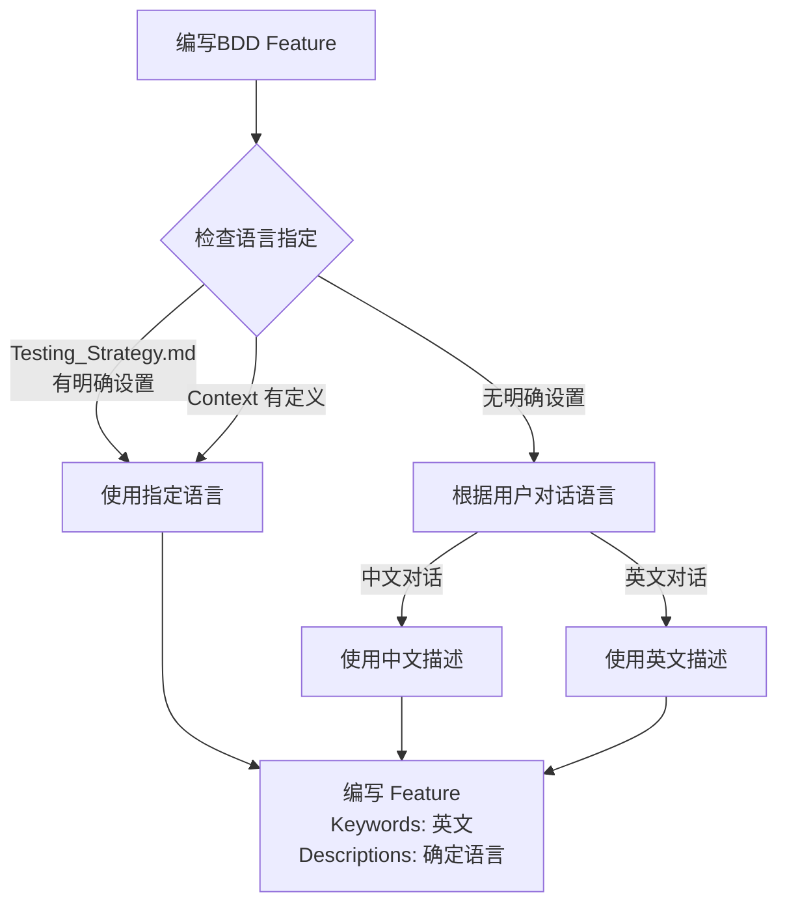

# BDD Feature 语言配置规范

本文档定义 BDD Feature 文件的语言使用规则。

## ⚠️ 适用范围

**本规范仅适用于 E2E Story (`type: e2e_test`)**

- ✅ E2E Story: 使用 BDD 场景作为验收标准
- ❌ 普通 Story (`type: dev`, `type: bug_fix`): 使用功能清单，不需要 BDD

---

## 1. 语言决策规则

### 核心原则

| 内容类型 | 语言规则 | 原因 |
| --- | --- | --- |
| **Keywords** | 强制英文 | 跨框架兼容，所有BDD工具原生支持 |
| **Descriptions** | 项目交互语言 | 团队自然理解，利益相关者可读 |

### 描述语言决策流程



**快速决策**: 检查文档指定 → 无则推断对话语言 → Keywords英文 + Descriptions对应语言

---

## 2. 语法示例

### 示例：标准 BDD 格式 (English Keywords + Chinese Descriptions)

```gherkin
Feature: 用户登录

  Scenario: 用户成功登录
    Given 用户已注册
    When 用户输入正确的用户名和密码
    Then 用户应该成功登录
    And 页面应该跳转到首页

  Scenario Outline: 登录失败尝试
    Given 用户位于登录页面
    When 用户输入用户名 "<username>" 和密码 "<password>"
    Then 页面应显示错误信息 "<message>"

    Examples:
      | username | password | message |
      | admin    | wrong    | 密码错误 |
      | unknown  | 123456   | 用户不存在 |
```

---

## 3. AI 执行检查清单

| 步骤 | 检查项 | ✓ |
| --- | --- |---|
| 1 | 识别项目语言（文档或对话） | [ ] |
| 2 | Keywords 使用英文 | [ ] |
| 3 | Descriptions 使用识别的语言 | [ ] |
| 4 | 格式正确，关键字未翻译 | [ ] |

---

**最后更新**: 2025-12-18
