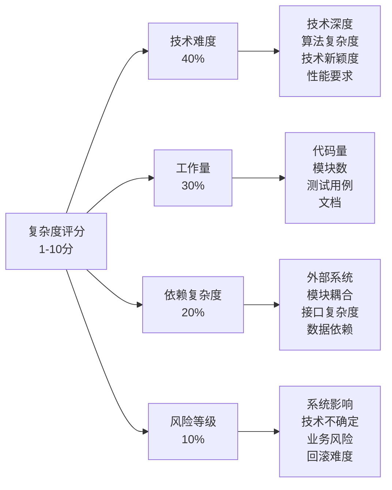
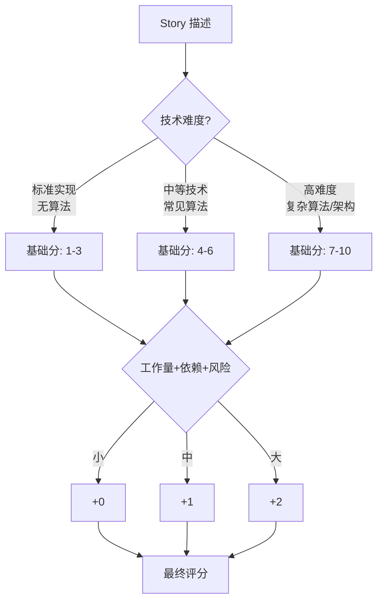

# 复杂度评估规范

本文档定义 The Conn 框架中的复杂度评估标准。

---

## 核心原则

**重要**：在 The Conn 框架中，**不使用时间估算**，而使用**复杂度评分**。

---

## 评分标准

### 评分范围

- **范围**：1.0 - 10.0 分（支持浮点数，如 3.5、6.8）
- **粒度**：建议使用 0.5 的倍数

### 快速评分参考

| 分数 | 技术难度 | 工作量 | 示例 |
| --- | --- | --- | --- |
| 1-2 | 极简单 | 很小 | 数据结构定义、常量配置 |
| 3-4 | 简单 | 小 | CRUD、基础API、参数验证 |
| 5-6 | 中等 | 中 | 业务逻辑、状态管理、多实体交互 |
| 7-8 | 复杂 | 大 | 多模块集成、分布式协调、复杂算法 |
| 9-10 | 极复杂 | 很大 | 架构设计、框架级创新、高难度算法 |

---

## 评分权重与流程

### 权重分配



### 快速评分流程



---

## 典型示例

| Story | 技术 | 工作 | 依赖 | 风险 | 评分 |
| --- | --- | --- | --- | --- | --- |
| 用户信息表 CRUD API | 低(标准ORM) | 小(4接口) | 简单(仅DB) | 低(独立) | 3.0 |
| 订单状态机管理 | 中(状态逻辑) | 中(多状态) | 中(3模块) | 中(流程) | 5.0 |
| 分布式事务协调器 | 高(2PC协议) | 大(协调器) | 高(多服务) | 高(一致性) | 7.5 |

---

---

## 4. 高复杂度审查机制 (Review Check) 🔴

**AI 必须在评分后执行以下审查**：

| 评分范围 | 风险等级 | AI 必须执行的动作 |
| --- | --- | --- |
| **≤ 8.0** | ✅ 安全 | 正常继续 |
| **> 8.0** | 🔴 高危 | **强制触发拆解建议** |

### 拆解建议模板

当复杂度 > 8.0 时，AI **必须**暂停并输出以下建议：

```markdown
⚠️ **高复杂度警告**

当前评估复杂度为 **{分数}**，超过了安全阈值 (8.0)。
建议将此 Story 拆分为更小的任务以降低风险。

**拆解建议**：
1. Story A: {建议内容} (预估复杂度: {X})
2. Story B: {建议内容} (预估复杂度: {Y})

是否采纳拆解建议？
- [ ] 是，请帮我拆解
- [ ] 否，保持原样（我知晓风险）
```

---

## 使用场景

### 在需求拆解时

- 评估每个 Story 的复杂度
- 识别高风险 Story
- 平衡 Story 粒度

### 在规划时

- 计算 Feature/Epic 的总复杂度
- 评估开发优先级
- 识别需要拆分的 Story

### 在进度跟踪时

- 按复杂度统计完成度
- 识别进度风险
- 调整资源分配

---

**最后更新**: 2025-12-16
