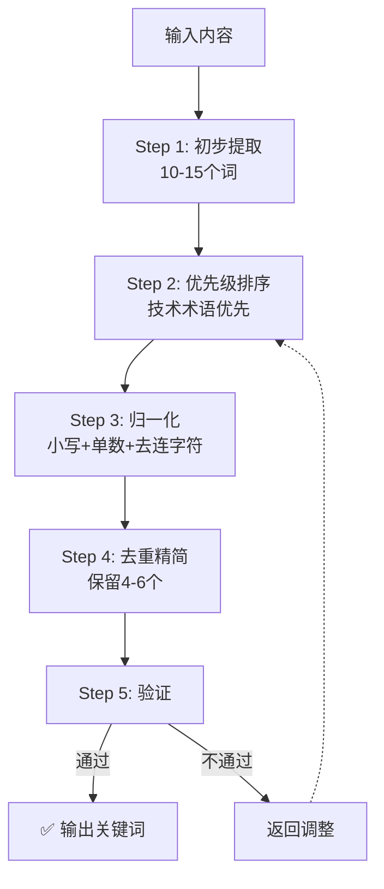

# 关键词提取规范

本规范定义了从需求、Story、或任务描述中提取技术关键词的标准化流程，供所有 Playbook 统一使用。

---

## 适用场景

本规范适用于以下场景的关键词提取：

1. **需求评审**（requirements_review.md）：从需求文档中提取关键词，用于搜索相关 Context
2. **Task 生成**（task_generation.md）：从 Story 中提取关键词，用于搜索相关 Context
3. **Context 添加**（context/add.md）：从技术方案中提取关键词，用于搜索是否已有相关 Context
4. **快速变更**（quick_change.md）：从变更描述中提取关键词，用于定位相关模块

---

## 提取规则速查

### 6个核心规则矩阵

| # | 规则 | 要点 | 示例 |
|---| --- | --- | --- |
| 1 | **多层次提取** | 从标题/描述/技术/标签/依赖提取 | "使用 pathlib" → ["pathlib", "path"] |
| 2 | **技术术语优先** | 框架/架构/领域 > 功能模块 > 通用词 | pathlib(高) > user-management(中) > create(低) |
| 3 | **英文术语** | 中文描述提取英文技术词 | "用户认证" → ["authentication", "auth"] |
| 4 | **归一化** | 小写+单数+去连字符 | "User-Management" → "user management" |
| 5 | **数量控制** | 3-6个（推荐4-6） | 太少不精确，太多噪音大 |
| 6 | **排除通用词** | 排除 create/update/file/system 等 | 除非组合："file system"✅ |

### 优先级速查

| 优先级 | 类型 | 示例 |
| --- | --- | --- |
| 🔴 **高** | 框架/库/架构/技术领域 | pathlib, REST, authentication, Redis |
| 🟡 **中** | 功能模块/数据结构 | user-management, payment, tree |
| ⚪ **低** | 通用动词/名词 | create, update, file, system |

---

## 提取流程（5步）

### 流程图



### 快速步骤表

| Step | 操作 | 输入示例 | 输出示例 |
| --- | --- | --- | --- |
| 1 | 初步提取 | "实现用户认证模块，使用 JWT Token" | 10-15个原始词 |
| 2 | 优先级排序 | ["user","authentication","JWT"...] | 🔴高/🟡中/⚪低 分类 |
| 3 | 归一化 | ["User","JWT-Token"] | ["user","jwt token"] |
| 4 | 去重精简 | 移除重复和通用词 | 4-6个关键词 |
| 5 | 验证 | 检查数量/质量/代表性 | ✅/❌ |

### 验证清单

- [ ] 数量: 3-6个
- [ ] 技术术语: ≥2个（🔴高优先级）
- [ ] 无重复/近义词
- [ ] 无通用词（除非组合）
- [ ] 能代表核心技术特征

---

## 输出模板

**统一输出格式**（适用所有场景）：

```markdown
## 关键词提取记录

**输入**: {内容描述}

### 提取过程

| Step | 操作 | 结果 |
| --- | --- | --- |
| 1 | 初步提取 | {10-15个原始词} |
| 2 | 优先级排序 | 🔴{N}个 🟡{N}个 ⚪{N}个 |
| 3 | 归一化+去重 | {精简后的词} |

### 最终关键词

```json
["keyword1", "keyword2", "keyword3", "keyword4"]
```

**验证**: ✅ 数量{N}个 | 技术术语{N}个 | 能代表核心特征

---

## 完整示例

**输入内容**:
```
需求: 实现用户认证系统
描述: 支持用户注册、登录、JWT Token 验证，使用 Redis 缓存会话
技术栈: Python + Flask + Redis
```

**提取过程**:

| Step | 操作 | 结果 |
| --- | --- | --- |
| 1 | 初步提取 | user, authentication, system, register, login, jwt, token, redis, session, python, flask (11个) |
| 2 | 优先级排序 | 🔴 authentication, jwt, redis, flask<br/>🟡 user, login, session<br/>⚪ system, register, token |
| 3 | 归一化+去重 | 小写化，移除重复（token与jwt重复），移除通用词（system, register） |
| 4 | 精简 | 选择最具代表性的6个 |
| 5 | 验证 | ✅ 6个词 | 4个技术术语 | 能代表核心特征 |

**最终关键词**:

```json
["authentication", "jwt", "redis", "flask", "user", "session"]
```

**选择理由**:
- `authentication` - 核心功能领域
- `jwt` - 认证技术方案
- `redis` - 缓存技术
- `flask` - Web 框架
- `user` - 业务对象
- `session` - 会话管理

---

## 常见错误速查

| 错误类型 | ❌ 错误 | ✅ 正确 | 原因 |
| --- | --- | --- | --- |
| **过多** | 12个关键词 | 4-6个 | 搜索结果宽泛、噪音大 |
| **通用词** | create, implement, system | authentication, jwt, redis | 无技术特征、无法精确定位 |
| **中英混用** | ["用户认证", "JWT"] | ["authentication", "jwt"] | 匹配效率低 |
| **未归一化** | User-Management, APIs | user management, api | 格式不统一、匹配失败 |

---

现在，请根据本规范提取关键词。

