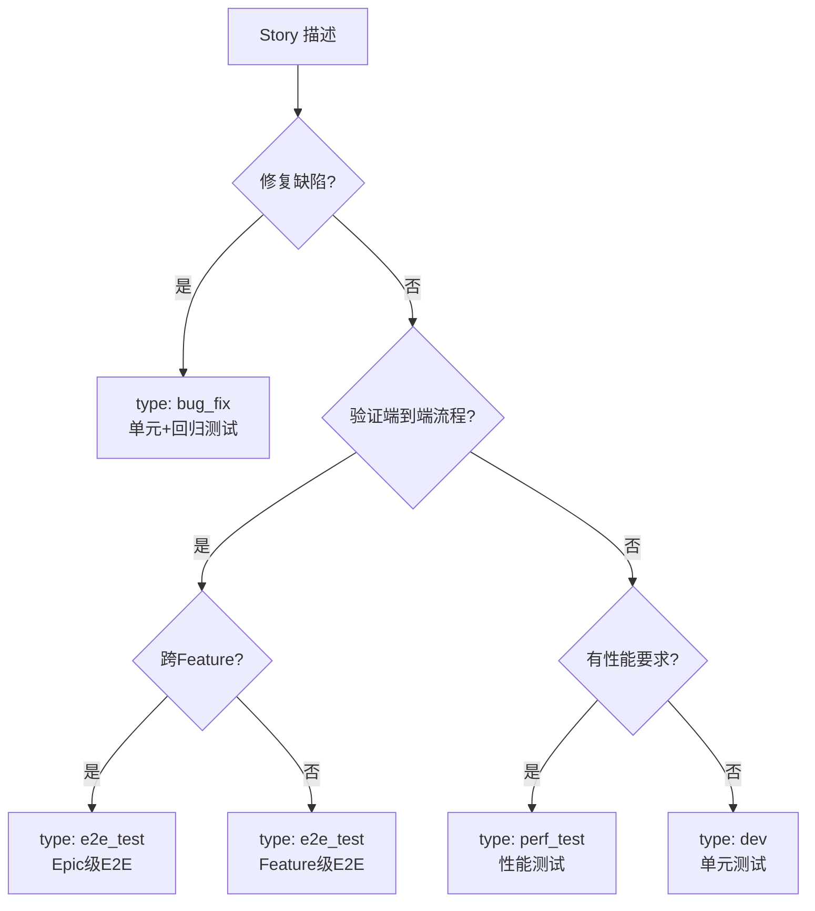
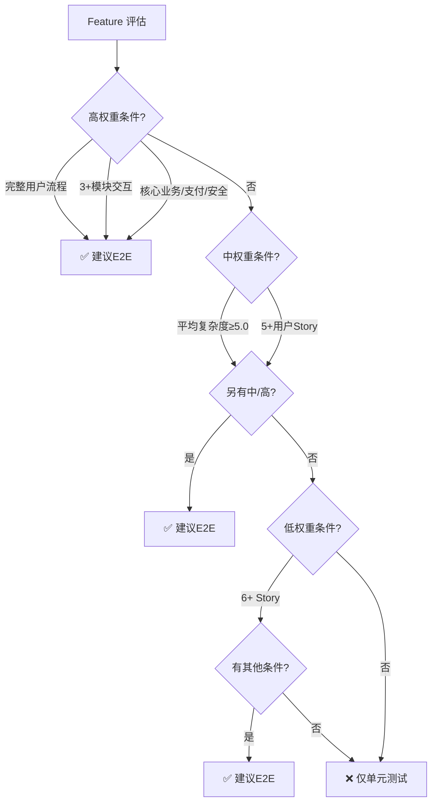

# 测试策略规范

本文档定义 The Conn 框架中的测试策略和 Story 类型判断规则。

---

## Story 类型与测试策略

| Story 类型     | 验收标准 | 测试策略     | Story Type     | 判断依据                          |
| --- | --- | --- | --- | --- |
| 用户功能 Story | 功能清单 | 单元测试     | `dev`          | 有用户界面交互或业务流程          |
| 技术实现 Story | 技术清单 | 单元测试     | `dev`          | 技术基础设施、工具、框架配置      |
| Bug 修复 Story | 测试清单 | 单元+回归    | `bug_fix`      | 修复已有功能的缺陷                |
| E2E Story      | BDD 场景 | BDD E2E 测试 | `e2e_test`     | Feature 级集成测试，验证完整流程  |
| Epic E2E Story | BDD 场景 | BDD E2E 测试 | `e2e_test`     | Epic 级集成测试，跨 Feature 流程  |
| 性能测试 Story | 性能指标 | 性能测试     | `perf_test`    | 有性能要求或性能瓶颈风险的功能点  |

---

## 测试金字塔与职责边界

### 测试层级结构

```
           E2E 测试（少量）
        ┌─────────────────┐
        │  Feature E2E    │  验证完整用户旅程
        │  Epic E2E       │  测试跨 Feature 集成
        └─────────────────┘
             /        \
       ┌──────────────────┐
       │  单元测试（大量）  │  验证函数/模块逻辑
       └──────────────────┘
```

### 测试层级职责

| 测试层级 | 职责范围                       | 执行速度 | 数量占比 | Story 类型      |
| --- | --- | --- | --- | --- |
| 单元测试 | 验证单个函数/类的逻辑正确性    | 快       | 70-80%   | 所有普通 Story  |
| E2E 测试 | 验证完整业务流程的端到端集成   | 慢       | 10-20%   | E2E Story       |
| 性能测试 | 验证系统在压力下的表现         | 很慢     | 5-10%    | 性能测试 Story  |

### 为什么 Story 级不使用 BDD？

**原因**：

1. **避免重复**：Story 级 BDD + Feature E2E 会测试相同的业务逻辑
2. **降低维护成本**：减少测试代码量，BDD 场景变更时只需修改一处（E2E Story）
3. **加快反馈速度**：单元测试执行更快，更适合 TDD 开发流程
4. **保持层次清晰**：单元测试验证实现细节，E2E 测试验证业务流程

**测试覆盖策略**：

- ✅ 每个普通 Story → 单元测试（快速验证逻辑）
- ✅ 每个 Feature → E2E Story（验证集成）
- ✅ 关键路径 → Epic E2E Story（验证跨功能流程）

---

## Story 类型决策

### 决策流程图



### 类型特征速查

| Story类型 | 验收标准 | 测试策略 | 示例 |
| --- | --- | --- | --- |
| **dev** | 功能清单 | 单元测试 | 用户登录、订单逻辑、缓存实现 |
| **bug_fix** | 测试清单 | 单元+回归 | 修复错误提示、并发问题 |
| **e2e_test** | BDD场景 | E2E测试 | 注册→登录流程、下单→支付流程 |
| **perf_test** | 性能指标 | 性能测试 | API响应时间、系统吞吐量 |

---

## 测试文件组织规范

### 单元测试路径

**按编程语言习惯组织**：

| 语言       | 测试路径规则                     | 示例                                                         |
| --- | --- | --- |
| Go         | 与源代码同目录，`*_test.go`      | `src/pkg/sender/buffer.go`<br>`src/pkg/sender/buffer_test.go` |
| Python     | 独立 `tests/` 目录，镜像源码结构 | `src/theconn/init.py`<br>`tests/test_init.py`               |
| JavaScript | 与源代码同目录或 `__tests__/`    | `src/utils.js`<br>`src/__tests__/utils.test.js`             |
| Java       | `src/test/java/` 镜像包结构      | `src/main/java/com/example/Service.java`<br>`src/test/java/com/example/ServiceTest.java` |

### BDD 测试路径

**统一按功能模块分组**（不跟 Epic 走）：

```
tests/bdd/features/{module}/
├── auth/
│   ├── login_flow.feature
│   └── register_flow.feature
├── payment/
│   ├── checkout_flow.feature
│   └── refund_flow.feature
└── user/
    └── profile_flow.feature
```

**Step Definitions 路径**（根据语言）：

- Go: `tests/bdd/*_test.go`
- Python: `tests/bdd/steps/*.py`
- JavaScript: `tests/bdd/steps/*.js`

**路径规则**：

- ✅ Feature 按业务模块（auth, payment, user）分组
- ✅ 一个 E2E Story 对应一个 .feature 文件
- ❌ 不要按 Epic 或 Feature ID 组织 BDD 目录

---

## Feature E2E 测试决策

**⚠️ 使用说明**：
- **快速筛选**：使用下方决策树（快速但简化，准确度约80%）
- **准确判断**：使用"评分速查表"完整评分（4维度加权，准确度95%+）

### 快速决策树（简化版）



**快速判断**: 高×1 或 中×2 或 低+其他 → E2E

### 完整评分速查表（准确判断）

| 维度 | 权重 | 高分(10) | 中分(7) | 低分(4) | 零分(0) |
| --- | --- | --- | --- | --- | --- |
| **流程完整性** | 40% | 完整业务流程 | 多步骤 | 简单交互 | 单点功能 |
| **模块集成** | 30% | 跨系统 | 跨模块 | 单模块多组件 | 单组件 |
| **用户视角** | 20% | 完整旅程 | 关键操作 | 部分交互 | 技术细节 |
| **数据流转** | 10% | 跨系统流转 | 跨模块流转 | 模块内流转 | 单点操作 |

**评分方法**：
1. 每个维度选择对应档位分数（10/7/4/0）
2. 乘以权重百分比
3. 四项相加得总分
4. **判断标准**：≥70 = E2E | 40-69 = 视情况 | <40 = 普通

**示例**："验证用户注册→登录→修改资料流程"
- 流程完整性：10 × 40% = 4.0
- 模块集成：7 × 30% = 2.1（跨模块）
- 用户视角：10 × 20% = 2.0
- 数据流转：7 × 10% = 0.7
- **总分**：8.8 → ≥70 → **是 E2E**

---

## 性能测试决策

**触发条件**（满足任意一条）：

- 预期有高并发场景
- 涉及大数据量处理
- 有明确的性能指标要求
- 存在已知的性能瓶颈风险
- 实时性要求严格

**测试时机**：Feature 功能开发完成后，单独规划性能测试 Story

**性能测试范围**：

- Feature 性能测试：STORY-97（单个 Feature 的性能）
- 系统性能测试：STORY-997（整体系统的性能）

**性能测试工具**：

- 负载生成：JMeter, Gatling, Locust, K6
- 监控分析：Prometheus, Grafana, New Relic
- APM 工具：Jaeger, Zipkin

**生成方式**：使用 `@playbooks/planning/performance_test_story.md` 生成

---

## Bug Fix Story 说明

**使用场景**：

- 已完成的 Story 发现缺陷
- 生产环境发现问题
- 测试覆盖不足导致的遗漏

**测试策略**：

- 修复验证测试：先写测试复现 Bug，修复后测试通过
- 回归测试：确保修复不破坏现有功能
- 边界测试：测试相似场景是否也存在问题

**ID 规则**：

- 格式：`STORY-{父序号}.{子序号}`
- 示例：STORY-01.1, STORY-01.2

**生成方式**：使用 `@playbooks/planning/bug_fix_story.md` 生成

---

**最后更新**: 2025-12-16
